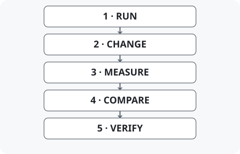

# Inference Lab

[English](README.md) | 한국어

Inference Lab은 AI 모델을 더 가볍고 빠르게 바꾸려 할 때 실행 방식, 계산 시간, 답변이 어떻게 달라지는지 실험하는 프로젝트입니다. RTX 5080에서 모델을 바꾸고 비교하는 도구를 만들고, 입력별 결과를 살펴볼 수 있도록 기록했습니다. 요약에서 개별 예시, 코드, 재현 안내로 이어지는 경로를 제공합니다.

[처음 보는 분](docs/ko/START_HERE.md) · [저장된 결과 보기](docs/ko/GETTING_STARTED.md#offline-explorers) · [구현 살펴보기](docs/ko/PORTFOLIO.md)

## 세 가지 질문

1. **실제로 실행되는가?** 측정한 GPU와 소프트웨어에서 모델이 작동하는 실행 경로를 확인합니다.
2. **정말 빨라지는가?** 핵심 연산, 데이터 준비까지 포함한 호출, 모델 전체의 시간을 따로 측정합니다.
3. **답변은 어떻게 달라지는가?** 전체 정답률과 함께, 같은 질문에서 정답에 주는 확률과 실제 선택을 비교합니다.

## 질문이 발전해 온 과정

실행(001) → 숫자를 가볍게 표현하기(002–003) → 연산 비용(004–005) → 모델 답변(006) → 실제 구조 압축(007).

*프로젝트를 읽는 개념적 순서입니다. 각 사례의 모델·입력·조건은 다르며, 화살표는 하나의 연속 실험에서 얻은 결과를 뜻하지 않습니다.*

## 직접 볼 수 있는 대표 사례

### Case 007 — AI 내부 계산의 어느 부분을 제거할 수 있을까?

<!-- claims: c007-transfer c007-quality -->
MLP는 모델 안에서 정보를 변환하는 큰 계산 블록입니다. 압축 도구는 한 블록의 채널을 16그룹으로 나눠, 각 그룹을 따로 평가하는 선택법과 그룹 사이의 상호작용도 보는 선택법을 비교합니다. 선택한 뒤에는 `gate_proj`, `up_proj`, `down_proj` 행렬을 잘라 실제로 작은 블록을 만듭니다.

그룹의 25%를 제거할 때 상호작용을 고려한 선택은 선택에 쓰지 않은 입력 192개에서 원래 블록 출력에 조금 더 가까웠습니다. 50%에서는 두 방법이 같은 구조를 골랐습니다. 축소한 **한 층 MLP**는 1.176–1.412배 빨랐지만, 전체 모델 측정에서는 가속이 뚜렷하지 않았습니다. 원래 모델을 가깝게 보존하는 것과 정답에 더 좋은 확률 점수를 주는 것도 다른 결과였습니다.

기술명: Qwen3-0.6B · SwiGLU · INDEPENDENT / PAIRWISE · 구조화 가지치기(pruning).

[결과와 정확한 지표](docs/ko/CASEBOOK.md#case-007) · [행렬 축소 코드](cases/007-interaction-aware-mlp-pruning/src/surgery.py) · [탐색기 열기](docs/ko/GETTING_STARTED.md#case007-explorer)

### Case 006 — 전체 정답률이 비슷해도 개별 답은 달라질까?

<!-- claims: c006-native c006-readout c006-limits -->
입력의 정보를 조합하는 attention 연산 한 곳의 숫자 정밀도를 줄이고, 같은 질문에서 네 가지 보기 중 고른 답을 변경 전후로 추적하는 도구를 만들었습니다. 새로 맞힌 답, 기준선이 맞혔지만 후보가 틀린 답, 다른 오답으로 바뀐 경우를 볼 수 있습니다.

두 저정밀 설정은 표준 입력 **192개 중 5개**, **192개 중 8개**의 선택을 바꿨습니다. 이 집합에서는 이전에 맞힌 답을 잃지 않았지만, 별도로 선정한 스트레스 입력에서는 그런 경우가 있었습니다. 같은 입력을 다시 살핀 후속 진단에서는 최고점 동률과 내부 상태를 마지막 단어 점수로 바꾸는 출력 계산을 조사했습니다. 한 모델의 한 층을 합성 질문으로 비교한 기록입니다.

기술명: BF16 기준선 · A_PUBLIC / V4 · 선택 변경(decision flip) · 출력 계산 민감성(readout sensitivity).

[결과·한계·출력 계산 진단](docs/ko/CASEBOOK.md#case-006) · [한정된 연산을 바꾸는 코드](cases/006-attention-decision-stability/src/intervention.py) · [탐색기 열기](docs/ko/GETTING_STARTED.md#offline-explorers)

## 일곱 질문과 구현물

| 쉬운 질문 | 이 사례에서 볼 수 있는 것 |
|---|---|
| [001 — GPU에서 모델이 실행되지 않는다면?](docs/ko/CASEBOOK.md#case-001) | 기존 실행 경로 수정의 전후 비교 도구. 기술명: SM120, vLLM, W8A8. |
| [002 — 적은 비트로 저장하면 메모리와 시간이 줄까?](docs/ko/CASEBOOK.md#case-002) | 공식 모델의 문서 추출 비교. 자원 사용은 줄었지만 과제 정답률은 낮았습니다. 기술명: BF16, FP8. |
| [003 — 간단해진 계산은 원래 값과 얼마나 비슷할까?](docs/ko/CASEBOOK.md#case-003) | 비교 기준의 scale을 나누어 검사한 수치 오차. 기술명: EFQ-Softmax, FP32 모의 계산. |
| [004 — 핵심 연산이 빠르면 호출 전체도 빨라질까?](docs/ko/CASEBOOK.md#case-004) | 준비 비용을 포함한 attention 시간. 긴 입력 일부는 빨랐지만 출력 오차는 고정 기준을 넘었습니다. 기술명: kernel, 전체 호출 비용. |
| [005 — 속도와 오차를 함께 만족하는 설정이 있을까?](docs/ko/CASEBOOK.md#case-005) | 측정한 절충 관계. 바꿔 본 설정 중 두 조건을 만족한 것이 없어 새 확인 단계로 넘어가지 않았습니다. 기술명: 정밀도, 국소 오차. |
| [006 — 어느 질문의 답이 바뀌는가?](docs/ko/CASEBOOK.md#case-006) | 입력별 답변 점수·선택·최고점 동률 진단. 기술명: NLL, top-score tie. |
| [007 — 작은 계산 블록에 어느 그룹을 남길까?](docs/ko/CASEBOOK.md#case-007) | 그룹 선택, 실제 행렬 축소, 선택에 쓰지 않은 입력의 평가. 기술명: MLP, pruning. |

## 더 깊게 보기

5분 [처음 보기](docs/ko/START_HERE.md)에서 시작하거나 [용어집](docs/ko/GLOSSARY.md)에서 궁금한 말을 찾아보세요. [사례 안내](docs/ko/CASEBOOK.md)는 방법·소스·정확한 결과로, [이용 안내](docs/ko/GETTING_STARTED.md)는 ZIP 다운로드·로컬 HTML·CPU 검사로 이어집니다. 탐색기는 저장된 측정값을 보여주므로 GPU가 필요 없습니다. GitHub의 HTML 미리보기는 작동 화면이 아닌 소스 코드입니다. 기존 탐색기 UI와 상세 기술 원문은 영어입니다.

## 기여와 출처

공개 모델과 실행 라이브러리에 비교 실행기, 행렬 축소 도구, 수치 검사와 근거 탐색기를 연결했습니다. [포트폴리오의 기여·출처](docs/ko/PORTFOLIO.md#contribution-and-reuse)에서 Qwen, Transformers, PyTorch, vLLM, SageAttention 및 기존 방법·수정의 저자를 확인할 수 있습니다. OpenAI Codex가 구현·실행·분석·작성을 지원했습니다. 프로젝트 자료는 [Apache-2.0](LICENSE)을 따르며 사례별 고지에 upstream 조건을 남겼습니다. 이 작업은 모델 변경 평가와 추론 문제 진단에 연결되며, 배포 적합성은 평가하지 않았습니다.
