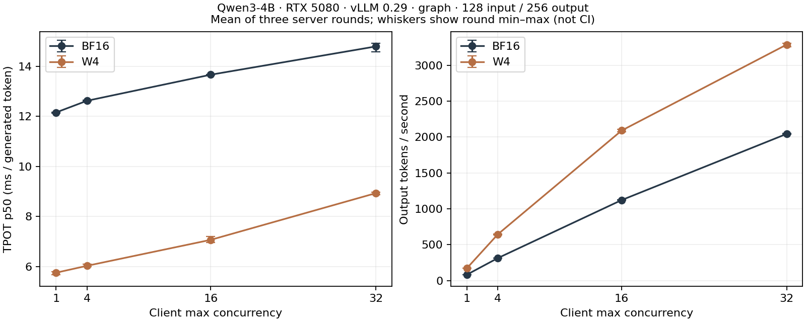

**Munsik-Kim | DIOVA**

[English](README.md) | 한국어

**D**eep-learning **I**nference **O**ptimization, **V**alidation & **A**nalysis

# 모델 압축부터 저장·실행까지 구현합니다.

모델 변환·구조 복원 로더와 GPU 성능·출력 비교 도구를 개발합니다.

공개 Qwen 모델에 저장본 검사, 가중치 보정, 실제 행렬 축소와 입력별 평가를 연결했습니다. 코드와 실행 예제로 구현을, 프로젝트별 결과로 관측을 확인할 수 있습니다.

**PyTorch · Transformers · LLM Compressor · safetensors · vLLM · NumPy**

[모델 제작 도구](docs/ko/PORTFOLIO.md#code-tour) · [CPU 데모 실행](docs/ko/GETTING_STARTED.md#tiny-model-demo) · [프로젝트 보기](#projects)

## 직접 구현한 부분과 재사용한 기술

| 프로젝트 구현 | upstream 제공 | 코드·테스트 |
|---|---|---|
| 저장본 검사·부분 저장 방지·strict reload | PyTorch · Transformers · safetensors | [code](tools/modelpack/artifact.py) · [tests](cases/008-build-reconstruct-reload/tests/test_core.py) |
| Q 변환·저장·복사·새 runtime 검사 | GPTQ · LLM Compressor · compressed-tensors · vLLM/Marlin | [code](tools/modelpack/quantized.py) · [tests](cases/008-build-reconstruct-reload/tests/test_boundaries.py) |
| 고정 구조 ridge 적합·작은 가중치에 보정 저장 | NumPy 선형대수 · 채널 재구성 선행연구 | [code](tools/modelpack/numerics.py) · [tests](cases/008-build-reconstruct-reload/tests/test_core.py) |
| 동일 입력 측정·paired 결과 리포트 | vLLM benchmark · lm-evaluation-harness · 비교 지표 선행연구 | [code](packages/diova-compare/src/diova_compare/core.py) · [tests](packages/diova-compare/tests/test_compare.py) |
| 저비트 state packing·실패 보존·새 프로세스 재시작 | NumPy · PyTorch · ComplexKDA recurrence | [구현](cases/010-ckda-finite-precision-memory-horizon/versions/v2/source/online_v2.py) · [합성 재시작 테스트](cases/010-ckda-finite-precision-memory-horizon/versions/v2/tests/test_online_v2.py) |
| 같은 state의 최종 판독층 교체·patch 저장·재적용 | ComplexKDA · PyTorch L-BFGS · NumPy | [adapter](cases/011-frozen-state-readout-adaptation/source/adapter.py) · [patch 검사](cases/011-frozen-state-readout-adaptation/tests/test_fitting_patch.py) |
| 같은 잡음의 loop/step 실행·시간 예산 선택·이미지 평가 | Looped-DiT · FLAN-T5 · PyTorch · Pillow | [adapter](cases/012-looped-dit-inference-budget/source/adapter.py) · [CPU 검사](cases/012-looped-dit-inference-budget/tests/test_analysis.py) |

[선행연구와 구현 대응](docs/related-work/README.ko.md) · [CPU 비교 도구](packages/diova-compare/README.ko.md)

## 구현 기능

### 모델을 압축하고, 저장하고, 다시 실행합니다

GPTQ 저장본 제작과 추론 엔진 연결, 층별 MLP 크기가 달라진 모델의 저장·로딩, 작은 모듈의 출력 가중치 보정을 구현했습니다.

LLM Compressor · PyTorch · Transformers · safetensors. [저장본 로더](tools/modelpack/artifact.py) · [저장·재로딩 테스트](cases/008-build-reconstruct-reload/tests/test_core.py)

### GPU 추론 성능과 답변 비교

같은 입력에서 지연시간·GPU 메모리·정답 점수를 비교합니다. 부분 연산과 모델 전체의 실행 비용을 나누어 측정합니다.

vLLM · CUDA 실행 환경 · NVML · NumPy. [요청·메모리 측정 코드](cases/002-bf16-fp8-document-extraction/scripts/run.py) · [시간 측정 경계](cases/004-low-precision-attention-break-even/src/timing.py)

### 재계산 도구와 결과 탐색기

공개 기록을 재계산하는 Python 도구와 입력별 결과를 보는 웹 화면을 만듭니다. 자동 검사로 표시 데이터와 원자료의 연결을 확인합니다.

Python · JavaScript · GitHub Actions · GitHub Pages. [CPU 선택기 재계산](tools/showcase/replay_selection.py) · [표시 계층 검사와 테스트](tests/showcase/test_showcase.py)

## 기술스택별 작업

| 작업 | 기술과 구현 |
|---|---|
| 양자화·압축 저장 | **LLM Compressor / GPTQ / compressed-tensors** — Linear 가중치를 변환하고 packed tensor와 변환 recipe를 검사합니다. |
| 모델 구조·저장·로딩 | **PyTorch / Transformers / safetensors** — 행렬을 자르고 층별 폭을 저장한 뒤 tensor shape와 공유 가중치를 복원합니다. |
| 수치 보정·그룹 선택 | **NumPy / CPU FP64 / ridge regression / Cholesky** — 작은 MLP의 출력 가중치를 보정하고 그룹 선택과 쌍별 점수를 비교합니다. |
| GPU 실행·검사 | **vLLM / Marlin / PyTorch SDPA / SageAttention / CUDA runtime / NVML** — 실제 실행 경로를 확인하고 같은 입력의 메모리·전체 호출 비용을 측정합니다. |
| 재계산·결과 화면 | **Python / unittest / GitHub Actions / HTML / CSS / JavaScript** — 스칼라·저장본 검사, 작은 CPU 예제, 한·영 결과 화면을 제공합니다. |

[구현 코드·관련 테스트 읽기](docs/ko/PORTFOLIO.md#code-tour). CUDA는 GPU 실행·측정에, 공개 커널은 연산 교체에 사용했습니다.

## 대표 프로젝트

### Case 008 — 모델을 변환하고, 복구하고, 다시 실행하기

<!-- claims: c008-tracks c008-artifact-implementation -->
Qwen 4B의 양자화 저장본 제작과 Qwen 0.6B의 작은 MLP 출력 복구를 구현했습니다. 모델과 측정 대상이 다른 두 결과물을 각각 살펴볼 수 있습니다.

#### Q · GPTQ 변환·저장·새 runtime 실행

원본 모델을 GPTQ W4A16으로 변환하고, 압축된 가중치와 설정을 검사한 뒤 새 vLLM 프로세스에서 실행하는 파이프라인을 구현했습니다.

**8.045 GB → 2.652 GB** · 원본 대비 가중치 파일 **67.0% 감소** — 가중치 파일 · 원본 BF16 → GPTQ W4A16 · 십진 GB.

Qwen3-4B-Instruct-2507 · GPTQ W4A16. **LLM Compressor · compressed-tensors · vLLM**.

[변환 코드](tools/modelpack/quantized.py) · [저장·재실행 과정](https://munsik-kim.github.io/inference-lab/ko/case008.html#track-q) · [품질·속도 평가](https://munsik-kim.github.io/inference-lab/ko/case008.html#q-evaluation)

#### R · 구조가 달라진 모델의 저장·재로딩과 가중치 보정

고정된 작은 down projection에 ridge 보정값을 저장합니다. 층별 크기 metadata와 meta skeleton으로 구조를 구성하고, strict 할당·공유 가중치·파생 buffer를 복원해 원래 checkpoint 없이 새 프로세스에서 실행합니다.

Qwen3-0.6B · 한 층 MLP · BF16 · 재구성 평가는 짧은 합성 평가 입력 192개 · **PyTorch · NumPy · safetensors**.

[구조 복원 코드](tools/modelpack/artifact.py) · [보정 방법](https://munsik-kim.github.io/inference-lab/ko/case008.html#track-r) · [품질·속도 평가](https://munsik-kim.github.io/inference-lab/ko/case008.html#r-evaluation)

[설계와 실험 결과](cases/008-build-reconstruct-reload/REPORT.ko.md) · [CPU 데모 실행](docs/ko/GETTING_STARTED.md#tiny-model-demo) · [코드·recipe·측정 자료 ZIP](downloads/case008_build_reconstruct_reload_reviewed_publication_v2.zip)

### Case 007 — 채널 선택부터 실제 행렬 축소까지

<!-- claims: c007-implementation -->
각 채널 그룹의 기여와 그룹 간 상호작용을 계산해 제거 대상을 고르고, gate/up/down 행렬을 함께 줄이는 도구를 구현했습니다. 선택 결과를 실제 작은 PyTorch 모듈로 만들고, 원래 모듈에 같은 삭제를 적용한 계산과 비교합니다.

**그룹 선택 → 행렬 축소 → 계산 검증**

Qwen3-0.6B · 한 층 MLP · 16개 채널 그룹. **PyTorch · NumPy · 구조화 pruning**.

[선택기 실행](docs/ko/GETTING_STARTED.md#cpu-selector) · [구조 변경 코드](cases/007-interaction-aware-mlp-pruning/src/surgery.py) · [설계와 실험 결과](https://munsik-kim.github.io/inference-lab/ko/case007.html#design)

### Case 006 — 모델 변경을 질문별로 추적하는 평가 도구

<!-- claims: c006-implementation c006-readout -->
모델의 특정 attention 연산을 교체하고, 같은 질문의 답변 확률·선택·동률을 비교하는 도구를 구현했습니다. 평균 점수에서 가려진 변화를 입력별로 확인하고, 마지막 출력 계산의 정밀도까지 별도로 조사할 수 있습니다.

**정답 손실 · 새 정답 · 다른 오답으로의 변경**

Qwen3-0.6B · 한 층 attention · 고정 합성 질문. **PyTorch · Transformers · SageAttention**.

[비교 화면](https://munsik-kim.github.io/inference-lab/ko/case006.html#results) · [연산 개입 코드](cases/006-attention-decision-stability/src/intervention.py) · [설계와 실험 결과](https://munsik-kim.github.io/inference-lab/ko/case006.html#design)

## 새 측정 — 긴 decode와 동시 요청

Case009는 기존 Qwen3-4B BF16/W4 저장본을 출력 256토큰·동시 요청 상한 1/4/16/32에서 비교합니다. 전체 graph grid와 같은 조건의 eager 비교에 서버 3라운드를 모두 남겼습니다. 공식 품질 계산은 별도이며 native 프로세스 종료 실패도 표시합니다.

영어 축 라벨입니다. [두 입력 길이와 품질표](cases/009-q-serving-quality/REPORT.ko.md) · [CPU 재계산·영어](cases/009-q-serving-quality/REPRODUCTION.md) · [설치형 paired CLI](packages/diova-compare/README.ko.md)

## Case 010 — 저정밀 state의 저장·재시작과 기억 수명

<!-- claims: c010-state-bytes -->
반복해서 갱신하는 recurrent state를 실제 저비트로 저장하고, 수치 실패 상태와 난수를 보존해 새 프로세스에서 이어 실행하는 도구를 구현했습니다. 같은 저장 한도에서 첫 오답까지의 길이와 계산 비용을 비교합니다.

**stream별 직렬화 state 12,305 → 3,137 bytes, 약 74.5% 감소** · Native FP32 → INT8. 같은 세 학습 CKDA의 새 입력에서 평균 연속 정답 길이 점추정 차이는 각각 1token 미만이었습니다. 전체 RAM·VRAM이나 품질 동등성을 나타내는 수치는 아닙니다.

[실패를 보존하는 구현](cases/010-ckda-finite-precision-memory-horizon/versions/v2/source/online_v2.py) · [CPU 검산](cases/010-ckda-finite-precision-memory-horizon/REPRODUCTION.ko.md) · [두 단계의 방법과 결과](cases/010-ckda-finite-precision-memory-horizon/REPORT.ko.md)

## Case 011 — 같은 상태, 다른 판독기

모델이 저장한 상태는 유지하고, 답을 읽는 마지막 층만 교체하는 도구를 만들었습니다. 보정한 두 tensor를 patch로 저장하고 새 프로세스에서 다시 적용해 결과를 비교합니다.

**마지막 층 1,158개 값 · 추가 recurrent-state 저장 0 B · 새 프로세스 재적용**

정답 확률 점수는 개선됐지만, 처음부터 연속해서 맞히는 평균 길이는 짧아졌습니다. 같은 상태에서도 정답에 높은 점수를 주는 것과 첫 오류를 늦추는 것은 달랐습니다.

CKDA 기호 상태추적 · 기존 checkpoint 3개 · 마지막 선형층만 지도 보정. 상태는 입력마다 갱신되며, 같은 저장 방식의 판독기들이 그 상태를 공유합니다.

[쉽게 살펴보기](https://munsik-kim.github.io/inference-lab/ko/case011.html#overview) · [구현 코드](cases/011-frozen-state-readout-adaptation/source/adapter.py) · [상세 결과](https://munsik-kim.github.io/inference-lab/ko/case011.html#results)

## Case 012 — 이미지 생성 시간, 어디에 계산을 더 쓸까?

이미지를 고치는 생성 단계와 각 단계의 내부 반복에 시간을 나눠 쓰는 도구를 구현했습니다. 같은 초기 잡음의 세 이미지를 저장하고, 개수·색·좌우 요구와 실제 시간을 함께 비교할 수 있습니다.

**동일 초기 잡음 · 설정별 시간·메모리 · 조건을 가린 평가 화면**

MAIN 192장의 생성·측정과 AI 판독을 마쳤습니다. 모든 평가 조건을 충족한 장수는 Loop1이 51/64장, Loop2와4가 각각 53/64장입니다. Loop2/Step66이 가장 짧은 중앙 시간이었고, Loop4와1의 충족률 차이는 불확실했습니다. 같은 입력에서 얻은 조건과 잃은 조건을 함께 공개합니다. AI 판독자 1개, 인간 평가 0명입니다.

[쉽게 살펴보기](cases/012-looped-dit-inference-budget/README.ko.md) · [모든 이미지 비교](cases/012-looped-dit-inference-budget/publication/IMAGES.ko.md) · [실행 코드](cases/012-looped-dit-inference-budget/source/adapter.py) · [설계와 결과](cases/012-looped-dit-inference-budget/REPORT.ko.md)

## 질문과 구현물

| 쉬운 질문 | 이 사례에서 볼 수 있는 것 |
|---|---|
| [001 — GPU에서 모델이 실행되지 않는다면?](docs/ko/CASEBOOK.md#case-001) | 기존 실행 경로 수정의 전후 비교 도구. 기술명: SM120, vLLM, W8A8. |
| [002 — 적은 비트로 저장하면 메모리와 시간이 줄까?](docs/ko/CASEBOOK.md#case-002) | 공식 모델의 문서 추출 비교. 자원 사용은 줄었지만 과제 정답률은 낮았습니다. 기술명: BF16, FP8. |
| [003 — 간단해진 계산은 원래 값과 얼마나 비슷할까?](docs/ko/CASEBOOK.md#case-003) | 비교 기준의 scale을 나누어 검사한 수치 오차. 기술명: EFQ-Softmax, FP32 모의 계산. |
| [004 — 핵심 연산이 빠르면 호출 전체도 빨라질까?](docs/ko/CASEBOOK.md#case-004) | 준비 비용을 포함한 attention 시간. 긴 입력 일부는 빨랐지만 출력 오차는 고정 기준을 넘었습니다. 기술명: kernel, 전체 호출 비용. |
| [005 — 속도와 오차를 함께 만족하는 설정이 있을까?](docs/ko/CASEBOOK.md#case-005) | 측정한 절충 관계. 바꿔 본 설정 중 두 조건을 만족한 것이 없어 새 확인 단계로 넘어가지 않았습니다. 기술명: 정밀도, 국소 오차. |
| [006 — 어느 질문의 답이 바뀌는가?](docs/ko/CASEBOOK.md#case-006) | 입력별 답변 점수·선택·최고점 동률 진단. 기술명: NLL, top-score tie. |
| [007 — 작은 계산 블록에 어느 그룹을 남길까?](docs/ko/CASEBOOK.md#case-007) | 그룹 선택, 실제 행렬 축소, 선택에 쓰지 않은 입력의 평가. 기술명: MLP, pruning. |
| [008 — 바꾼 모델을 저장하고 다시 실행할 수 있을까?](docs/ko/CASEBOOK.md#case-008) | GPTQ 저장·실행 통합과 고정 MLP ridge 복구. Q 파일과 R 국소 오차가 감소했고 정답 점수 변화는 혼재. |
| [009 — 긴 decode와 동시 요청에서 비용은 어떻게 바뀔까?](cases/009-q-serving-quality/README.ko.md) | 같은 조건의 graph/eager 요청 비용과 공식 품질 계산. 비정상 프로세스 종료 기록도 함께 표시. |
| [010 — 저비트 state를 실패 이후에도 재시작할 수 있는가?](docs/ko/CASEBOOK.md#case-010) | 실제 bit packing, 실패 상태 직렬화, 최초 판독 실패와 저장 예산 비교. |
| [011 — 같은 상태에서 판독기만 바꾸면?](docs/ko/CASEBOOK.md#case-011) | 마지막 층 두 tensor 보정·재적용, 정답 점수와 첫 오류 길이의 비교. |
| [012 — 이미지 생성 시간을 어디에 더 쓸까?](docs/ko/CASEBOOK.md#case-012) | 같은 잡음의 loop/step 실행·시간 비교·이미지 판독 도구. 전체192장 AI 평가와 조건별 획득·손실. |

## 더 깊게 보기

5분 [처음 보기](docs/ko/START_HERE.md)에서 시작하거나 [용어집](docs/ko/GLOSSARY.md)에서 궁금한 말을 찾아보세요. [사례 안내](docs/ko/CASEBOOK.md)는 방법·소스·정확한 결과로, [이용 안내](docs/ko/GETTING_STARTED.md)는 ZIP 다운로드·로컬 HTML·CPU 검사로 이어집니다. 탐색기는 저장된 측정값을 보여주므로 GPU가 필요 없습니다. GitHub의 HTML 미리보기는 작동 화면이 아닌 소스 코드입니다. 기존 탐색기 UI와 상세 기술 원문은 영어입니다.

## 기여와 출처

DIOVA는 **Deep-learning Inference Optimization, Validation & Analysis**의 약자입니다.

공개 모델과 실행 라이브러리에 비교 실행기, 행렬 축소 도구, 수치 검사와 근거 탐색기를 연결했습니다. [포트폴리오의 기여·출처](docs/ko/PORTFOLIO.md#contribution-and-reuse)에서 Qwen, Transformers, PyTorch, vLLM, SageAttention 및 기존 방법·수정의 저자를 확인할 수 있습니다. OpenAI Codex가 구현·실행·분석·작성을 지원했습니다. 프로젝트 자료는 [Apache-2.0](LICENSE)을 따르며 사례별 고지에 upstream 조건을 남겼습니다. 이 작업은 모델 변경 평가와 추론 문제 진단에 연결되며, 배포 적합성은 평가하지 않았습니다.

[수정판 CPU wheel 0.1.1](downloads/diova_compare-0.1.1-py3-none-any.whl) · [Case009 공개 자료](downloads/case009_serving_quality_reviewed_publication_v2.zip) · [메타데이터](downloads/case009_serving_quality_reviewed_publication_v2.json)
