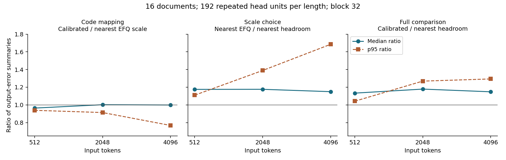

# Analysis

## Finding

EFQ-Mean had 11.49–14.49% median attention-output error on these Qwen3-0.6B traces. The calibrated/MMLU setting was close to same-scale nearest rounding in the aggregate, while headroom-scale nearest rounding had lower median and p95 error at every length. This was an FP32 numerical simulation; packed FP4 kernels, speedup and downstream quality were not measured.

## Experimental question

This audit tests the probability-generation path of [EFQ-Softmax v1](https://arxiv.org/html/2609.09721v1) under fixed Q/K/V and causal masking. Eight development and sixteen held-out documents use a shared self-authored synthetic English/Korean/code generator. It asks about sampled local attention fidelity within this prompt family and sampling design.

## Primary numerical results

Each cell is median / p95 relative output Frobenius error over 192 repeated head units. A unit pools its sixteen query outputs; it is not the mean of row-wise relative errors.

| Method | 512 tokens | 2048 tokens | 4096 tokens |
|---|---:|---:|---:|
| Nearest, headroom scale | 7.14% / 14.58% | 5.76% / 9.21% | 5.67% / 8.82% |
| Nearest, EFQ scale | 8.39% / 16.18% | 6.78% / 12.80% | 6.52% / 14.86% |
| EFQ-MMLU | 8.09% / 15.18% | 6.79% / 11.69% | 6.51% / 11.41% |
| EFQ-Mean | 14.49% / 23.25% | 12.13% / 22.28% | 11.49% / 22.06% |
| EFQ-Balance | 9.99% / 18.28% | 8.08% / 12.75% | 7.92% / 13.25% |
| EFQ-LUT | 8.82% / 18.16% | 6.88% / 13.63% | 6.75% / 15.63% |
| EFQ calibrated | 8.09% / 15.18% | 6.79% / 11.69% | 6.51% / 11.41% |

The new calculation starts with each public row's absolute error and reference norm, sums their squares and divides the resulting Frobenius norms. Original unit and aggregate files serve only as cross-checks after calculation. The maximum unit discrepancy was 1.843e-08, attributable to rounding in the stored FP32 row norms. No discrepancy exceeded the fixed 2e-6 absolute-error tolerance; all two-decimal percentage table values agree. [All differences](results/comparison_decomposition.json) are retained, including those below tolerance.

FP32 online's maximum unit error was 5.941277e-07. The original 128-token trace check reproduced native BF16 SDPA exactly through the same backend; FP32 versus native BF16 differed by 0.142–0.186%. The latter is a precision/backend comparison, not EFQ error. Valid-row numerical failures and near-zero reference units were absent in the saved real and synthetic runs.

## Mapping effect, scale effect, full comparison

- **Mapping:** calibrated EFQ / nearest with the EFQ scale. Only the score-to-code mapping changes.
- **Scale:** nearest with the EFQ scale / nearest with the headroom scale. The nearest mapping is held fixed.
- **Full:** calibrated EFQ / nearest with the headroom scale. Both scale and code generation differ.

Ratios divide the indicated summary statistics; they are not medians of per-unit ratios. Differences are percentage points of relative output error (numerator minus denominator). They do not measure task-accuracy changes.

| Contrast | Length | Median ratio | p95 ratio | Median difference | p95 difference |
|---|---:|---:|---:|---:|---:|
| mapping | 512 | 0.964 | 0.939 | -0.303 pp | -0.993 pp |
| scale | 512 | 1.176 | 1.110 | +1.253 pp | +1.602 pp |
| full | 512 | 1.133 | 1.042 | +0.950 pp | +0.608 pp |
| mapping | 2048 | 1.002 | 0.913 | +0.014 pp | -1.109 pp |
| scale | 2048 | 1.176 | 1.389 | +1.016 pp | +3.587 pp |
| full | 2048 | 1.179 | 1.269 | +1.030 pp | +2.478 pp |
| mapping | 4096 | 0.999 | 0.768 | -0.008 pp | -3.456 pp |
| scale | 4096 | 1.150 | 1.685 | +0.849 pp | +6.045 pp |
| full | 4096 | 1.148 | 1.294 | +0.840 pp | +2.589 pp |

The engineering screen's denominator is the **same-scale nearest reference**. Its length-wise median limits (1.10×), p95 limits (1.25×), valid-row numerical checks and layer×length limit (2×) all passed; the largest layer×length median ratio was 1.309. This means the calibrated affine code generator stayed within the prespecified aggregate ratios under the same EFQ scale. Headroom nearest still gave lower median and p95 errors. The screen was recorded before evaluation; it was not externally preregistered, and this post-hoc analysis does not change it.

## Calibration transfer within the tested scope

The 7×7 Cartesian grid contains (-2.90, 2.00) because both values were listed before evaluation. Re-summing squared errors for all 49 candidates across the eight development documents selects that published MMLU point again. The objective is a concatenated-output Frobenius ratio, not a mean of unit ratios. The subset is length 2048, layer 13, heads 0/10 and the same sixteen query positions.

Using that subset definition, the objective changes from **5.792% development to 5.827% evaluation**. The all-head median table covers three layers/four heads with a different aggregation and is not the same statistic. Calibration's older plan hash is explained by the documented development-only JS diagnostic fix; the grid and output objective did not change. The final specification predates evaluation extraction, and the selected parameters are fixed in all evaluation methods.

This checks transfer between document splits of the same model and synthetic generator. It says nothing about Qwen3-8B, other domains or downstream task accuracy. In v1 section IV-A, MMLU and Mean are selected for downstream MMLU and seven-task mean accuracy; Balance is selected on vision-language tasks. Higher local Frobenius error for Mean does not directly refute those task results. A follow-up question is why an operating point selected for downstream accuracy can differ from one selected for local attention-output fidelity.

## Representative counterexample

For `eval-13`, length 512, layer 27, head 0, EFQ-Mean's unit error was **35.85%**, versus **16.56%** for same-scale nearest. Query position **170 is zero-based** and uses keys 0–170. The recorded key 170 has reference probability 0.069700, EFQ-Mean probability 0.108802 and nearest probability 0.075533. Its scale exponent is -6 and residual is approximately -0.20839. EFQ's code-7 threshold is tau+6/h = -0.451304; nearest's 4/6 midpoint corresponds to log(5/6) = -0.182322. The residual lies between these thresholds, giving EFQ code 7 and nearest code 6.

Removed reference mass was only 0.35586%, and no finite row-max increase occurred after initialization. This is a **nonzero code-boundary counterexample that zero pruning alone cannot explain**. The normalized probabilities include historical rescaling. The public [key records](results/representative_details.json) and [case table](results/representative_cases.md) preserve the evidence; a small archived-score fixture and independent scalar check are described in Methods.

Calibrated EFQ's worst unit error was 18.88%; its largest unit-wise same-scale error ratio was 3.24×. Grouped screen limits do not protect every head.

The following post-hoc flags describe rows with at least 20% error. High entropy means entropy/log(valid keys) >=0.8; a large max update is >=8 logits. A scale-sensitive control has nearest-EFQ error >=1.5× headroom-nearest error and at least 1 percentage point larger. The thresholds were fixed in the audit plan before this tally; they are not failure criteria from the paper.

| Method | Rows with error >=20% | Removed mass >=10% | High entropy | Large max update | Scale-sensitive control | None of these flags |
|---|---:|---:|---:|---:|---:|---:|
| EFQ-Mean | 2071 | 71 | 15 | 5 | 987 | 1012 |
| EFQ calibrated | 297 | 59 | 5 | 0 | 48 | 192 |

Flags overlap and rows are dependent. Removed mass, entropy and max updates do not establish a dominant cause. Global nonzero-boundary attribution needs per-key records that the row CSV does not contain. Dominant-mechanism classification remains unresolved rather than forcing each row into a causal label.

## Dependence structure and uncertainty

There are **16 independent document IDs, not 192 independent documents per length**. The 192 units repeat measurements across layers/heads, and lengths reuse document prefixes. English/Korean/code evaluation counts are 5/5/6; development counts are 3/3/2. All documents share generation rules, so even document-level intervals have limited population meaning.

The **post-hoc clustered uncertainty analysis** draws 16 document IDs with replacement, preserving all twelve layer/head units per document and pairing methods. The same 5,000 draws (seed 470011) are used at each length. Each draw recalculates method medians and then their difference/ratio. These percentile intervals supplement the original mean-document-difference bootstrap; they neither replace it nor alter the screen. The same-scale median intervals include both sides of zero difference (and ratio 1); this is not evidence of equivalence. The full-comparison intervals remain above ratio 1 in this sample.

| Contrast | Length | Median-difference 95% interval | Median-ratio 95% interval |
|---|---:|---:|---:|
| mapping | 512 | [-1.130, +0.214] pp | [0.871, 1.027] |
| scale | 512 | [+0.663, +1.823] pp | [1.091, 1.260] |
| full | 512 | [+0.445, +1.257] pp | [1.062, 1.179] |
| mapping | 2048 | [-0.502, +0.678] pp | [0.930, 1.108] |
| scale | 2048 | [+0.545, +1.367] pp | [1.094, 1.246] |
| full | 2048 | [+0.522, +1.562] pp | [1.085, 1.288] |
| mapping | 4096 | [-0.499, +0.454] pp | [0.928, 1.072] |
| scale | 4096 | [+0.545, +1.403] pp | [1.095, 1.253] |
| full | 4096 | [+0.485, +1.395] pp | [1.084, 1.248] |

Row-level Spearman correlations for calibrated EFQ were +0.559 with removed mass, +0.511 with entropy and -0.405 with top-logit gap. They pool 9,216 dependent rows (8,640 for the gap, which is undefined for one-key rows). No independent-row p-value or causal interpretation is used. [Full counts and coefficients](results/comparison_decomposition.json) are retained.

## What this result establishes

The fixed v1 equations can be implemented and checked on real normalized/rotated Qwen3-0.6B attention inputs. Within this prompt family and sampling design, calibration finds a public operating point near the same-scale nearest reference in aggregate. The controlled comparisons separate that code-mapping observation from a larger scale-choice penalty, and the key-level counterexample exposes a nonzero boundary effect.

## What this result does not establish

This is FP32 simulation of decoded FP4 values on sampled traces. It does not validate packed FP4 tensor-core behavior, speedup, downstream quality, the authors' complete implementation or parameter transfer outside the tested scope. The paper leaves its precise hardware block layout and MXFP4 baseline details unresolved; both local baselines are explicit numerical references. No third-party or independent human reproduction is claimed.

## Decision for a possible microkernel follow-up

Consider only a limited feasibility experiment that measures code-generation cost at fixed operands and retains **both** nearest references. The same-scale screen motivates that narrow question; the present fidelity results alone favor headroom nearest. No microkernel was developed in this audit.

Recompute this document, README, JSON and figure from the row evidence with `python scripts/publication_audit.py --output-dir /path/to/new-derived-output`. Existing measured files are read-only. The generated bundle is post-hoc and is distinct from the frozen experiment.
