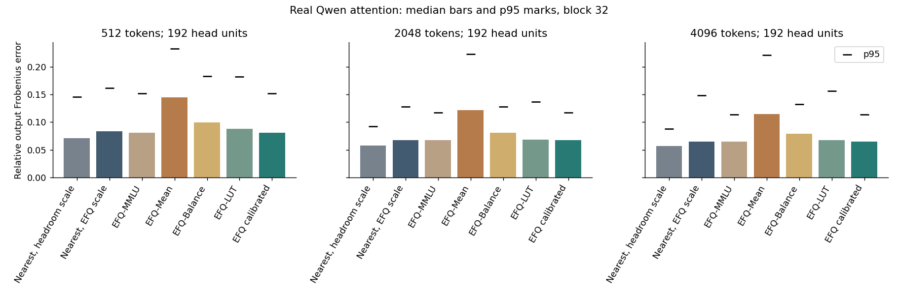
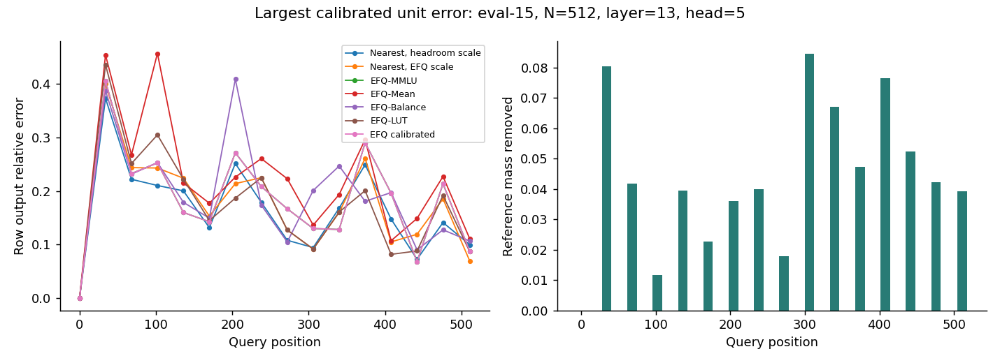
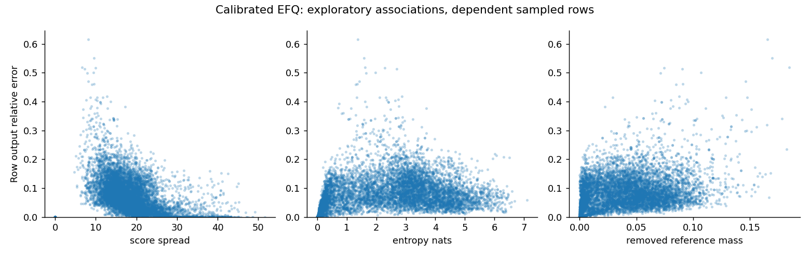
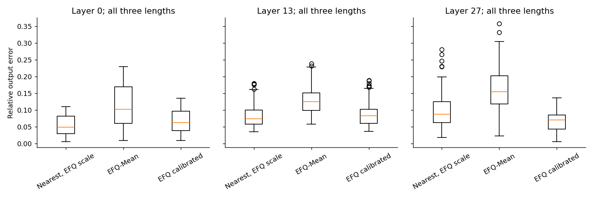

# Independent numerical audit of EFQ-Softmax on Qwen attention

**EFQ-Mean was a poor default on these traces.** Its median attention-output error was 11.49–14.49%, compared with 6.51–8.09% for the development-selected setting. The selected setting passed the prespecified screen against nearest rounding with the same scale. A different, headroom-based nearest scale still had lower median and p95 error at every length. These are attention-output errors, not model accuracy scores.

This case independently implements [EFQ-Softmax v1](https://arxiv.org/html/2609.09721v1) and checks it on actual post-QK-normalization/post-RoPE attention inputs from the official BF16 Qwen3-0.6B model. The inputs are self-authored synthetic English, Korean and code documents. No packed FP4 computation, A5 benchmark, model-quality test or new kernel is involved.

## Recorded comparison

Values below are **median / p95 relative output Frobenius error** over 192 head units per length: 16 held-out documents × 3 layers × 4 heads. Each unit contains 16 prespecified query rows, using all valid keys. Prefix lengths overlap within a document. The independent document count is 16, not the number of heads or query rows.

| Method | 512 tokens | 2048 tokens | 4096 tokens |
|---|---:|---:|---:|
| Nearest, headroom scale | 7.14% / 14.58% | 5.76% / 9.21% | 5.67% / 8.82% |
| Nearest, EFQ scale | 8.39% / 16.18% | 6.78% / 12.80% | 6.52% / 14.86% |
| EFQ-MMLU | 8.09% / 15.18% | 6.79% / 11.69% | 6.51% / 11.41% |
| EFQ-Mean | 14.49% / 23.25% | 12.13% / 22.28% | 11.49% / 22.06% |
| EFQ-Balance | 9.99% / 18.28% | 8.08% / 12.75% | 7.92% / 13.25% |
| EFQ-LUT | 8.82% / 18.16% | 6.88% / 13.63% | 6.75% / 15.63% |
| EFQ calibrated | 8.09% / 15.18% | 6.79% / 11.69% | 6.51% / 11.41% |

Attention tile size is 128 and microscaling block size is 32. “Nearest, EFQ scale” isolates the code mapping from the scale choice and is the prespecified screen baseline. “Nearest, headroom scale” is an independent MXFP4 numerical reference; its equivalence to the paper's MXFP4 implementation was not established. The latter result shows why a favorable same-scale comparison should not be read as an overall accuracy win for EFQ.

FP32 online attention agreed with the FP32 dense reference to a worst unit error of 5.941e-07. All real and synthetic evaluation methods had zero valid-row denominator/output/probability numerical failures. No real unit crossed the near-zero reference-norm threshold. This distinguishes approximation error from an implementation crash or a zero-denominator failure.

## Published parameters and development calibration

A 49-candidate search on eight development documents selected **tau=-2.90, h=2.00**. This is exactly the published EFQ-MMLU point, so those two rows are identical. It is not a new parameterization invented by this project. The search used length 2048, layer 13 and heads 0/10, with no evaluation input or refinement.

On that matched subset definition, the concatenated-output objective changed from **5.792% development to 5.827% evaluation**. There was no large transfer collapse in this sample. The corresponding same-scale nearest errors were 5.788% and 5.810%. This pooled objective differs from the all-head median table above.

EFQ-Mean and EFQ-Balance produced higher median errors than the selected/MMLU point at all three lengths. Balance was originally selected for the paper's vision-language experiments. EFQ-LUT improved typical error over Mean, but its worst unit error reached 32.60%; finer intermediate indices did not remove the tail. All three published points and the LUT remain reported; none was selected after seeing evaluation outcomes.

## Engineering screen and limits on that decision

The calibrated/same-scale-nearest ratios were:

| Length | Median ratio | p95 ratio |
|---|---:|---:|
| 512 | 0.964 | 0.939 |
| 2048 | 1.002 | 0.913 |
| 4096 | 0.999 | 0.768 |

All median ratios were <=1.10, all p95 ratios <=1.25, and the largest layer×length median ratio was 1.309, below 2.0. There were no valid-row numerical failures or floor-based ratio holds. **The predefined screen passed.** This supports considering a limited kernel-feasibility follow-up. No such kernel work was started here, and the result does not prove speedup, model-quality preservation or universal robustness.

The paired document bootstrap below concerns the **mean per-document error difference**, calibrated minus same-scale nearest, rather than the median ratio. It resamples 16 documents, preserving all their heads and prefixes. Intervals describe this small shared-generator sample.

| Length | Mean document error difference | Paired 95% interval |
|---|---:|---:|
| 512 | -0.426 pp | [-0.759, -0.076] pp |
| 2048 | -0.376 pp | [-0.683, -0.059] pp |
| 4096 | -0.494 pp | [-0.787, -0.204] pp |

The headroom-scale reference remains a relevant competing design. In addition, individual units can be much worse under calibrated EFQ even though aggregate groups pass: one unit reached 3.24× the same-scale nearest error (2.87% versus 0.89%). The screen's grouped thresholds do not protect every head or input.

## Where error grew

The clearest EFQ-Mean example was `eval-13`, length 512, layer 27, head 0. Its unit error was **35.85%**, versus 16.56% for nearest rounding with the same scale. At query 170, the secondary key's normalized probability rose from 0.06970 in the reference to 0.10880 under EFQ-Mean; the nearest control gave 0.07553. EFQ assigned code 7 where nearest rounding assigned code 6. Removed reference mass was only 0.356%, and that row had no finite row-max jump. Zero pruning or historical rescaling alone therefore does not explain this example: the nonzero code mapping also redistributes weight.

The largest calibrated unit error was 18.88%, in `eval-15`, length 512, layer 13, head 5. A separate unit with the largest calibrated/nearest ratio showed a secondary probability of 0.07046 becoming 0.13801, with code 2 instead of nearest code 1. Detailed original key probabilities, codes and row diagnostics are in [representative cases](results/representative_cases.md) and [machine-readable details](results/representative_details.json).

For calibrated EFQ, row error had exploratory Spearman correlations of +0.559 with removed reference mass and +0.511 with attention entropy, and -0.405 with the largest-logit gap. The correlation with maximum row-max jump was -0.013. These pooled rows are dependent; the associations are not causal explanations or new theoretical results.

Layer 0's median error was 1.27–1.31× the same-scale nearest baseline, while layer 27's was 0.76–0.80×. The layer breakdown matters even when the global median looks similar. [Joint layer/head/length summaries](results/layer_head_length.json) retain all groups.

## Stress and block-size sensitivity

Nine synthetic families were measured separately with distinct development/evaluation seeds. Gaussian scores with standard deviation 2 produced the largest EFQ-Mean synthetic unit error, 28.10% at length 4096. Near-uniform inputs, sharp peaks, heavy tails, causal masks and large late row-max changes were also retained, including unsuccessful approximation cases. The absence of NaN/Inf in these stress tests is not evidence of model quality.

With the same fixed calibration, block 16 gave calibrated median errors of 7.11%, 6.33% and 6.16%; block 64 gave 9.85%, 7.21% and 6.95%. These are sensitivity results. The main screen remains the preselected block 32; the experiment was not relabeled around the best block size after evaluation.

## Reproduce and inspect

- [Methods, equations and exact metric definitions](METHODS.md)
- [Fresh-output reproduction commands](provenance/REPRODUCE.md)
- [Frozen experiment specification](configs/experiment_spec.json), SHA256 `75b3d0e9ed46a22425bbf4b3d8c96affcd8e8faa5229a4f3f331eb84da0fcfdf`
- [Model revision, file hashes and BF16 tensor verification](provenance/model.json)
- [Environment and versions](provenance/environment.json)
- [Input texts and exact tokenizer IDs](inputs/manifest.json)
- [Aggregate tables, screen and document bootstrap](results/aggregate.json)
- [Per-unit results](results/eval_units.jsonl), [compressed row measurements](results/eval_rows.csv.gz)
- [Numerical tests](provenance/numerical_tests.json), [native trace check](provenance/trace_validation.json)
- [Static artifact checks](provenance/artifact_validation.json); run `python scripts/verify_artifacts.py`

The runs used an RTX 5080 16GB, WSL2 Ubuntu 24.04.4, driver 610.47, Python 3.12.14, PyTorch 2.13.0+cu130 and Transformers 5.17.0. The exact model revision is `c1899de289a04d12100db370d81485cdf75e47ca`. The full attention inputs are private working files; the supplied text, tokens, scripts, hashes and small development fixture support regeneration without distributing model weights or large activations.

Twelve numerical tests passed, including an independent scalar FP64 oracle, GPU/CPU checks, code boundaries, masking, shared operands, online rescaling and scale underflow. The initial FP32 JS diagnostic had tiny negative roundoff values during development; its correction and preserved prior evidence are [documented](provenance/development_corrections.json). All attention-output error records were unchanged by that diagnostic correction. Evaluation began only after the freeze.

These findings are limited to one small model, selected layers/heads/query rows and 24 synthetic documents sharing generation rules. The paper's original block layout, finite-exponent policy and baseline implementation were not independently recovered. This case audits an explicit independent implementation of v1, not the authors' complete experiments. No human annotation review, independent third-party replication, model-quality gain or hardware acceleration is claimed.

The EFQ method and published parameters are Han et al.'s work; Qwen and the inference libraries belong to their respective authors. OpenAI Codex assisted with the inputs, implementation, analysis and documentation. See [NOTICE](NOTICE.md).
