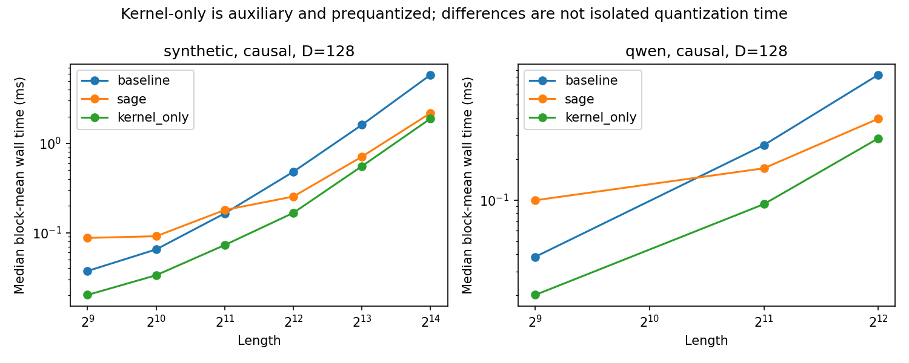

# Analysis

The measured SageAttention path was faster on some shapes, but none of the three real-Qwen conditions passed the fixed local numerical screen. Sage's median sampled-query output error was 2.30–2.87%, above the 1% limit. The selection table therefore contains 0 local candidates. This is a completed operator comparison, not a model-quality or deployment verdict.

## Complete cost and the observed crossover

The following synthetic measurements include the whole public adapter. Intervals are pointwise paired process/block bootstrap intervals. Missing lengths are not interpolated. Both causal curves and head dimensions are separate; a speed result on one is not a result on the others.

| Length | D | Causal | Frozen BF16 | BF16 ms | Sage ms | Paired speedup | 95% CI | Status |
| --- | --- | --- | --- | --- | --- | --- | --- | --- |
| 512 | 64 | True | default | 0.0291 | 0.0799 | 0.350 | [0.321, 0.408] | SYNTHETIC_ONLY |
| 512 | 64 | False | default | 0.0435 | 0.1113 | 0.336 | [0.285, 0.378] | SYNTHETIC_ONLY |
| 512 | 128 | True | flash | 0.0373 | 0.0875 | 0.414 | [0.394, 0.448] | SYNTHETIC_ONLY |
| 512 | 128 | False | default | 0.0365 | 0.0887 | 0.400 | [0.361, 0.430] | SYNTHETIC_ONLY |
| 1024 | 64 | True | flash | 0.0465 | 0.1219 | 0.383 | [0.245, 0.456] | SYNTHETIC_ONLY |
| 1024 | 64 | False | default | 0.0368 | 0.0859 | 0.434 | [0.399, 0.481] | SYNTHETIC_ONLY |
| 1024 | 128 | True | flash | 0.0651 | 0.0914 | 0.706 | [0.497, 0.775] | SYNTHETIC_ONLY |
| 1024 | 128 | False | default | 0.0642 | 0.0896 | 0.723 | [0.641, 0.816] | SYNTHETIC_ONLY |
| 2048 | 64 | True | flash | 0.1149 | 0.0930 | 1.257 | [0.307, 1.346] | SYNTHETIC_ONLY |
| 2048 | 64 | False | flash | 0.1145 | 0.1303 | 0.945 | [0.318, 1.281] | SYNTHETIC_ONLY |
| 2048 | 128 | True | flash | 0.1647 | 0.1797 | 0.954 | [0.499, 1.276] | SYNTHETIC_ONLY |
| 2048 | 128 | False | default | 0.2254 | 0.1299 | 1.767 | [1.206, 1.824] | SYNTHETIC_ONLY |
| 4096 | 64 | True | default | 0.2572 | 0.2267 | 1.120 | [0.816, 1.806] | SYNTHETIC_ONLY |
| 4096 | 64 | False | flash | 0.4265 | 0.2146 | 1.998 | [1.605, 2.077] | SYNTHETIC_ONLY |
| 4096 | 128 | True | default | 0.4810 | 0.2539 | 1.865 | [1.688, 1.984] | SYNTHETIC_ONLY |
| 4096 | 128 | False | default | 0.8706 | 0.3452 | 2.505 | [2.472, 2.566] | SYNTHETIC_ONLY |
| 8192 | 64 | True | flash | 0.8428 | 0.3779 | 2.232 | [2.205, 2.287] | SYNTHETIC_ONLY |
| 8192 | 64 | False | flash | 1.4578 | 0.6200 | 2.349 | [2.321, 2.366] | SYNTHETIC_ONLY |
| 8192 | 128 | True | default | 1.6117 | 0.7096 | 2.283 | [2.267, 2.297] | SYNTHETIC_ONLY |
| 8192 | 128 | False | default | 3.0601 | 1.1259 | 2.726 | [2.706, 2.744] | SYNTHETIC_ONLY |
| 16384 | 64 | True | flash | 2.9326 | 1.1830 | 2.478 | [2.457, 2.489] | SYNTHETIC_ONLY |
| 16384 | 64 | False | default | 5.2899 | 2.0808 | 2.551 | [2.544, 2.555] | SYNTHETIC_ONLY |
| 16384 | 128 | True | flash | 5.8464 | 2.1844 | 2.677 | [2.667, 2.681] | SYNTHETIC_ONLY |
| 16384 | 128 | False | default | 11.3545 | 3.8712 | 2.934 | [2.930, 2.938] | SYNTHETIC_ONLY |

The ms columns are medians of block-mean costs. Their ratio can differ from the reported median of paired ratios.

| D | Causal | First measured latency win | Lengths passing timing gate | Real fidelity eligibility |
| --- | --- | --- | --- | --- |
| 64 | True | 2048 | 8192, 16384 | unverified synthetic geometry |
| 64 | False | 4096 | 4096, 8192, 16384 | unverified synthetic geometry |
| 128 | True | 4096 | 4096, 8192, 16384 | unverified synthetic geometry |
| 128 | False | 2048 | 2048, 4096, 8192, 16384 | unverified synthetic geometry |

“First” refers only to observed points, not an exact continuous break-even length or a monotonic guarantee. No synthetic shape earns real-model eligibility: H8/H8 is different from the captured Qwen H16/H8 geometry. In the actual Qwen matrix, timing advantages and numerical rejection coexist:

| Length | Complete speedup [95% CI] | BF16 median error | Sage median error | Sage p95 error | Decision |
| --- | --- | --- | --- | --- | --- |
| 512 | 0.373× [0.343, 0.387] | 0.173% | 2.872% | 4.735% | NUMERICAL_REJECT |
| 2048 | 1.465× [1.385, 1.518] | 0.170% | 2.444% | 4.157% | NUMERICAL_REJECT |
| 4096 | 2.100× [2.093, 2.105] | 0.169% | 2.301% | 3.897% | NUMERICAL_REJECT |

## Prequantized kernel versus complete call

| Qwen length | Backend | Wall median ms | Wall p95 ms | Event median ms | Event p95 ms | Allocator peak MiB |
| --- | --- | --- | --- | --- | --- | --- |
| 512 | default | 0.0383 | 0.0790 | 0.0355 | 0.0882 | 42.03 |
| 512 | sage | 0.0996 | 0.4535 | 0.0938 | 0.4463 | 45.02 |
| 512 | kernel_only | 0.0202 | 0.0629 | 0.0183 | 0.0802 | not measured |
| 2048 | default | 0.2528 | 0.2762 | 0.2486 | 0.2703 | 72.13 |
| 2048 | sage | 0.1709 | 0.4493 | 0.1638 | 0.4461 | 84.02 |
| 2048 | kernel_only | 0.0933 | 0.1135 | 0.0916 | 0.1114 | not measured |
| 4096 | default | 0.8279 | 0.8535 | 0.8204 | 0.8422 | 112.25 |
| 4096 | sage | 0.3945 | 0.4344 | 0.3912 | 0.4244 | 136.02 |
| 4096 | kernel_only | 0.2830 | 0.3061 | 0.2779 | 0.3009 | not measured |

`kernel_only` has prequantized operands and a preallocated output. Every measured input passed bitwise equality with the public wrapper before its auxiliary timing. It is measured after complete-call blocks, not interleaved in the primary comparison. Its p95 is also a block-mean distribution. The difference between kernel-only and complete cost includes more than quantization and is not a stage-level timing decomposition.

Wall and device-event numbers are separate measurements. Host-side scheduling, wrapper dispatch and synchronization can affect wall cost. Process-round median variation is retained in the JSON; no favorable process was selected. The five processes run on one device and desktop environment, not five independent machines.

## Fidelity against the common reference

| Length | Backend | Dependent units | Median error | p95 error | Median absolute RMS | Median cosine |
| --- | --- | --- | --- | --- | --- | --- |
| 512 | default | 256 | 0.173% | 0.182% | 0.000763 | 0.999999 |
| 512 | sage | 256 | 2.872% | 4.735% | 0.014063 | 0.999598 |
| 2048 | default | 256 | 0.170% | 0.177% | 0.000825 | 0.999999 |
| 2048 | sage | 256 | 2.444% | 4.157% | 0.012517 | 0.999716 |
| 4096 | default | 256 | 0.169% | 0.176% | 0.000826 | 0.999999 |
| 4096 | sage | 256 | 2.301% | 3.897% | 0.011542 | 0.999746 |

Each length has 16 independent document clusters and 256 repeated document/head units. Round 0 defines fidelity; the same inputs in later rounds do not add independent documents. The [detailed JSON](results/report_details.json) includes document-cluster intervals and absolute errors. No invalid rows (0) or near-zero units (0) were observed across repeated numerical checks. Passing finite-value checks does not imply that the stricter 1%/3% screen passed.

The largest sampled-output unit error at each length was:

| Length | Document | Head | Sage error | BF16 error | Absolute RMS | Cosine |
| --- | --- | --- | --- | --- | --- | --- |
| 512 | c004-confirm-03 | 12 | 7.717% | 0.172% | 0.025501 | 0.997580 |
| 2048 | c004-confirm-12 | 12 | 6.812% | 0.179% | 0.022445 | 0.998191 |
| 4096 | c004-confirm-12 | 12 | 5.662% | 0.173% | 0.018959 | 0.998446 |

These examples use all valid keys for each of the 32 fixed query positions. Their high output cosine does not cancel the Frobenius error. Head 12 appears in these worst units, but this experiment does not isolate which of Q/K quantization, P/V quantization or accumulation caused its error. Native-to-adapter BF16 equality and the much smaller BF16-reference errors support a capture/semantic check; they do not prove the approximation is acceptable downstream.

A separate development stress input changed only future V ranges by a factor of 1000. This altered Sage prefix outputs while leaving BF16 unchanged. Range-preserving future permutations did not change the prefix. The [Gate 0 record](provenance/backend_probe.json) preserves this nonlocal effect of global quantization statistics. It is excluded from ordinary-input error summaries and rules out a prefix-invariance claim.

## Memory and execution conditions

Maximum observed operator allocator peak was 304.03 MiB allocated and 374.00 MiB reserved. Confirmation model capture separately peaked at 1.339 GiB allocated. These scopes must not be compared as model-weight savings. Complete-call peak includes live input tensors and other allocator state; extension allocations may not all appear in PyTorch counters.

The 100 ms whole-device sampled peak was 4.626 GiB, including WSL/Windows background use. Temperature ranged 45–78 °C and observed graphics clock 787–2872 MHz across the samples. No clock or thermal setting was forced. Sampling does not establish an exact peak or isolate unrelated device activity. Original per-round startup and telemetry values remain in the raw files.

## What the result supports

The chosen official SM120 path executes real INT8-QK/FP8-PV attention, and its complete cost can beat verified fused BF16 on measured shapes. Including preprocessing changes the comparison substantially relative to a prequantized internal kernel. At the three captured real-Qwen shapes, the fixed local numerical screen rejects the path. The combined eligible region is therefore empty under this protocol; keep BF16 for the queried real-model entries.

This result is limited to one RTX 5080/software fingerprint, one Qwen3-0.6B layer, selected query rows and a narrow self-authored prompt family. It does not establish downstream quality, model-wide failure, decode behavior, video quality, another accumulator option's behavior, or an optimal attention backend across installations. No new quantization algorithm or automatic production router was built. Thresholds were not relaxed after observing the results.

The next technical question is whether a separately specified precision configuration can reduce the observed output error without losing the measured complete-cost advantage. That comparison was not run here. There is no basis in this case to enable the rejected configuration automatically.
