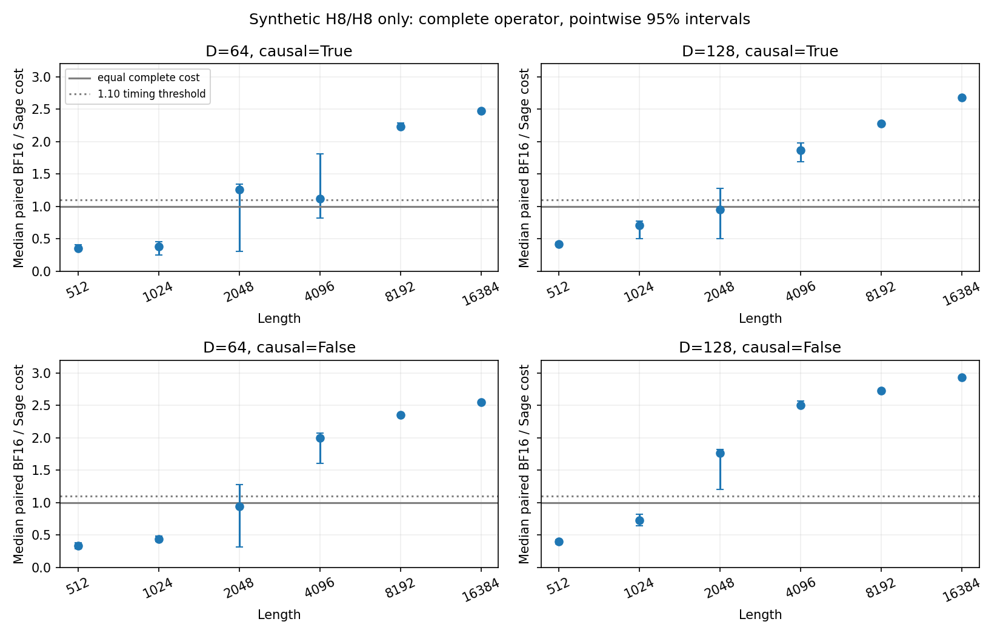
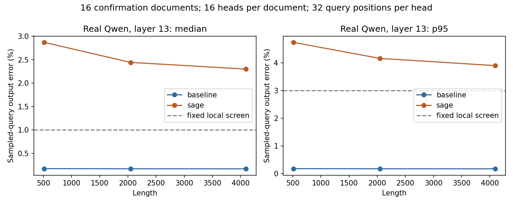

# Low-Precision Attention Break-Even on RTX 5080

Can official SageAttention INT8-QK/FP8-PV attention beat the fastest development-verified BF16 SDPA adapter after including all preprocessing, while meeting a fixed local output-error screen on real Qwen inputs?

The measured SageAttention path was faster on some shapes, but none of the three real-Qwen conditions passed the fixed local numerical screen. Sage's median sampled-query output error was 2.30–2.87%, above the 1% limit. The selection table therefore contains 0 local candidates. This is a completed operator comparison, not a model-quality or deployment verdict.

| Length | Complete speedup [95% CI] | BF16 median error | Sage median error | Sage p95 error | Decision |
| --- | --- | --- | --- | --- | --- |
| 512 | 0.373× [0.343, 0.387] | 0.173% | 2.872% | 4.735% | NUMERICAL_REJECT |
| 2048 | 1.465× [1.385, 1.518] | 0.170% | 2.444% | 4.157% | NUMERICAL_REJECT |
| 4096 | 2.100× [2.093, 2.105] | 0.169% | 2.301% | 3.897% | NUMERICAL_REJECT |

BF16 means the shape's frozen default/forced-Flash choice, not math fallback. Speed is the median paired complete-operator wall-cost ratio over five process rounds. Error uses a common FP32 reference and round 0 only: 16 new synthetic documents, 16 heads each, 32 sampled queries per head. The screen is median ≤1%, p95 ≤3%, with no invalid or unresolved near-zero units. These are local engineering limits, not downstream task-quality tolerances.

## What ran

- RTX 5080 SM120, WSL2 Ubuntu 24.04.4, driver 610.47; Python 3.12.14, Torch 2.13.0+cu130, Triton 3.7.1, Transformers 5.17.0, SageAttention 2.2.0.
- All 24 synthetic shape conditions and all three real-Qwen GQA geometries ran in all five confirmation processes. There were no OOM or unsupported shape results. Synthetic results remain `SYNTHETIC_ONLY`; they do not share Qwen's H16/H8 head geometry.
- Full layer-13 Q/K/V from pinned Qwen3-0.6B; all 48 confirmation captures matched native BF16 replay bitwise. Full activations and weights are not distributed.
- Actual fused BF16 and INT8/FP8 kernel execution was profiled outside timing. Matching static GPU instructions were inspected; they are not dynamic instruction counters.
- Complete cost includes smoothing, quantization, layout/padding, attention, output conversion and wrapper overhead. Kernel-only figures are explicitly auxiliary.

## Experimental design

The experiment separates two questions: whether the full operator is cheaper at a given shape, and whether its local attention output remains within a fixed numerical tolerance. A fast synthetic result alone cannot answer the second question for Qwen.

| Component | Fixed design | Purpose |
| --- | --- | --- |
| Synthetic sweep | Batch 1, Hq=Hkv=8; D=64/128; lengths 512, 1024, 2048, 4096, 8192, 16384; causal and noncausal: 24 conditions | Map measured cost and support across shapes, without treating random tensors as model-quality evidence. |
| Real Qwen inputs | Qwen3-0.6B, layer 13, batch 1, Hq=16/Hkv=8, D=128; causal lengths 512, 2048, 4096 | Measure complete-operator cost on real head geometry and local output error against the same reference. |
| Development | Eight existing synthetic documents; separate Gaussian seeds | Check capture and backend semantics and choose the BF16 path before confirmation. |
| Confirmation | Sixteen new synthetic documents: five English, five Korean, six code | Evaluate the fixed choices on document IDs and prefixes not used for development. |
| Common contract | GPU-resident BF16 Q/K/V → BF16 O, same scale, causal mask and GQA mapping, dropout=0 | Include necessary conversions and preprocessing without changing the operator interface. |
| Repetition | Five fresh processes; 20 warmups and 20 blocks of 10 calls per backend/input in each process | Retain timing variability and balanced backend order, rather than select a favorable run. |

The model revision, exact input tokens, sampling positions, source hashes, thresholds and baseline choices are in the [frozen protocol](configs/experiment_spec.json). The [input manifest](inputs/manifest.json) and [model manifest](provenance/model.json) make the inputs recapturable without distributing weights or full activations. This is a local protocol fixed before confirmation, not an external preregistration.

Both BF16 choices were verified fused SDPA executions: default dispatch and explicitly forced Flash. For each shape, development timing selected one and confirmation retained that choice. The reference is therefore the faster of these two tested adapters in development, not a claim to have found the fastest BF16 implementation across all libraries. No math fallback was used for the speed denominator.

Real-Qwen timing uses **every query position** in the captured tensor. Only error calculation samples 32 fixed queries per head, each against every causal-valid key. The capture is post-QK-normalization and post-RoPE; GQA heads are not expanded. Model capture and operator timing run in separate processes.

At each length, 16 documents × 16 heads give 256 document/head units. They are repeated observations within 16 document clusters. Lengths are prefixes of the same documents; the five timing processes do not increase the independent document count. The inputs share a narrow self-authored template family, so unique IDs do not establish broad domain coverage.

## Validation and evidence

| Check | Recorded outcome | What it establishes |
| --- | --- | --- |
| CPU harness tests | 28 passed; imports of Torch, SageAttention and Transformers blocked | Small FP64 references, mask/GQA examples, near-zero handling, timing boundaries, paired resampling, threshold boundaries, hash checks and rejection of mock timing records. |
| Explicit GPU Gate 0 | 12 checks passed | Actual BF16/Sage execution, output shape/dtype, explicit scale, GQA mapping, causal behavior and unchanged inputs on small development fixtures. |
| Capture versus native BF16 | All 48 confirmation captures bitwise equal to BF16 adapter replay | The captured full attention inputs reproduce the native interface under the tested configuration. |
| Low-precision execution | Profiler specialization matched compiled INT8 QK and FP8 PV instruction-bearing symbols | The candidate runs low-precision matrix instructions; it is not FP8 storage converted back to BF16 matmul. Static instruction occurrences are not dynamic call counts. |
| Complete versus isolated call | Kernel-only output matched the public wrapper bitwise for each measured input | The auxiliary timing corresponds to the same kernel result, while excluding preparation costs explicitly. |
| Confirmation execution | Five processes completed; 1,440 backend/input records, no OOM or unsupported condition | Coverage of all 24 synthetic and three Qwen geometries. This record count is not an independent sample count. |
| Scalar recomputation | 14,400 repeated unit errors and 594 aggregate values matched | Recorded row norms, relative/RMS errors and latency/error summaries are internally consistent under a separate scalar calculation. |
| Reanalysis and integrity | Tables/figures regenerated; protocol and input hashes verified | Public outputs can be traced to the included records without rerunning GPU measurements. |

The [GPU probe](provenance/backend_probe.json), [instruction evidence](provenance/instruction_evidence.json), [artifact audit](provenance/artifact_audit.json) and [execution log](provenance/validation.log) support these checks. They were performed with Codex assistance; they are not a claim of independent human or third-party GPU reproduction. The numerical audit recomputes metrics from recorded row norms. Independently recalculating attention outputs requires recapture using the supplied inputs and model revision.

The small Gate 0 tolerance was a coarse semantic check, separate from the 1% median/3% p95 confirmation screen. Passing that check, producing finite output, or obtaining high cosine similarity did not override a failed confirmation screen. The development error was already above 1%; the confirmation threshold was kept unchanged.

## What the result implies

1. **Kernel-only speed can give the wrong adoption signal.** At Qwen length 512, the prequantized internal call had a 0.0202 ms wall median, versus 0.0383 ms for BF16. The complete Sage call took 0.0996 ms. Excluding preparation would turn an observed full-call slowdown into an apparent advantage. These medians are descriptive; the primary speedup uses paired block ratios.
2. **Longer inputs can amortize the complete-call cost.** Qwen lengths 2048 and 4096 reached 1.465× and 2.100× paired median speedup, including preprocessing. This identifies measured points, not a universal sequence-length threshold. Several smaller synthetic conditions had wide intervals, so a single smooth crossover rule is not supported.
3. **Latency and local fidelity lead to different answers.** All three Qwen lengths exceeded both error limits. BF16-reference median errors were about 0.17%, versus 2.30–2.87% for Sage. Under this experiment's combined rule, the eligible real-Qwen region is empty even where timing improves.
4. **The rejection is local and conditional.** It does not establish a downstream task-quality loss, reject other SageAttention precision settings, or generalize to other layers, models or GPUs. A separate test would be needed to decide whether these output differences matter for a specific task.
5. **Causal masking does not guarantee prefix-invariant approximation.** A separate development stress test changed future V ranges and changed earlier Sage outputs through sequence-wide quantization statistics. It was not pooled into ordinary-input fidelity; no decode or prefix-invariance guarantee follows from this prefill experiment.

The practical outcome is to keep BF16 for this exact real-Qwen configuration. A useful follow-up would compare a separately fixed precision setting against the same complete-cost and fidelity criteria. No such follow-up, new kernel or automatic model routing was implemented here.




Read [ANALYSIS](ANALYSIS.md) for all 24 speed conditions, kernel-only costs, error tails and observed crossovers; [METHODS](METHODS.md) for boundaries and statistics; and [selection_table.csv](results/selection_table.csv) or [JSON](results/selection_table.json) for exact decisions. The [shape table](figures/selection_table.png) is a compact visual index. Raw [round 0](results/confirmation/round-0.json), [1](results/confirmation/round-1.json), [2](results/confirmation/round-2.json), [3](results/confirmation/round-3.json), [4](results/confirmation/round-4.json) retain all block timings, numerical records and device samples.

## Reproduce the recorded analysis

From this case directory, use NumPy 2.3.5 and Matplotlib 3.10.8 for analysis. CPU tests import neither Torch nor SageAttention:

```bash
python -m unittest discover -s tests -v
sha256sum -c SHA256SUMS
python scripts/analyze.py --output-dir /tmp/case004-analysis
python scripts/make_report.py --analysis-dir /tmp/case004-analysis --output-dir /tmp/case004-report
```

Use a fresh output directory for derived files. Analysis verifies the frozen source/input hashes and recomputes unit errors from retained row norms before aggregating.

## Replay GPU measurements

[INSTALL](provenance/INSTALL.md) describes the isolated environment and both build attempts, including the first link failure. Set `CASE004_PYTHON`, `CASE004_WORK` and `QWEN_SNAPSHOT` to your own compatible interpreter, private working directory and existing pinned model snapshot. No weights download is implicit. Preserve the distributed results; use a disposable copy of the case with its `results/confirmation/round-*.json` and `provenance/confirmation_capture.json` moved aside before replay. Those confirmation files are not members of `frozen_files`.

```bash
"$CASE004_PYTHON" scripts/verify_artifacts.py --snapshot "$QWEN_SNAPSHOT" --model-only
"$CASE004_PYTHON" scripts/probe_backend.py --output "$CASE004_WORK/replay-gate0.json"
"$CASE004_PYTHON" scripts/capture_qwen.py --split confirmation \
  --snapshot "$QWEN_SNAPSHOT" --work-dir "$CASE004_WORK"
for round in 0 1 2 3 4; do
  "$CASE004_PYTHON" scripts/benchmark.py --stage confirmation --round "$round" \
    --work-dir "$CASE004_WORK" || break
done
```

The preserved model hashes are in [model.json](provenance/model.json). The exact binary/environment fingerprint is intentionally checked: a different installation needs a separately versioned development run and local protocol, not a silent claim to match this run. To create a new protocol, use a fresh experiment copy, generate/check inputs with `prepare_inputs.py`, capture development traces, run `benchmark.py --stage dev --round 0`, and then `freeze_protocol.py`; never replace published confirmation records.

The [selector](scripts/select_backend.py) only looks up an exact environment/model/input-family/spec/shape record and otherwise returns BF16/UNKNOWN. It does not modify model dispatch. [NOTICE](NOTICE.md) credits SageAttention's authors and Codex assistance. This case contains independent measurement code and self-authored synthetic inputs; it does not claim a new attention algorithm, preserved model quality or production readiness.
