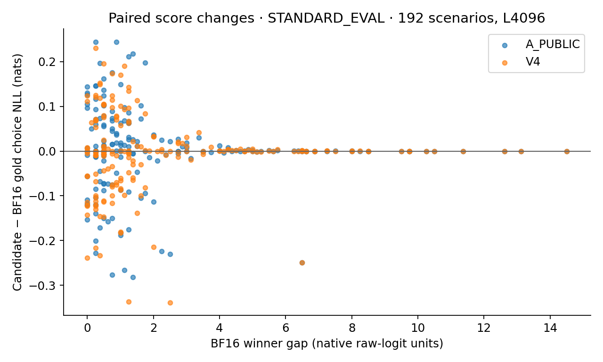

# Decision Stability Audit for Low-Precision Attention

Controlled Qwen prefill interventions, paired answer scores and reproducible evidence.

On an RTX 5080, replacing only Qwen3-0.6B layer 13's prompt-prefill attention changed 5 of 192 standard-set choices with A_PUBLIC and 8 with V4. These included 2 and 4 gains against independently computed gold, with no standard-set regressions; a separately selected boundary stress set did contain regressions. The task-balanced mean gold-NLL changes had intervals spanning zero. This case retains the score changes, decision transitions and actual model-prefill costs rather than treating similar aggregate accuracy as equivalent behavior.

**Measured scope:** Qwen3-0.6B BF16, zero-based layer 13, B1 / Hq16 / Hkv8 / D128, causal L4096. All other layers and every decode step remain BF16. **Status: COMPLETED_CONTROLLED_STUDY; deployment NOT_ASSESSED.** This is a narrow synthetic forced-choice study, not evidence of general model-quality preservation.

## Primary result

| Arm | Correct / 192 | Gold choice NLL change, nats [95% CI] | Regressions | Gains | All choice flips |
|---|---:|---|---:|---:|---:|
| B | 104 / 192 | Reference | — | — | — |
| A_PUBLIC | 106 / 192 | +0.00109 [-0.01198, +0.01404] | 0 / 104 B-correct | 2 / 88 B-wrong | 5 / 192 |
| V4 | 108 / 192 | -0.00718 [-0.01920, +0.00446] | 0 / 104 B-correct | 4 / 88 B-wrong | 8 / 192 |

Positive NLL change is worse. Intervals are paired, task-stratified, scenario-cluster bootstrap intervals (5000 draws). A flip can be a gain, regression or different wrong answer. A_PUBLIC/V4 had 3/4 wrong-to-wrong flips. Zero regressions here does not establish zero risk: the BF16-conditioned stress set had 2/1 regressions among 46 selected scenarios.



## Question and implementation

When does a small attention perturbation change answer scores or choices even if aggregate accuracy looks similar? Three fact-first task families have independent exact gold: key retrieval, value comparison and bounded Python arithmetic. Native one-token option logits are scored without supplying a gold or future continuation. A scoped adapter changes only the chosen prompt-prefill operator, restores the original path after exceptions, and records full-output validity and actual kernel routes.

A_PUBLIC uses the pinned SageAttention INT8-QK / FP8-PV bundle; V4 uses INT8-QK / FP16-PV. These are bundles, not an isolated accumulator experiment or a monotonic precision scale. The model weights and output head remain BF16.

## Read the evidence

- [Offline explorer](demo/index.html): download/open the HTML in a browser. It embeds the measured data and figures, uses no network, and filters exact items by task, set, length, arm and outcome. GitHub's source view is not a running demo.
- **30 seconds:** read the standard outcome table; inspect one item’s gold, four probabilities and allowed-label mass; switch to the separately conditioned stress set. Do not interpret its flip rate as a workload rate.
- [Analysis](ANALYSIS.md), [methods](METHODS.md), [raw evidence index](results/README.md), [summary](results/study/summary.json), [paired item records](results/study/pairs.json).
- [English/Korean portfolio card](PORTFOLIO.md), [Korean explanation](README.ko.md), [limitations](LIMITATIONS.md).

## Model-level cost

| Arm | Complete model-prefill speedup [95% CI] | Wall median / block-mean p95 (ms) |
|---|---|---|
| B | 1.000x (control) | 87.595 / 88.460 |
| A_PUBLIC | 1.0041x [1.0033, 1.0052] | 87.231 / 88.046 |
| V4 | 1.0014x [1.0007, 1.0023] | 87.440 / 88.328 |

These are new measurements of complete prompt forward with a last-position LM head: 12 fixed scenarios, three processes, five paired blocks of five calls. They are not Case005's operator-only speedups or server TTFT. Block-mean p95 is not service p95. All arms retain the same BF16 weights.

## Limits that affect interpretation

BF16 answered retrieval 59/64, comparison 30/64 and code 15/64 correctly. Weak code utility and shared templates limit conclusions. Inputs use repeated irrelevant filler for exact length; they are not customer documents. Only one model/layer/device and two fixed interventions were measured. Local numerical fidelity is not task accuracy, and non-significant mean differences do not prove equivalence.

The separate 24-scenario JSON-generation diagnostic had **0/24 strict schema-valid outputs in every arm**. Markdown fences, unsupported output format and truncated responses remain in the evidence. It supports bounded token-path observations, not a successful structured-output task benchmark. No output repair or prompt retuning was applied.

## CPU reproduction

Use the tested CPU dependencies in `requirements-cpu.txt`; no GPU, model download or network is needed to reanalyze retained scalar evidence. Run from this case directory, with new output locations outside it:

```bash
python -B scripts/verify_publication.py --output /tmp/case006-publication-check-new.json
python -B scripts/analyze_study.py --records results/raw/paired/*.json --timing results/raw/timing/*.json --secondary results/raw/secondary/*.json --output /tmp/case006-analysis-new
python -B scripts/audit_study.py --records results/raw/paired/*.json --summary /tmp/case006-analysis-new/summary.json --output /tmp/case006-audit-new.json
python -B scripts/audit_timing.py --timing results/raw/timing/model-timing.json --summary /tmp/case006-analysis-new/summary.json --output /tmp/case006-timing-audit-new.json
python -B scripts/plot_study.py --summary /tmp/case006-analysis-new/summary.json --pairs /tmp/case006-analysis-new/pairs.json --output /tmp/case006-figures-new
```

[REPRODUCTION.md](REPRODUCTION.md) includes demo, package and pinned-local GPU commands. CPU consistency checks cannot independently reproduce omitted full tensors or kernel execution. The frozen design and evaluation manifests remain unchanged; reporting files were completed afterward.

## Attribution

Qwen, Transformers and SageAttention provide the model and kernels. This case contributes controlled intervention, gold-grounded paired evaluation, explicit validity handling, CPU auditing and an offline evidence explorer. Codex assisted implementation, local execution, analysis and documentation. [NOTICE](NOTICE.md) records pinned sources and reuse from Cases004/005. Case005's STOP_DEV_SCREEN remains unchanged. No third-party GPU reproduction or human review is claimed.

## Post-hoc / same-input readout supplement

All 5 A_PUBLIC and 8 V4 native choice changes in the 192-scenario standard set involved an exact top-score tie in B or the candidate. The same final hidden states read through a full-vocabulary FP32 output projection produced 3 changes for each candidate, with no exact four-option top ties. This shadow readout also introduced new changes: it does not erase the native outcomes or establish improved model quality. All original results remain unchanged; this is a post-hoc, same-input diagnostic. See [the separately labelled supplement](supplemental/readout-ties-v1/README.md). Original generation and model-prefill results above remain unchanged.


The supplement reuses the same 192 standard and 46 selected stress scenarios, not 238 additional independent samples. [Supplemental figure](supplemental/readout-ties-v1/figures/01_readout_flips.png) and [complete tie/readout tables](supplemental/readout-ties-v1/results/derived/TABLES.md) preserve task-wise results, newly observed shadow flips and the limits of attributing differences to output rounding. The FP32 head is a diagnostic, not a quality-improvement or deployment recommendation.

## Download and publication snapshot

[Download the combined original + supplement ZIP](../../downloads/case006_decision_stability_with_readout_20260917_docfix1.zip) · [archive size and SHA256](../../downloads/case006_decision_stability_with_readout_20260917_docfix1.json).

Unzip and open `demo/index.html` for the original native explorer or `supplemental/readout-ties-v1/demo/index.html` for the separately labelled readout diagnostic. Both are offline HTML files; GitHub's HTML source preview is not a running demo. The supplemental file was tested through `file://` in Windows Edge 153 at desktop and emulated tablet sizes. Real iPad operation remains untested; GitHub Pages is not enabled by this publication.

Original protocols, raw results, native summaries, figures and historical `RUN_STATE.json` remain unchanged. The original `SHA256SUMS` describes the pre-publication reviewed snapshot; `PUBLICATION_SHA256SUMS` describes this combined publication package. [Publication provenance](provenance/publication_snapshot.json) identifies the historical archives and the presentation-only changes. See [reproduction](REPRODUCTION.md#publication-package-verification) for the two verification scopes.
