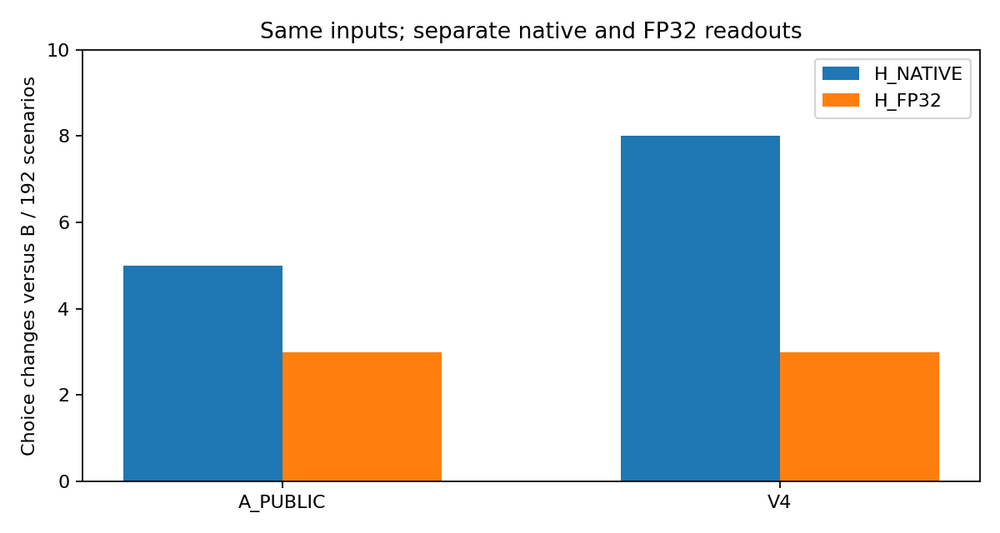

# Native ties and same-hidden-state readout sensitivity

**POST-HOC SAME-INPUT READOUT DIAGNOSTIC — original Case 006 remains unchanged.**

All 5 A_PUBLIC and 8 V4 native choice changes in the 192-scenario standard set involved an exact top-score tie in B or the candidate. The same final hidden states read through a full-vocabulary FP32 output projection produced 3 changes for each candidate, with no exact four-option top ties. This shadow readout also introduced new changes: it does not erase the native outcomes or establish improved model quality. All original results remain unchanged; this is a post-hoc, same-input diagnostic.



## What ran

238 existing L4096 scenarios (192 standard and the original 46 selected stress IDs), three original attention arms, one unchanged BF16 Qwen3-0.6B model. We reused 238 verified B final-normalized hidden vectors, replayed 476 missing candidate cells once, and ran six fixed smoke forwards. Every replay's full native vocabulary vector exactly matched its original. All 714 core cells received a separate full-vocabulary GPU FP32 head readout and CPU FP64 four-option check. No new scenarios, generation, timing, model downloads or installations were used.

## Main readout contrasts

| Set | Readout | Arm | B correct | Candidate correct | Flips | Regression | Gain | Wrong-to-wrong | B / candidate top ties |
|---|---|---|---:|---:|---:|---:|---:|---:|---|
| standard | H_NATIVE | A_PUBLIC | 104/192 | 106/192 | 5 | 0 | 2 | 3 | 14 / 12 |
| standard | H_NATIVE | V4 | 104/192 | 108/192 | 8 | 0 | 4 | 4 | 14 / 9 |
| standard | H_FP32 | A_PUBLIC | 104/192 | 105/192 | 3 | 1 | 2 | 0 | 0 / 0 |
| standard | H_FP32 | V4 | 104/192 | 106/192 | 3 | 0 | 2 | 1 | 0 / 0 |
| boundary_pool | H_NATIVE | A_PUBLIC | 18/46 | 17/46 | 3 | 2 | 1 | 0 | 0 / 3 |
| boundary_pool | H_NATIVE | V4 | 18/46 | 19/46 | 3 | 1 | 2 | 0 | 0 / 4 |
| boundary_pool | H_FP32 | A_PUBLIC | 18/46 | 17/46 | 1 | 1 | 0 | 0 | 0 / 0 |
| boundary_pool | H_FP32 | V4 | 18/46 | 17/46 | 3 | 2 | 1 | 0 | 0 / 0 |

Each candidate is compared to B **within the same readout**. The native and shadow views do not double the sample size. The selected stress set is not an estimate of ordinary-workload risk. [All task tables, tie partitions and intervals](results/derived/TABLES.md) retain the comparison/code floors.

On STANDARD, 1 of A_PUBLIC's 5 native flips persisted, 4 vanished, and 2 new flips appeared. For V4, 1 of 8 persisted, 7 vanished, and 2 new flips appeared. Tie-breaking is part of the original native system; tie-involved choices are not dismissed as artifacts.

## Controls and interpretation

Widening already-rounded native logits preserved all values, ties and predictions (714/714). FP32 → BF16 round trips reproduced the four option scores in 714/714 cells, but **none of the 714 full vocabulary vectors matched completely** (maximum absolute difference 0.0625). This is consistent with an output-rounding contribution for the observed choices, while GEMM/reduction-path differences remain visible. It does not attribute all model error to rounding.

The CPU FP64 four-label calculation disagreed with the FP32 winner in 0/714 cells; maximum option difference was 6.447e-6 and maximum gap difference 8.168e-6. FP64 is a numerical check on represented BF16 weights/hidden values, not mathematical exactness or restored training precision.

Local candidate-to-B error showed weak/mixed descriptive associations with absolute margin change; sparse flips do not support ranking predictors. The standard V4 shadow NLL difference has a post-hoc interval below zero; this conditional numerical observation is not fresh evidence of broadly improved task quality. [Methods](METHODS.md) define the two readouts, grouping and uncertainty.

The original structured-generation diagnostic remains **0/24 valid JSON outputs in every arm**. Original model-prefill changes remain about **0.4% / 0.14%**, not the earlier operator speedups. This supplement measured neither generation nor performance. Deployment remains `NOT_ASSESSED`.

## Inspect and reproduce

Open [the standalone HTML](demo/index.html) directly from disk. It embeds measured inputs and scores, defaults to native STANDARD, and exposes FP32 as a separate labelled view. File loading, filters, empty groups and downloads were tested with installed headless Edge on Windows via a WSL UNC file URL, at desktop and emulated tablet sizes. **Real iPad: NOT_TESTED.**

From this supplement directory, use the original tested CPU environment (Python 3.12.14, NumPy 2.3.5; Matplotlib 3.10.8 for figures), without installing anything for this audit:

```bash
python -B -m unittest discover -s tests -v
python -B scripts/readout_analysis.py --case . --output /tmp/readout-analysis-new
python -B scripts/verify_scalar.py --case . --summary /tmp/readout-analysis-new/summary.json --output /tmp/readout-audit-new.json
python -B scripts/build_materials.py --case . --analysis /tmp/readout-analysis-new --output /tmp/readout-materials-new
```

Outputs must be new locations; measurement files are never overwritten. The GPU replay command is documented in [METHODS.md](METHODS.md) and requires the excluded original private vectors and pinned cached assets. CPU reanalysis verifies scalar arithmetic, not independent GPU replication.

## Files and attribution

- [Frozen supplementary protocol](protocol.json), [input manifest and exact tokens](inputs/core.json), [separate gold](inputs/gold.json).
- [Evidence schema](results/SCHEMA.md).
- [Native records](results/raw/native.json), [shadow records and controls](results/raw/shadow.json), [summary](results/derived/summary.json), [item pairs](results/derived/pairs.json).
- [Independent scalar audit](provenance/scalar_audit.json), [browser checks](provenance/browser_validation.json), [original file hashes](provenance/original_case_files.json).
- [Korean explanation](README.ko.md), [portfolio card](PORTFOLIO.md), [attribution and reuse](NOTICE.md).

Qwen and SageAttention are upstream work. This supplement contributes the tie-aware/readout diagnostic, checked evidence and offline presentation, with Codex assistance. It does not introduce a quantizer or a deployment approval.
