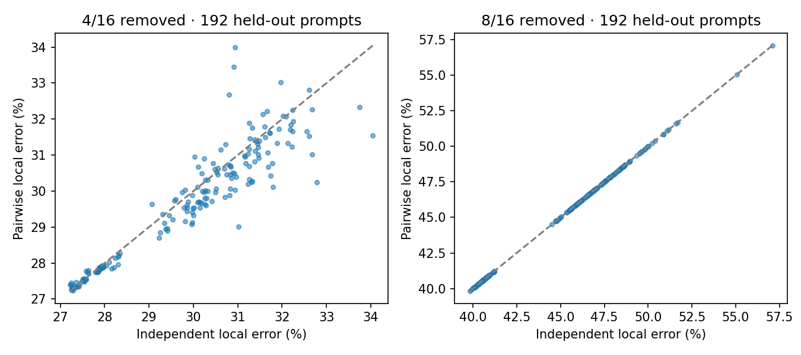

# 상호작용을 고려한 구조화 MLP 압축 실험

[English](README.md) | 한국어

Qwen3-0.6B의 MLP 한 층을 구조적으로 25% 삭제했을 때, 상호작용을 고려한 선택은 미관측 입력의 국소 재구성 오차를 작게 줄이고 기준 모델의 분포와 선택을 더 가깝게 보존했습니다. 50%에서는 두 선택기가 같은 삭제 집합을 골라 서로 다른 구조의 비교가 성립하지 않았습니다. 고정된 두 예산 규칙에 따라 종합 판정은 **COMPLETED_NO_CLEAR_TRANSFER**입니다. 기준 모델에 더 가까운 결과가 가장 좋은 정답 NLL을 주지는 않았고, 모델 전체 prefill 가속도 입증하지 못했습니다.

**범위:** RTX 5080, zero-based layer 13의 원래 BF16 dense MLP, 길이512, 재학습 없음. B는 삭제 전 BF16 기준선입니다. INDEPENDENT는 그룹별 중요도, PAIRWISE는 부호가 있는 그룹 간 상호작용도 사용합니다. 삭제 예산은 연속16그룹 중4개 또는8개입니다. 보정96·개발48·미관측192개 합성 입력과 별도 smoke6개를 사용했습니다. 국소 오차는 입력당 고정32토큰의 MLP 출력을 묶어 계산하며, 불확실성의 단위는 토큰이 아닌 입력입니다. 미관측 입력은 원래 선택 당시에 보지 않은 자료였으며, 이번 공개 준비의 재검산은 새로운 평가가 아닙니다.

## 미리 고정한 무작위 삭제 집합과의 비교

두 중요도 기반 선택은 같은 예산에서 미리 고정한 무작위 삭제 집합20개 **각각보다 평균 미관측 국소 오차가 낮았습니다.** 상호작용 정보가 더한 추가 이득은25% 예산에서 작게 관측됐습니다.

<!-- publication-table: random -->
| 평균 미관측 국소 오차 | 25% 삭제 | 50% 삭제 |
|---|---|---|
| 고정 random 20개 중 최솟값 | 32.5468% | 48.0447% |
| 집합별 평균의 중앙값 | 48.8427% | 66.9175% |
| 고정 random 20개 중 최댓값 | 71.4458% | 81.5654% |
| INDEPENDENT | 29.8291% | 45.1326% |
| PAIRWISE | 29.6288% | 45.1326% |
| 선택법보다 오차가 낮은 random 집합 | 0/20 | 0/20 |
<!-- /publication-table: random -->

각 삭제 집합에서 같은192개 입력의 상대오차를 먼저 평균하고, 그20개 집합별 평균의 최솟값·중앙값·최댓값을 구했습니다. 최솟값은 이번20개 중 가장 낮은 값이며 모든 집합의 최적값이 아닙니다. 고정 reference에 대한 기술통계이지 모든 무작위 방식에 대한 통계적 우월성이나 전역 최적성의 증거는 아닙니다. Random 집합은 국소 MLP 입력에서만 비교했으며 전체 모델 품질·속도를 측정하지 않았습니다. 20×192를3,840개 독립 입력으로 세지 않습니다. [원래 분석 — 영어](ANALYSIS.md#all-random-references) · [보존된 요약](results/derived/summary.json).

## 작은 국소 개선과 유지되는 종합 판정

25%의 입력별 평균 상대오차 차이(PAIRWISE−INDEPENDENT)는 **−0.200277퍼센트포인트**, 점별95% 구간은 **[−0.284779, −0.114472]**이고 **141/192개** 입력에서 더 낮았습니다. 상대오차 자체는 약29.8%이므로 추가 감소량은 작습니다. 이를 정답률0.2% 개선으로 해석하지 않습니다.

INDEPENDENT_4는 `[8,12,13,14]`, PAIRWISE_4는 `[8,13,14,15]`를 삭제합니다. 50% 두 설정은 모두 `[7,8,9,11,12,13,14,15]`를 삭제했고 가중치와 기록된 출력이 같습니다. [0,0] 구간은 동일 구조의 결과이지 별도의 비열등성 증거가 아닙니다. 사전 규칙은 두 예산 모두에서 구간 상한이0보다 작을 것을 요구했고, 이 기준을 바꾸지 않았습니다. [고정 protocol](configs/protocol.json) · [선택 집합](results/raw/selection.json) · [입력별 차이](results/derived/pairs.json).

## 기준 모델 보존과 정답 점수는 다른 목표입니다

INDEPENDENT_4와 PAIRWISE_4는 각각16그룹 중4그룹을 삭제합니다. 정답(gold)은 과제에서 별도로 계산했습니다. 회귀는 B가 맞힌 답을 후보가 틀린 경우, 개선은 B가 틀린 답을 후보가 맞힌 경우입니다.

<!-- publication-table: quality -->
| 지표 · held-out 192개 | INDEPENDENT_4 | PAIRWISE_4 |
|---|---|---|
| 평균 국소 상대 Frobenius 오차 | 29.8291% | 29.6288% |
| 평균 전체 어휘 KL(B ∥ 후보), nats | 0.125937 | 0.042244 |
| B 대비 선택 변경 | 48/192 | 12/192 |
| B 정답 → 후보 오답 (회귀) | 15/94 | 2/94 |
| B 오답 → 후보 정답 (개선) | 14/98 | 3/98 |
| 오답 → 다른 오답 | 19/192 | 7/192 |
| 정답 수 | 93/192 | 95/192 |
| 평균 Δ정답 선택지 NLL(후보−B), nats | -0.336159 | -0.266299 |
<!-- /publication-table: quality -->

회귀의 분모는 B가 맞힌 **94개**, 개선의 분모는 B가 틀린 **98개**입니다. 선택 변경과 다른 오답으로의 변경은 전체192개를 분모로 씁니다. 낮은 국소 오차와 KL은 B의 계산·분포에 더 가까움을 뜻합니다. 선택 변경 감소는 B의 답을 더 많이 보존했다는 뜻이며 B가 항상 정답은 아닙니다. NLL은 네 선택지로 조건화한 정답 확률의 음의 로그입니다. ΔNLL은 후보−B이므로 **음수가 더 좋습니다.**

낮은 재구성 오차와 높은 기준선 충실도가 가장 좋은 정답 NLL을 뜻하지는 않았습니다. 기준 모델 보존과 정답 품질은 이 실험에서 다른 평가 목표입니다. 전체 어휘 KL(B ∥ 후보)은 전체 원래 logits로 계산해 저장한 측정값이며, 공개된 네 선택지 logits나 norm만으로 독립 복원할 수 없습니다. [측정 구현](scripts/run.py) · [지표 정의](src/core.py).

기존 **사후 분석**의 직접 PAIRWISE−INDEPENDENT 비교에서 정답 선택지 NLL은 **+0.069860 nats [0.025925, 0.111997]**로 PAIRWISE가 더 나빴습니다. 정답률 차이는 **+1.04퍼센트포인트 [−4.17, +6.25]**입니다. 점별 구간이며 그룹 선택이나 원래 판정에 쓰지 않았습니다. [사후 기록](results/derived/posthoc_completion_notes.json) · [스칼라 검사기](scripts/verify_completion.py). 어떤 구성요소가 원인인지 분리해 입증한 결과는 아닙니다.

B의 정답 수는 검색63/64, 비교15/64, 코드16/64입니다. 25% 두 후보는 검색 선택이 바뀌지 않았고 모두63/64였습니다. 비교·코드의 기준 성능이 우연 수준에 가까워 실용적 해석이 제한됩니다. 선택형 점수이며 코딩 능력이나 자유 생성 품질의 개선을 뜻하지 않습니다.

## 실제 작은 모듈과 측정 비용

Gate/up 행과 down 열을 실제로 잘랐습니다. 해당 MLP의 너비/파라미터/BF16 bytes는 원래3072 / 9,437,184 / 18,874,368, 25% 삭제 후2304 / 7,077,888 / 14,155,776, 50% 후1536 / 4,718,592 / 9,437,184입니다. 나머지 층은 그대로이며 전체 모델의 압축 비율이 아닙니다. [구조 근거](provenance/structural_sizes.json).

국소 MLP 속도비는 **1.176–1.412배**였지만 모델 prefill 속도비의 모든 구간은1을 포함합니다. 동일50% 모듈의 설정 이름별 시간 차이는 측정 변동입니다. 고정6개 입력·3개 프로세스·5회 호출 평균 블록의 같은 장치 내 측정입니다. 메모리에는 비교 모듈도 함께 상주하며 장치 전체 peak는 측정하지 않았습니다. [비용·메모리 상세 — 영어](ANALYSIS.md#timing-variability-and-memory).

## 자료와 재현

- [검토 반영 공개 ZIP](../../downloads/case007_mlp_pruning_reviewed_publication_v1.zip) · [크기·SHA256 정보](../../downloads/case007_mlp_pruning_reviewed_publication_v1.json).
- [CPU 재검산·공개본 검사 안내 — 영어](REPRODUCTION.md) · [방법](METHODS.md) · [한계](LIMITATIONS.md).
- [오프라인 탐색기 — 영어 UI](demo/index.html): 다운로드한 HTML을 로컬에서 엽니다. GitHub 소스 미리보기는 실행형 데모가 아닙니다. 브라우저 검사는 과거 기록이며 실제 iPad는 NOT_TESTED입니다.
- [한·영 포트폴리오](PORTFOLIO.md) · [검토본→공개본 보존 기록](provenance/publication_snapshot.json).

배포는 **NOT_ASSESSED**이며 이번 게시 준비의 GPU 실행은0회입니다. Qwen/Transformers가 모델을 제공했고 HOPE는 별도 MoE 문맥의 발상 출처입니다. 이 프로젝트는 통제된 선택, 실제 구조 축소, 측정·검산 가능한 근거를 연결했으며 Codex가 지원했습니다. 새 pruning 알고리즘이나 HOPE 재현으로 소개하지 않습니다. [출처·라이선스](NOTICE.md).
