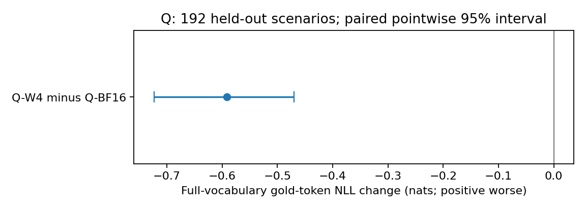
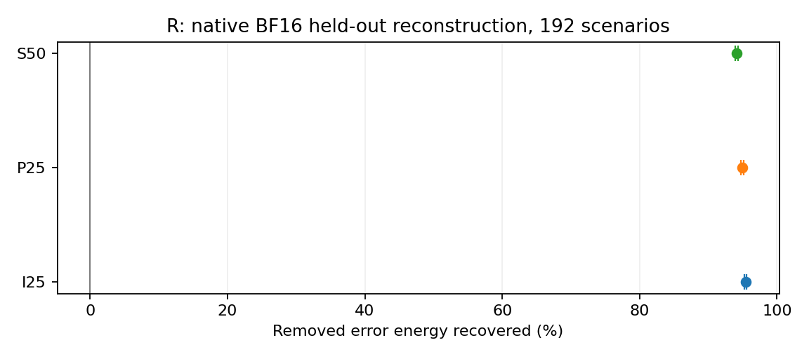
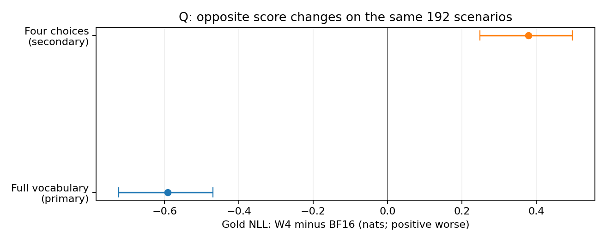

# Case 008 — 양자화 모델 제작·재실행과 구조 압축 후 계산 복구

**Qwen 모델의 저장·실행 통합과 고정 MLP 구조의 출력 재구성**

[English](REPORT.md) · [짧은 요약](README.ko.md) · [재현 안내(영어)](REPRODUCTION.md)

Q 트랙은 Qwen 4B를 GPTQ W4A16 저장본으로 만들고 다른 디렉터리의 새 vLLM 프로세스에서 실행했습니다. R 트랙은 Qwen 0.6B의 이미 축소한 MLP를 그대로 두고 출력 가중치만 보정했습니다. Q의 가중치 파일은 약 67.0% 작아졌고, R은 짧은 합성 평가 입력에서 삭제에 따른 제곱 출력 오차를 94.1–95.4% 줄였습니다. 요청 속도와 정답 성적은 아래에서 별도로 확인합니다.

실험 기록: [설계 동결](configs/build_freeze.json) 2026-09-19 13:37 UTC(22:37 KST), [완료 검증 기록](validation.json) 14:57 UTC(23:57 KST). 보고서 작성: 2026-09-20 KST. 제공된 사용자 검토서에는 별도 작성 시각이 없어 추정하지 않았습니다. 장치: RTX 5080. 근거: `case008_two_track_review_20260919.zip`, SHA256 `49cc2640b63d7662cf3d40c168eaf036505bbf5f7f5f73de8de48099d452daca`. 두 트랙의 모델·실행기가 다르므로 결합 압축 실험으로 합산하지 않습니다.

## 목차

1. [배경](#background)
2. [가설](#hypotheses)
3. [이론](#theory)
4. [방법](#methods)
5. [실험](#experiments)
6. [실험 결과](#results)
7. [결과 분석](#analysis)
8. [결론](#conclusions)
9. [레퍼런스](#references)

## 1. 배경

모델을 메모리에서 바꾸는 것만으로는 다른 실행 환경에서 다시 사용할 수 없습니다. 저장 형식, 실제 연산 경로, 구조 복원과 결과 검사가 이어져야 합니다. [Case 002](../002-bf16-fp8-document-extraction/README.md)는 공식 배포 모델을 비교했고, [Case 007](../007-interaction-aware-mlp-pruning/README.ko.md)은 한 층 MLP의 행렬을 실제로 줄였습니다. 이번에는 이 변경을 저장 가능한 모델과 새 프로세스 재실행까지 연결했습니다.

**Q는 숫자 표현과 실행 통합**, **R은 고정된 작은 구조의 계산 복구**를 다룹니다. 파일 크기, 실제 저정밀 커널 사용, 상주 가중치 메모리, 요청 시간, 정답 점수는 각각 다른 측정 대상입니다. 코드에서 볼 수 있는 기능은 [저장본 검사·로더](../../tools/modelpack/artifact.py), [GPTQ 변환](../../tools/modelpack/quantized.py), [고정 구조 보정](../../tools/modelpack/r_study.py), [스칼라 검산](../../tools/modelpack/audit.py)입니다.

## 2. 가설

다음은 결과를 본 뒤 만든 성공 기준이 아니라 [원래 설계](configs/build_freeze.json)의 검증 질문을 설명한 것입니다. 외부 사전등록이나 하나의 통계적 합격 시험으로 묶지 않습니다.

| 질문 / 성격 | 원기록과 확인 대상 | 관측 |
|---|---|---|
| Q 저장본을 새 프로세스로 읽을 수 있는가? / 엔지니어링 조건 | `reload`, `Q.recipe`; 완전한 key·shape·checksum, 새 경로와 프로세스 | 두 fresh process의 smoke 점수와 짧은 decode 일치 |
| Q의 저장·상주 표현이 작아지는가? / 사전 비교 질문 | `Q.recipe`, `timing.allocation`; 파일·parameter bytes | 둘 다 감소 |
| 작은 R 구조의 출력 오차가 미관측 입력에서도 줄어드는가? / 재구성 비교 | `R.teacher`, `R.eta_rule`; 같은 입력의 BF16 teacher 대비 오차 | 세 구조 모두 제곱오차 감소 |
| R 보정 전후 구조를 유지하는가? / 엔지니어링 조건 | 고정 `R.removed`, standalone export; tensor shape와 parameter 수 | down weight 하나만 변경, 크기 동일 |
| 정답 점수와 요청 비용은 어떻게 바뀌는가? / 탐색적 측정 | `data.primary_model_metric`, `timing`; paired NLL·정답 전환·벽시계 시간 | 점수 변화 혼재, 요청 가속 미확인 |

Q의 NLL 확률질량 분해, 코드의 상수 선택·생성 단서, 마지막 위치만의 분석은 **같은 기록에 대한 사후 진단**입니다. 원래 주지표와 판정을 대체하지 않습니다.

## 3. 이론

### 3.1 W4A16: 가중치 표현을 줄이기

**W4**는 양자화 대상 가중치를 4비트로 저장한다는 뜻이고, **A16**은 여기서 실제 BF16 활성값을 쓴다는 뜻입니다. 128개 가중치 그룹마다 scale을 두며 packed 정수·scale·shape가 함께 저장됩니다. embedding, normalization, tied output head는 native BF16입니다. 따라서 모든 모델 바이트나 VRAM이 정확히 4분의 1이 되는 규칙은 아닙니다.

GPTQ [1]는 보정 입력에서 얻은 정보를 쓰는 기존 양자화 방법입니다. 이 사례는 LLM Compressor의 구현을 한 recipe로 실행했습니다. 임의의 반올림 시뮬레이션을 실제 커널 결과처럼 쓰지 않았으며, 실행 기록에는 compressed-tensors 저장 형식을 읽은 vLLM의 Marlin 경로가 남아 있습니다 [3].

### 3.2 R: 삭제한 구조는 고정하고 출력 가중치를 맞추기

**MLP**는 토큰마다 중간 특징을 만들고 다시 모델의 hidden 크기로 돌려보내는 연산입니다. R의 원래 SwiGLU는 `SiLU(gate(x)) × up(x)`를 계산한 뒤 `down` 행렬을 곱합니다. 중간 3,072채널을 연속 192채널씩 16그룹으로 나눴습니다. 그룹은 의미별 문서 묶음이 아니라 행렬의 고정 채널 인덱스입니다.

Case 007에서 **INDEPENDENT**는 그룹을 따로 지웠을 때의 평균 기여도만 사용했고, **PAIRWISE**는 함께 지울 때의 부호 있는 교차항도 사용했습니다. 이번 R은 그때 선택한 집합을 가져오며 새로 선택하지 않습니다. **I25**는 독립 선택의 25% 삭제, **P25**는 상호작용 선택의 25% 삭제, **S50**은 두 방법이 같았던 50% 삭제 구조입니다. `-R`은 같은 작은 구조의 down projection을 보정한 버전이며, **R-B**는 삭제하지 않은 BF16 기준선입니다.

같은 MLP 입력에서 원래 BF16 출력이 교사값 $Y\in\mathbb{R}^{N\times d}$입니다. 실제 작은 gate/up 경로의 출력 $H\in\mathbb{R}^{N\times m}$를 사용합니다. 원래 큰 활성값을 사후에 잘라 같은 것이라고 가정하지 않습니다. 삭제 직후 down 가중치 $W_0$와 보정할 $W$의 크기는 모두 $d\times m$입니다.

$$\min_W \frac{1}{N}\lVert HW^T-Y\rVert_F^2+\lambda\lVert W-W_0\rVert_F^2.$$

$$G=H^TH/N,\quad C=Y^TH/N,\quad \lambda=\eta\,\mathrm{tr}(G)/m,$$

$$W(G+\lambda I)=C+\lambda W_0.$$

코드의 교차 통계 이름은 `b`이며 여기서는 기준선 B와 혼동하지 않게 $C$로 표기합니다. [solver](../../tools/modelpack/numerics.py)의 `fit_ridge`는 CPU FP64 Cholesky와 두 번의 solve를 쓰며 명시적 역행렬을 만들지 않습니다. 정규방정식 상대 잔차의 고정 상한은 $10^{-9}$입니다. DEV에서 공통 $\eta=0.01$을 선택하고 최종 가중치는 BF16으로 저장·평가했습니다. 보정 데이터를 사용한 적합이며, 역전파 학습을 하지 않았다는 뜻을 “학습 정보를 전혀 쓰지 않음”으로 넓히지 않습니다. SparseGPT [2]는 관련 연구이고 이 고정 dense ridge와 같은 방법은 아닙니다.

### 3.3 복구율과 정답 점수의 뜻

복구율은 `1 − Σ SSE(보정 후) / Σ SSE(삭제만)`입니다. **제곱오차 합의 비율**이며 입력별 회복률의 평균이나 정답률이 아닙니다. 192개 입력에서 같은 32개 위치를 측정하고, bootstrap 때마다 입력을 짝지어 다시 뽑아 양쪽 합을 재계산합니다.

별도로 계산한 정답(gold) 토큰을 $y$, 네 보기 집합을 $S$, 전체 어휘 확률에서 보기의 질량을 $m=\sum_{j\in S}p_j$라 하면:

$$\mathrm{NLL}_{full}=-\log p_y=\underbrace{-\log(p_y/m)}_{\mathrm{NLL}_{choice}}+\underbrace{(-\log m)}_{\mathrm{NLL}_{mass}}.$$

NLL(음의 로그우도)은 낮을수록 정답에 더 좋은 확률을 준 것입니다. 변화는 **후보−같은 트랙의 기준선**, 양수는 악화입니다. `mean(-log m)`은 `-log(mean m)`과 다릅니다. KL(B ‖ 후보)는 기준선 분포와의 차이이며 정답 여부를 판정하지 않습니다. 기준선이 맞힌 답을 후보가 틀리면 **정답 손실(regression)**, 기준선의 오답을 맞히면 **새 정답(gain)**입니다.

## 4. 방법

**Q: 변환 → 저장 검사 → 복사 → 새 실행기.** 252개 Linear를 GPTQ로 변환하되 output head는 제외했습니다. packed tensor·scale·shape·전체 key를 검사한 뒤 `qartifact.finalize`로 standalone manifest를 붙이고 별도 디렉터리로 복사했습니다. 두 새 vLLM 프로세스에서 prompt와 짧은 decode를 비교했습니다. fused runtime의 MarlinLinearKernel 경로 144개는 변환 Linear 252개와 다른 집계 단위입니다. before/after parameter inventory와 별도 profiler 기록은 저장 압축과 실제 실행을 연결합니다. [Q 코드](../../tools/modelpack/q_runtime.py) · [runtime 기록](results/raw/Q/Q-W4-runtime.json).

**R: 고정 삭제 → 적합 → BF16 저장 → 구조 로딩.** layer 13의 gate/up 행과 down 열을 같은 retained index로 잘랐습니다. post-attention layer normalization 뒤의 MLP 입력을 공유하며, 보정은 작은 down weight 하나에만 저장합니다. config 기반 meta skeleton에 해당 층 크기를 지정하고 safetensors를 엄격하게 할당한 뒤 tied embedding과 rotary buffer를 복원합니다. 원래 checkpoint를 다시 읽지 않는 standalone 로더입니다. [구조·로더 코드](../../tools/modelpack/artifact.py) · [재로딩 기록](results/raw/R/reload.json).

입력 변경, shape 불일치, 비유한 출력(NaN/Inf), 누락된 전체 출력 검사는 진행을 막습니다. 네 보기만 검사하지 않고 전체 block·norm·MLP·마지막 어휘 출력을 확인하는 경로를 사용했습니다. prompt에는 정답 continuation이 없으며, 한 토큰 답을 점수화하기 전 미래 정답을 넣지 않습니다. 실제 token hash와 gold를 기준으로 결과를 짝짓습니다. CPU 공개 검산은 option logits·보존 normalizer·norm 통계를 재계산합니다. 전체 KL·hidden vector·커널의 독립 재실행에는 공개하지 않은 데이터/환경이 더 필요합니다.

[재현 안내(영어)](REPRODUCTION.md)는 현재 공개본 CPU 검사, 원래 snapshot 복원, 향후 GPU 재현을 나눕니다. Q의 `build → finalize → copy → inspect → smoke evaluate`와 R의 arm별 복사 경로를 연결했습니다. 이번 게시 준비에서 GPU 명령은 실행하지 않았습니다.

## 5. 실험

| 조건 | Q | R |
|---|---|---|
| 모델 | Qwen3-4B-Instruct-2507 | Qwen3-0.6B |
| 고정 revision | `cdbee75f17c01a7cc42f958dc650907174af0554` | `c1899de289a04d12100db370d81485cdf75e47ca` |
| 변경 | GPTQ W4, group 128, symmetric, block 128, dampening 0.01, actorder 없음 | zero-based layer 13 MLP; hidden 1024, intermediate 3072; bias 없음 |
| 실행 | vLLM 0.29.0 / Marlin / BF16 활성·KV | Transformers 5.17.0 / BF16 |
| smoke / calibration / DEV / held-out | 6 / 256 / 64 / 192 | 6 / 128 / 48 / 192 |
| 실제 입력 길이 / 상한 | 98–130 / 1024 tokens | 103–134 / 512 tokens |

데이터는 영어 합성 검색·두 값 비교·제한된 정수 프로그램입니다. 평가셋은 과제마다 64개이며 모든 항목을 보고합니다. ID·사실·token hash의 split 중복을 검사했지만 생성 템플릿은 공유합니다. 상한까지 filler로 채우거나 정답 근거를 잘라내지 않았습니다. [입력 manifest Q](inputs/Q/manifest.json) · [R](inputs/R/manifest.json).

Q build 환경은 LLM Compressor 0.13.0, compressed-tensors 0.18.0, Transformers 5.14.1입니다. serving 환경은 compressed-tensors 0.17.0·Transformers 5.17.0이며 Torch 2.13.0·safetensors 0.8.0을 사용했습니다. 현재 웹 예제 버전으로 바꾸지 않았습니다. [환경·source hash](provenance/environment.json).

R 제거 그룹은 I25 `[8,12,13,14]`, P25 `[8,13,14,15]`, S50 `[7,8,9,11,12,13,14,15]`입니다. 25%는 2304채널, 50%는 1536채널을 남깁니다. 삭제만·보정 후 각각과 R-B를 합쳐 7설정입니다. calibration의 128입력 × 32위치(4096벡터)로 적합하고, 48 DEV 입력에서 다섯 eta 후보 중 세 구조 평균 상대 제곱오차가 가장 작은 **공통 eta**를 골랐습니다. 동률이면 더 큰 eta를 고르는 규칙도 고정했습니다. 그 뒤 [Q](configs/Q_evaluation_freeze.json)·[R](configs/R_evaluation_freeze.json) 평가 동결과 held-out 실행을 진행했습니다.

주 모델 지표는 과제별 가중치를 같게 둔 paired full-vocabulary gold NLL 변화입니다. 95% 구간은 입력을 과제 안에서 복원 추출한 5,000회 bootstrap(seed 808191)의 pointwise 구간입니다. head·token·arm 반복을 독립 표본 수로 세지 않습니다. Q/R 각각 192입력이지 두 모델의 위험률을 합친 384입력은 아닙니다.

시간 측정은 트랙마다 고정 12입력, 새 프로세스 3회, warmup 5회, paired block 5개 × 호출 3회입니다. 프로세스·과제 내 입력·block을 재표집하며 시간 bootstrap seed는 808192입니다. Q는 eager, batch 1, BF16 KV 1 GiB 고정이며 scheduler·sampling·readback을 포함한 blocking 요청입니다. R은 pretokenized prefill+argmax 또는 고정 8토큰 요청입니다. Q의 one-token 요청을 순수 prefill로 바꾸어 읽지 않습니다. timing의 EOS 무시는 작업량 고정을 위한 것이며 생성 품질 결과가 아닙니다.

## 6. 실험 결과

### 6.1 만든 저장본과 실제 실행

Q는 완전한 packed 저장본 검사와 두 프로세스 재로딩을 통과했습니다. R은 7개 standalone 저장본 각각 두 프로세스의 재로딩을 기록했습니다. 보정 전후 공개 tensor manifest에서 shape·parameter 수는 같고 `model.layers.13.mlp.down_proj.weight` 하나의 hash만 달라집니다. 실제 큰 모델 파일은 private 산출물이며 공개 ZIP은 코드·recipe·입력·측정 기록입니다. [Q reload](results/raw/Q/reload.json) · [R export](results/raw/R/export.json).

### 6.2 Q 크기와 정답 점수

<!-- table:q-size -->
| 측정 범위 | Q-BF16 | Q-W4 |
| --- | --- | --- |
| Safetensors (bytes) | 8,044,982,000 | 2,651,839,568 |
| Named parameters (bytes) | 8,044,936,192 | 2,651,735,728 |
| Allocator peak allocated (GiB) | 10.4868 | 5.3971 |
<!-- /table:q-size -->

파일 감소율은 67.0373%입니다. allocator peak는 고정 KV와 초기화·실행 할당을 포함하며 whole-device peak나 가중치 크기 자체가 아닙니다.

<!-- table:q-score -->
| 지표 | Q-BF16 | Q-W4 |
| --- | --- | --- |
| 정답 / 입력 | 137/192 | 137/192 |
| Δ full NLL (nats), 95% CI | 0 | -0.591295 [-0.723442, -0.470060] |
| Δ choice NLL (nats), 95% CI | 0 | +0.379465 [+0.248205, +0.497079] |
| Mean label mass | 0.666963 | 0.673368 |
| 기준선 정답 손실 / 기준선 정답 | — | 1/137 |
| 새 정답 / 기준선 오답 | — | 1/55 |
<!-- /table:q-score -->

정답 수는 같지만 정답 손실 1개와 새 정답 1개가 상쇄됐습니다. 네 보기 NLL과 전체 어휘 NLL이 반대 방향으로 바뀐 점은 7절에서 해석합니다.

원래 주지표 그림입니다. 후보−기준선, 음수가 낮은 정답 NLL을 뜻하며 과제 전반의 정답률 개선을 뜻하지 않습니다.

### 6.3 R 같은 구조의 출력 복구

<!-- table:r-local -->
| 구조 | 평균 상대오차: 전 → 후 | 오차 에너지 회복률 [95% CI] |
| --- | --- | --- |
| I25 | 39.6698% → 8.1835% | 95.4019% [95.2529, 95.5491]% |
| P25 | 39.4471% → 8.4832% | 94.9609% [94.7869, 95.1338]% |
| S50 | 58.8122% → 13.7042% | 94.0924% [93.9041, 94.2807]% |
<!-- /table:r-local -->

세 구조 각각 192/192입력에서 32위치 pooled 국소 오차가 줄었습니다. 평균 상대오차와 제곱오차 에너지 회복률은 서로 다른 지표입니다.

입력별 제곱오차의 합으로 계산한 회복률과 pointwise 95% 구간입니다. 원래 32위치 주지표이며 마지막 위치만의 사후 분석은 포함하지 않습니다.

<!-- table:r-score -->
| 설정 / 정답 수 | Δ full NLL (nats), 95% CI | Mean KL(B ‖ candidate) |
| --- | --- | --- |
| R-B: 124/192 | +0.000000 [+0.000000, +0.000000] | 0.000000 |
| I25: 128/192 | -0.583823 [-0.660297, -0.505045] | 0.122761 |
| I25-R: 124/192 | -0.058966 [-0.082720, -0.034713] | 0.008785 |
| P25: 130/192 | +0.774289 [+0.727695, +0.820419] | 0.182441 |
| P25-R: 123/192 | -0.134708 [-0.155610, -0.113348] | 0.019861 |
| S50: 107/192 | +2.267479 [+2.169380, +2.371095] | 0.966793 |
| S50-R: 122/192 | -0.139956 [-0.173521, -0.106027] | 0.016958 |
<!-- /table:r-score -->

KL은 전체 logits에서 계산해 남긴 스칼라의 평균입니다. R-B와 가까워진 것과 정답 수는 별개입니다. 다음은 같은 작은 구조에서 **보정 후−삭제만**의 정답 NLL입니다.

<!-- table:r-contrast -->
| 보정 − 삭제만 | Δ full NLL (nats), 95% CI |
| --- | --- |
| I25-R − I25 | +0.524857 [+0.450223, +0.597687] |
| P25-R − P25 | -0.908996 [-0.952994, -0.865879] |
| S50-R − S50 | -2.407435 [-2.510137, -2.308216] |
<!-- /table:r-contrast -->

### 6.4 요청 시간

<!-- table:q-timing -->
| 요청 | BF16 / W4 mean (ms) | BF16/W4 ratio [95% CI] |
| --- | --- | --- |
| fixed_8_token_request | 164.711 / 150.969 | 1.0910 [0.8790, 1.2899] |
| one_token_request | 21.638 / 23.329 | 0.9275 [0.8474, 1.0095] |
<!-- /table:q-timing -->

<!-- table:r-timing -->
| 구조 / 경계 | 전/후 시간비 [95% CI] |
| --- | --- |
| I25 / fixed_8_token_request | 1.0295 [0.9727, 1.0905] |
| I25 / prefill_and_argmax | 0.9678 [0.8668, 1.0718] |
| P25 / fixed_8_token_request | 1.0088 [0.9609, 1.0598] |
| P25 / prefill_and_argmax | 1.0450 [0.8942, 1.2265] |
| S50 / fixed_8_token_request | 0.9981 [0.9631, 1.0328] |
| S50 / prefill_and_argmax | 0.9313 [0.8329, 1.0374] |
<!-- /table:r-timing -->

R 표는 보정 전 시간/보정 후 시간입니다. 모두 95% 구간이 1을 포함합니다. 같은 shape와 추가 행렬곱이 없다는 사실은 비용이 0이거나 latency가 동등하다는 증명이 아닙니다. [원 timing](results/raw/Q/timing.json) · [R](results/raw/R/timing.json) · [동일 크기 비교](results/derived/additional_tables.json).

### 6.5 검증 기록을 읽는 법

| 검사 범위 | 원실험 / 앞선 사용자 검토 | 이번 게시 준비 |
|---|---|---|
| CPU unit tests | 원실험 19 PASS; 검토서 16 PASS·Transformers 부재로 3 미실행 | 원본 snapshot에서 19 PASS, 0 skip; CPU tiny-model fixture 포함 |
| 스칼라·구간·timing | 원실험과 검토서 PASS 기록 | Q 384 / R 1344 arm 기록, Q 720 / R 2520 timing 기록 재검산 |
| 파생 파일 | 원래 재생성 기록 | summary·추가/국소 JSON·PNG 3개·HTML의 byte 일치 |
| 큰 모델·private H/Y·GPU·브라우저 | 원래 실행 기록은 validation에 보존 | GPU·private vector 재실행 없음; real iPad NOT_TESTED |

384/1344는 입력×설정 기록, 720/2520은 시간 block 기록입니다. 독립 문서 수가 아닙니다. 현재 공개 문서·manifest 검사와 역사적 snapshot 검사는 [별도 경로](publication/README.md)입니다.

## 7. 결과 분석

### 7.1 Q의 두 NLL은 무엇을 다르게 보는가?

**사후·같은 입력 재계산.** 원래 full NLL은 전체 어휘 중 정답 토큰에 부여한 확률을 봅니다. choice NLL은 네 보기 안에서 정답을 구별하는 정도입니다. 평균 변화는 `−0.591295 = +0.379465 − 0.970760`으로 분해됩니다.

<!-- table:q-decomposition -->
| 과제 | 정답: BF16 → W4 | Δ full / choice / mass NLL (nats) |
| --- | --- | --- |
| retrieval | 63/64 → 64/64 | -0.125005 / -0.125005 / -0.000000 |
| comparison | 58/64 → 57/64 | -0.058983 / -0.058961 / -0.000022 |
| code | 16/64 → 16/64 | -1.589898 / +1.322361 / -2.912258 |
| all | 137/192 → 137/192 | -0.591295 / +0.379465 / -0.970760 |
<!-- /table:q-decomposition -->

코드에서 보기 확률질량의 산술평균은 0.001172 → 0.020368(0.1172% → 2.0368%)입니다. 전체 NLL 감소는 네 보기 전체로 이동한 질량의 영향을 크게 받았고, 보기 사이 정답 구별의 NLL은 나빠졌습니다. 평균 log-mass를 써야 항등식이 성립하며 평균 mass에 나중에 log를 취하지 않습니다. [재계산 코드](publication/posthoc/recalculate.py) · [사후 기록](publication/posthoc/metrics.json).

같은 192입력의 두 점수입니다. 양수는 후보의 정답 확률 점수 악화이며, 그림만으로 코드 능력의 원인을 분리할 수 없습니다.

### 7.2 코드 과제의 상수 선택과 데이터 단서

<!-- table:code-decisions -->
| 트랙 / 설정 | 네 보기 선택 / 정답 | 전체 argmax가 보기인 수 |
| --- | --- | --- |
| Q / Q-BF16 | D: 64; 16/64 | 0/64 |
| Q / Q-W4 | D: 64; 16/64 | 0/64 |
| R / R-B | A: 64; 16/64 | 0/64 |
| R / I25 | A: 64; 16/64 | 0/64 |
| R / I25-R | A: 64; 16/64 | 0/64 |
| R / P25 | A: 64; 16/64 | 0/64 |
| R / P25-R | A: 64; 16/64 | 0/64 |
| R / S50 | A: 64; 16/64 | 0/64 |
| R / S50-R | A: 64; 16/64 | 0/64 |
<!-- /table:code-decisions -->

Q는 코드에서 네 보기 중 D만, R은 모든 설정에서 A만 골랐습니다. 정답 위치가 균형을 이뤄 각 16/64를 얻었습니다. 특히 Q의 전체 어휘 최고 점수는 양쪽 모두 64문항에서 한 번도 보기 토큰이 아니었습니다. 이 강제 선택 점수를 코드 수행력이나 자유 생성의 지시 준수로 넓히지 않습니다.

[생성기](../../tools/modelpack/data.py)는 `count = 2 + index % 4`, `gold = index % 4`를 함께 사용합니다. 따라서 반복 횟수 2/3/4/5가 정답 A/B/C/D와 대응합니다. 보기도 `answer, answer+1, answer+3, answer+7`이어서 정답은 항상 최소 숫자입니다. 두 단서를 모든 Q/R code split에서 입력으로 대조했습니다. 모델이 이를 사용했다거나 이 단서가 ridge 회복률·NLL 변화의 원인이라는 실험은 없습니다. split 간 데이터 누출을 입증한 것과도 다릅니다. 후속 데이터 버전에서는 정답 라벨과 난도를 독립화하고 정답 양쪽에 distractor를 두는 구성을 검토할 수 있습니다. 이번 입력·결과는 바꾸지 않았습니다.

### 7.3 R의 복구가 전달된 범위

<!-- table:split-recovery -->
| 구조 | Calibration / DEV / held-out (%) | 입력 수 |
| --- | --- | --- |
| I25 | 98.9409 / 95.6977 / 95.4019 | 128 / 48 / 192 |
| P25 | 98.8563 / 95.4431 / 94.9609 | 128 / 48 / 192 |
| S50 | 97.9732 / 94.6986 / 94.0924 | 128 / 48 / 192 |
<!-- /table:split-recovery -->

모든 split은 같은 템플릿 계열이며 문맥은 실제 103–134토큰입니다. 512토큰 전체 실험이나 다른 도메인 일반화 결과가 아닙니다. 25%/50%는 **한 층 중간채널 삭제율**입니다. 전체 모델의 parameter bytes 감소는 각각 약 0.396%/0.792%이고, 보정 전후는 크기가 같습니다. [parameter 기록](results/raw/R/export.json).

보정 후 세 구조 모두 baseline KL이 작아졌지만 I25는 정답 128→124, P25는 130→123으로 줄었고 S50는 107→122로 늘었습니다. I25의 보정 후 full NLL도 삭제만 상태보다 나빴습니다. 원래 계산을 보존하는 목표와 정답 점수를 높이는 목표가 다르다는 관측입니다. 내부 오차 방향의 인과 효과를 분리한 결과는 아닙니다. 마지막 위치만 보면 더 큰 회복률이 나오는 검토 진단은 기존 32위치 주결과를 대체하지 않습니다.

## 8. 결론

Q는 GPTQ W4A16 변환, packed 저장본 검사, 새 vLLM 프로세스 실행을 연결했고 가중치 파일과 기록된 상주 parameter 크기를 줄였습니다. R은 고정된 작은 MLP의 down projection만 보정하고 층별 구조 로더로 실행해, 짧은 합성 미관측 입력의 제곱 출력 오차를 94.1–95.4% 줄였습니다. 두 트랙 모두 요청 속도 우위는 확인되지 않았고 정답 성적 변화는 혼재했습니다. 연구 실행은 `COMPLETED`, 배포 판정은 `NOT_ASSESSED`이며 같은 입력의 사후 설명을 새 확인 실험으로 세지 않습니다.

| 트랙 | 이번에 확보한 결과물 |
|---|---|
| Q | 변환·직렬화·Marlin 실행을 연결하는 코드와 저장/실행 검증 기록 |
| R | 고정 구조의 ridge 보정·strict loader와 재구성/정답/비용을 대조하는 기록 |

직접 확인: [원자료 Q](results/raw/Q/model_records.json) · [R](results/raw/R/model_records.json) · [CPU 재분석](REPRODUCTION.md) · [저장 결과 탐색기(영어, 내려받아 열기)](demo/index.html).

## 9. 레퍼런스

1. Elias Frantar, Saleh Ashkboos, Torsten Hoefler, Dan Alistarh. [GPTQ: Accurate Post-Training Quantization for Generative Pre-trained Transformers](https://arxiv.org/abs/2210.17323v2), 2023 v2(초판 2022). Q 변환에 쓰인 upstream 방법.
2. Elias Frantar, Dan Alistarh. [SparseGPT: Massive Language Models Can be Accurately Pruned in One-Shot](https://proceedings.mlr.press/v202/frantar23a.html), PMLR 202, 2023. 재구성 관련 연구이며 본 fixed dense ridge의 직접 재현은 아님.
3. vLLM / LLM Compressor 프로젝트. [W4A16 구현 안내](https://docs.vllm.ai/projects/llm-compressor/en/latest/examples/quantization_w4a16/) 및 [vLLM 실행 안내](https://docs.vllm.ai/en/stable/features/quantization/llm_compressor/int4/). 실제 사용 버전은 [환경 기록](provenance/environment.json)의 LLM Compressor 0.13.0, compressed-tensors build 0.18.0/runtime 0.17.0, vLLM 0.29.0. 현재 링크는 서지/구현 위치 확인용이며 새 API로 원실험을 바꾸지 않음.
4. Qwen 팀. [Qwen3-4B-Instruct-2507 고정 snapshot](https://huggingface.co/Qwen/Qwen3-4B-Instruct-2507/tree/cdbee75f17c01a7cc42f958dc650907174af0554), [Qwen3-0.6B 고정 snapshot](https://huggingface.co/Qwen/Qwen3-0.6B/tree/c1899de289a04d12100db370d81485cdf75e47ca). 모델·tokenizer·config 제공.
5. Hugging Face Transformers / safetensors, PyTorch 프로젝트. [설치 구현 hash·버전](provenance/environment.json): runtime Transformers 5.17.0, Torch 2.13.0, safetensors 0.8.0. native 모델·직렬화·행렬 연산 제공.
6. DIOVA [Case 006](../006-attention-decision-stability/README.md), [Case 007](../007-interaction-aware-mlp-pruning/README.ko.md), [재사용 기록](provenance/reuse.json). 답변 점수·전체 유효성·고정 그룹 구조의 재사용 경계. HOPE는 Case 007의 별도 MoE 배경이며 이번 Q/R에 새로 적용한 방법이 아님.

**기여 및 출처.** 이 프로젝트는 비교 실행, 저장본 검사, 층별 구조 로더, 고정 구조 ridge 보정과 재검산 경로를 구현했습니다. Qwen·GPTQ·실행 커널의 저자 기여는 upstream에 있습니다. Codex가 구현·디버깅·실행·분석·문서를 지원했습니다. [NOTICE](NOTICE.md) · [라이선스](LICENSE).
