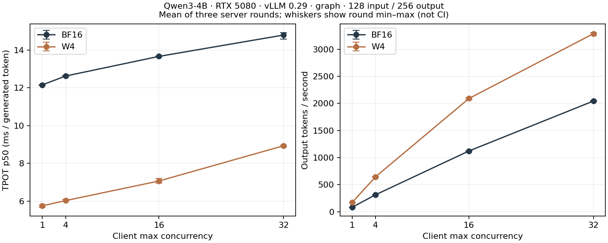

# Case 009 — Qwen의 요청 비용과 공식 품질 평가

[English](README.md) · [전체 보고서](REPORT.ko.md) · [CPU 재계산·영어](REPRODUCTION.md)

기존 Qwen3-4B-Instruct-2507 BF16과 GPTQ W4A16 저장본을 CUDA Graph, 출력 256토큰, 네 가지 동시 요청 상한에서 비교했습니다. 같은 입력을 보내는 실행기는 지연시간·처리량·실제 토큰 수·대기열 관측·프로세스 식별자를 남깁니다. 공식 품질 과제는 버전을 고정한 lm-evaluation-harness로 별도 실행합니다.

RTX 5080의 주 입력 128·출력 256 graph 조건에서 동시성 1/4/16/32의 짝지은 TPOT 시간비(BF16/W4)는 **2.113, 2.094, 1.934, 1.656**였습니다. 서버 3라운드의 요청 단위 decode 시간 관측이며, 전체 곡선·eager 대조·정답 점수·비정상 종료를 같은 보고서에 둡니다.

## 요청 비용

| 동시 요청 상한 | TPOT BF16 / W4 (ms/token) | 짝지은 시간비 BF16/W4 |
|---|---:|---:|
| 1 | 12.155 / 5.754 | 2.113 |
| 4 | 12.622 / 6.030 | 2.094 |
| 16 | 13.664 / 7.068 | 1.934 |
| 32 | 14.792 / 8.931 | 1.656 |

TPOT 칸은 라운드 중앙값의 평균이고 시간비 칸은 짝지은 라운드 비율의 평균입니다. 반올림한 두 시간의 나눗셈과 정확히 같을 필요는 없습니다. 그림 막대는 라운드 최솟값–최댓값이며 신뢰구간이 아닙니다. 영어 축 라벨입니다. [두 입력 길이·짝지은 구간·TTFT·처리량·메모리·preemption](REPORT.ko.md#results). 동시 요청 수는 GPU batch size와 다릅니다. 60개 셀에 timed 요청 7,296개와 고정 warmup 120개를 남겼으며, 고유 합성 workload prompt 512개를 여러 설정에서 재사용합니다.

## 공식 품질과 실행 상태

| Official task / metric | BF16 | W4 | Paired W4−BF16 [pointwise 95% interval] |
|---|---:|---:|---:|
| arc_challenge **process status** | COMPLETE | FAILED | retained computation below; not clean execution |
| arc_challenge/none acc | 507/1172 (43.26%) | 515/1172 (43.94%) | +0.68 [-1.02, +2.39] pp |
| arc_challenge/none acc_norm | 502/1172 (42.83%) | 493/1172 (42.06%) | -0.77 [-2.47, +0.85] pp |
| wikitext **process status** | FAILED | FAILED | retained computation below; not clean execution |
| WikiText-2 word perplexity | 13.1081 | 14.5194 | word NLL +0.10226 [+0.09620, +0.10893] nats |
| WikiText-2 byte perplexity | 1.6180 | 1.6493 | separate original UTF-8 denominator |
| gsm8k **process status** | COMPLETE | COMPLETE | original clean process exits |
| gsm8k/flexible-extract exact_match | 1211/1319 (91.81%) | 1191/1319 (90.30%) | -1.52 [-2.96, -0.15] pp |
| gsm8k/strict-match exact_match | 1145/1319 (86.81%) | 1028/1319 (77.94%) | -8.87 [-11.14, -6.60] pp |
| mmlu **process status** | COMPLETE | FAILED | retained computation below; not clean execution |
| MMLU acc (57 subjects) | 8720/14042 (62.10%) | 7616/14042 (54.24%) | -7.86 [-9.05, -6.87] pp |

표의 pp는 퍼센트포인트, 차이는 W4−BF16입니다. **실행 상태의 제한:** arc_challenge/W4, wikitext/BF16, wikitext/W4, mmlu/W4는 전체 계산과 결과 저장 뒤 비정상 종료했습니다. `COMPUTED_WITH_PROCESS_FAILURE` 상태를 유지합니다. 입력 pairing·유한 점수·공식 집계를 검산했지만 정상 프로세스 완료로 바꾸지 않습니다. 전체 split 재실행은 없습니다. [실행 기록](provenance/quality_attempts.json) · [입력별 전환·MMLU 과목·생성 상한](results/derived/quality_summary.json).

GSM strict-match와 flexible-extract는 같은 1,319개 출력의 공식 추출 규칙 두 가지입니다. ARC acc와 acc_norm도 별도 공식 지표입니다. WikiText는 62문서의 원문 단어·byte 분모를 사용합니다. 서로 다른 benchmark 점수는 합산하지 않습니다. 전체 어휘 KL은 미측정이며 선택지 진단은 continuation likelihood를 정규화합니다.

## 구현과 확인 경로

- [요청 실행기·영어](scripts/serving.py): 같은 token ID, graph/eager 프로세스 순서, 실제 SSE 시간.
- [공식 과제 연결·영어](scripts/quality.py): model 호출 전 고정 요청·few-shot 대조, 생성 상한 기록.
- [설치형 paired CLI](../../packages/diova-compare/README.ko.md): CPU 입력 계약, 정답 전환, NLL/Brier, 범위를 표시한 KL. 원래 프로세스 실패도 결과에 남습니다.
- [방법·영어](METHODS.md), [비용 protocol](configs/serving_protocol.json), [품질 protocol](configs/quality_protocol.json), [재현·영어](REPRODUCTION.md), [출처·영어](NOTICE.md).

기존 BF16/W4 파일, Case001–008과 modelpack 코드는 그대로입니다. 가중치 재제작과 R 재구성 실행은 하지 않았습니다. 새 data-v2는 CPU 입력 검사만 수행했고 다층 R은 [후속 설계·영어](../../docs/phase2a-design.md)로 남습니다. 배포 판정은 **NOT_ASSESSED**, 게시 상태는 **LOCAL_REVIEW**입니다. [실행 상태](RUN_STATE.json)에서 완료한 측정과 미해결 종료 문제를 나눠 확인할 수 있습니다.

## 검토 반영 도구와 진단

[CLI 0.1.1 wheel](../../downloads/diova_compare-0.1.1-py3-none-any.whl) · [공개 ZIP](../../downloads/case009_serving_quality_reviewed_publication_v1.zip) · [메타데이터](../../downloads/case009_serving_quality_reviewed_publication_v1.json) · [검토 반영 안내](publication/README.md)

MMLU는 57과목 모두 정확도가 낮아졌고 WikiText는 62문서 모두 로그우도가 낮아졌습니다. 보고서에서 이 관측, 원래 프로세스 종료 실패와 새 짧은 lifecycle 진단을 나누어 확인합니다.
