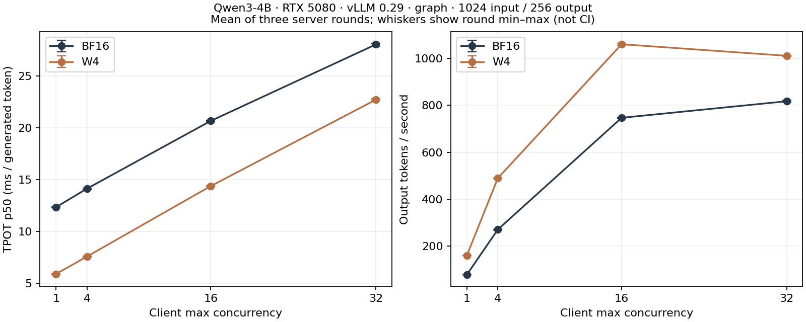

# Case 009 — Qwen serving cost and official quality evaluation

[한국어](REPORT.ko.md) · [Overview](README.md) · [Methods](METHODS.md) · [CPU reanalysis](REPRODUCTION.md)

## Contents

[Background](#background) · [Hypotheses](#hypotheses) · [Theory](#theory) · [Methods](#methods) · [Experiments](#experiments) · [Results](#results) · [Analysis](#analysis) · [Conclusion](#conclusion) · [References](#references)

## Background

Case 008 built, checked and reloaded a GPTQ W4A16 artifact. Its eager eight-token requests answered a short-workload question. This new case measures longer decode and client concurrency with the **same saved BF16 and W4 artifacts**, and evaluates official tasks separately. Earlier measurements and source files remain unchanged.

The implementation connects a loopback request runner, fixed request/task manifests, per-process records, paired scalar analysis and a CPU comparison package. The model, quantizer and inference kernels come from upstream projects. [Contribution and related work](../../docs/related-work/README.md).

## Hypotheses

Reduced weight traffic may lower decode cost, but attention, KV, prefill, scheduling and host overhead can limit that benefit. Graph execution may change the relative costs compared with eager execution. Quantization can also change official task scores and individual answers. No performance threshold, quality-equivalence margin or requirement that W4 win was used.

## Theory

For a Linear operation, FLOPs are approximately 2MKN and weight-heavy traffic is approximately bytes-per-weight×KN plus scale storage. Here M is the token-row dimension; client concurrency is a different quantity. Amdahl's expression 1/((1−f)+f/S) is an explanatory model with unchanged remaining costs, not a substitute for complete-request measurement. MARLIN's published device/shape-specific speedups are not RTX 5080 acceptance thresholds.

Correctness flips are lost correct answers plus newly correct answers. All-answer disagreement additionally counts changed wrong answers (and different accepted correct answers where applicable). Choice NLL, Brier and KL use normalized continuation likelihoods; full-vocabulary KL was not collected. WikiText perplexity is exp(−sum loglikelihood / sum denominator), not an average of document perplexities.

## Methods

Qwen3-4B-Instruct-2507 revision `cdbee75f17c01a7cc42f958dc650907174af0554`, RTX 5080 16GB, vLLM 0.29.0, TP=1, BF16 activations/KV and 4 GiB common KV capacity. Existing checkpoint bytes were verified; no model download, conversion, calibration or training was performed. The 252 unfused projections map to 144 runtime projections, not 144 GPU calls.

The serving grid uses input 128/1024, output 256, client concurrency 1/4/16/32 and saturation submission. Three fresh-server paired rounds alternate BF16/W4 order and share a frozen condition permutation. Both arms use the same graph/compile policy. A matched eager comparison covers input 128, output 256 and C1/16. Prefix caching, speculative decoding, chunked prefill and async scheduling are disabled during timing. Quality instead uses context 8192 and chunked prefill, with the same artifacts and vLLM version; it is not a timing comparison.

TTFT ends at the first choice-bearing SSE event. TPOT=(last−first)/(actual generated tokens−1). API usage and returned token IDs must agree. Throughput divides actual generated tokens by block elapsed time. Each table averages three round-level summaries. Ratios use BF16/W4 for time and W4/BF16 for throughput. Intervals resample the three paired server rounds 5,000 times, not individual concurrent requests.

Official harness commit `d6de81643928d653435c431bae19945d41d32520` supplies ARC-Challenge 0-shot, MMLU 5-shot, GSM8K 5-shot greedy with 1,024-token cap, and WikiText-2 rolling likelihood. Chat template is applied once to ARC/MMLU/GSM and never to WikiText. Paired intervals stay within tasks; MMLU uses subject clusters, WikiText uses summed document denominators. [Frozen protocol and metric definitions](METHODS.md).

## Experiments

All 60 serving cells completed: 7,296 timed requests and 1,867,776 output tokens, plus 120 excluded fixed warmup requests. There are 512 frozen workload prompts reused across conditions; requests are not 7,296 independent quality examples. Serving DEV used 37 requests across 3 process starts, including bounded C1/16 profiles. Primary timing had no profiler.

Quality test budgets were one full attempt per task/model: ARC 1,172 items, WikiText 62 documents, GSM 1,319 items, MMLU 14,042 items across 57 subjects. DEV used two validation documents from ARC and WikiText per arm. No failed test split was repeated. All task arguments were compared with the pre-evaluation request freeze before model calls.

**Runtime qualification:** native finalization failures occurred after complete calculation and JSON writes. Failed full-process exits: **arc_challenge/W4, wikitext/BF16, wikitext/W4, mmlu/W4**. Those rows are labelled `COMPUTED_WITH_PROCESS_FAILURE`; they are retained calculations, not clean executions. One earlier ARC/BF16 DEV also failed teardown. Explicit engine shutdown helped some processes but did not resolve the issue. Three CPU-only import/dataset diagnostics exited normally; the native cause remains unresolved. No failure was repaired by changing the benchmark, precision or generation limit. [Attempt ledger](provenance/quality_attempts.json).

## Results

### Complete serving curves

Curves show the mean of three round summaries; whiskers are round min–max, not confidence intervals. All graph cells completed without request failure or unexpected token length.

| Mode / input / concurrency | TPOT time ratio BF16/W4 [95% interval] | Throughput W4/BF16 [95% interval] |
|---|---:|---:|
| graph / 128 / 1 | 2.113 [2.100, 2.138] | 2.090 [2.061, 2.123] |
| graph / 128 / 4 | 2.094 [2.068, 2.109] | 2.060 [2.030, 2.078] |
| graph / 128 / 16 | 1.934 [1.898, 1.966] | 1.864 [1.845, 1.881] |
| graph / 128 / 32 | 1.656 [1.644, 1.662] | 1.609 [1.597, 1.623] |
| graph / 1024 / 1 | 2.100 [2.079, 2.126] | 2.031 [2.016, 2.053] |
| graph / 1024 / 4 | 1.868 [1.864, 1.873] | 1.805 [1.802, 1.810] |
| graph / 1024 / 16 | 1.438 [1.429, 1.448] | 1.419 [1.415, 1.426] |
| graph / 1024 / 32 | 1.235 [1.229, 1.242] | 1.237 [1.232, 1.240] |
| eager / 128 / 1 | 1.071 [1.025, 1.109] | 1.048 [0.997, 1.092] |
| eager / 128 / 16 | 1.075 [0.968, 1.211] | 1.096 [0.981, 1.214] |

The eager comparison gives a much smaller relative change and wider round variation. It is compared eager-to-eager; graph W4 is not divided by eager BF16 and called a quantization-only effect. [Absolute TTFT/TPOT/request p50/p95 and throughput table](results/derived/serving_table.md).

### Official quality calculations

Failed process status remains immediately above the affected metrics. These are full-split stored calculations with verified pairing/finite scores, but runtime validation is incomplete. Different benchmarks and GSM filters are separate views.

| Official task / metric | BF16 | W4 | Paired W4−BF16 [pointwise 95% interval] |
|---|---:|---:|---:|
| arc_challenge **process status** | COMPLETE | FAILED | retained computation below; not clean execution |
| arc_challenge/none acc | 507/1172 (43.26%) | 515/1172 (43.94%) | +0.68 [-1.02, +2.39] pp |
| arc_challenge/none acc_norm | 502/1172 (42.83%) | 493/1172 (42.06%) | -0.77 [-2.47, +0.85] pp |
| wikitext **process status** | FAILED | FAILED | retained computation below; not clean execution |
| WikiText-2 word perplexity | 13.1081 | 14.5194 | word NLL +0.10226 [+0.09620, +0.10893] nats |
| WikiText-2 byte perplexity | 1.6180 | 1.6493 | separate original UTF-8 denominator |
| gsm8k **process status** | COMPLETE | COMPLETE | original clean process exits |
| gsm8k/flexible-extract exact_match | 1211/1319 (91.81%) | 1191/1319 (90.30%) | -1.52 [-2.96, -0.15] pp |
| gsm8k/strict-match exact_match | 1145/1319 (86.81%) | 1028/1319 (77.94%) | -8.87 [-11.14, -6.60] pp |
| mmlu **process status** | COMPLETE | FAILED | retained computation below; not clean execution |
| MMLU acc (57 subjects) | 8720/14042 (62.10%) | 7616/14042 (54.24%) | -7.86 [-9.05, -6.87] pp |

| Task / metric | n | Lost correct | New correct | Both wrong | Changed wrong | All answer disagreements |
|---|---:|---:|---:|---:|---:|---:|
| arc_challenge/none acc | 1172 | 49 | 57 | 608 | 65 | 171 |
| arc_challenge/none acc_norm | 1172 | 54 | 45 | 625 | 45 | 144 |
| gsm8k **process status** | COMPLETE | COMPLETE | original clean process exits |
| gsm8k/flexible-extract exact_match | 1319 | 53 | 33 | 75 | 29 | 125 |
| gsm8k/strict-match exact_match | 1319 | 185 | 68 | 106 | 36 | 289 |
| MMLU acc (57 subjects) | 14042 | 1452 | 348 | 4974 | 600 | 2400 |

[Per-subject MMLU, score diagnostics, generation-cap counts and intervals](results/derived/quality_summary.json) · [Public per-item scalars](results/raw/quality_scalars.jsonl). Full-vocabulary KL is **NOT_RUN**. Public scalars cannot reconstruct excluded benchmark prose, rationales or full tensors.

### Memory and scheduler observations

| Server process | Whole-device sampled peak MiB | Sampled maximum running / waiting | Graph capture log |
|---|---:|---:|---|
| round1-BF16-graph | 14863.0 | 32 / 10 | True |
| round1-W4-graph | 9747.0 | 32 / 9 | True |
| round2-W4-graph | 9297.0 | 32 / 9 | True |
| round2-BF16-graph | 14477.0 | 32 / 10 | True |
| round3-BF16-graph | 14419.0 | 32 / 12 | True |
| round3-W4-graph | 9315.0 | 32 / 11 | True |
| round1-BF16-eager | 14269.0 | 16 / 0 | False |
| round1-W4-eager | 9175.0 | 16 / 0 | False |
| round2-W4-eager | 9175.0 | 16 / 0 | False |
| round2-BF16-eager | 14269.0 | 16 / 0 | False |
| round3-BF16-eager | 14269.0 | 16 / 0 | False |
| round3-W4-eager | 9175.0 | 16 / 0 | False |

These are 1 Hz whole-device peaks across process startup/warmup/measurement, including desktop allocations; not Torch allocator peaks or isolated model VRAM. A sample can miss a subsecond peak. Memory was not timestamp-aligned to individual cells, so no per-concurrency memory curve is invented. The six L1024/C32 graph cells each recorded 54 preemptions, total 324. They remain in timing. Client concurrency 32 therefore must not be read as 32 continuously active sequences or GEMM rows. No maximum-capacity W4-only sweep was run.

## Analysis

W4 reduced measured TPOT across the complete graph grid, while the ratio declined with larger concurrency and longer inputs. Both request processing and KV/scheduler work remain in the measured boundary. DEV traces identify graph launches and W4 Marlin kernels, but do not isolate the causal share of each kernel. [Trace summaries and observed allocator values](provenance/dev_profile_costs.json).

GSM8K's official strict-match change was -8.87 percentage points, while flexible-extract changed by -1.52 points on the same outputs. The 1,024-token cap was reached in 12/1,319 BF16 and 40/1,319 W4 generations; these outputs remain included. These views expose extraction and length sensitivity without isolating a causal explanation for the difference. MMLU's item-weighted change was -7.86 points across 57 subjects; subject results and the paired subject-cluster interval remain available.

Accuracy and normalized accuracy can move differently; probability loss, answer transitions and perplexity provide additional views. None is replaced by the best-looking metric. Only three timing rounds were collected on a WSL host with desktop/background activity; CPU document/test work overlapped parts of the timing session. These pointwise intervals do not establish production SLOs or a universal speedup.

The new data-v2 audit fixes independent label/fact/order RNGs and checks a bounded loop oracle. An initial 123/336 fixtures contained out-of-domain distractors; they were preserved privately and corrected before any model evaluation. The final 336 fixtures are byte-reproducible and have valid-domain choices on both sides of gold. Gold is interior by design, so this is not a cue-free dataset claim. Data-v2 received **no model evaluation** and does not replace the official tasks.

## Conclusion

The project now includes a complete controlled serving grid, stored official quality calculations with explicit process-exit qualifications, and an installable paired CPU CLI. The measured graph workload benefits from the existing W4 artifact; the quality table and unresolved native teardown remain part of the same evidence. Deployment is **NOT_ASSESSED**. Publication is **LOCAL_REVIEW**.

R remains a fixed-structure ridge correction and shape-aware save/reload implementation. No multi-layer R experiment ran. [Separate future design](../../docs/phase2a-design.md). A future runtime investigation must resolve clean shutdown before claiming a fully successful quality pipeline; this study does not repeat its failed full attempts.

## Review follow-up: recorded-scalar analysis and lifecycle

**POST_HOC_SAME_RECORDED_SCALARS** — recalculated existing public records and aggregates; original inputs, scores and subject-cluster intervals are unchanged.

- **MMLU:** accuracy decreased in 57/57 subjects. Among 14,042 items, 1,452 of the 8,720 baseline correct answers were lost and 348 baseline errors became correct: 1,104 fewer correct answers. Choice D increased from 5,842/14,042 (41.60%) to 7,163/14,042 (51.01%). [Post-hoc JSON](publication/posthoc/analysis.json) retains gold-label denominators and counts. This observed position shift does not identify a quantization, tokenizer or runtime cause.
- **WikiText-2:** W4 loglikelihood decreased on 62/62 documents. Summed likelihood and the retained 241,335-word / 1,290,527-byte denominators give word PPL 13.1081→14.5194, a 10.77% increase. This is not a mean of document perplexities or a new parse of excluded text.
- **GSM8K:** on the same generations, strict-wrong/flexible-correct counts increased from 67 to 165; the reverse combination also increased from 1 to 2. Flexible extraction lost 53 correct answers and gained 33, a net loss of 20. Recorded mean length increased 185.20→232.54 tokens and 1,024-token-cap counts 12→40. Missing rationales are not used to invent failure causes; length ratios are not actual GSM runtime speedups.
- **Serving:** L128/C1 TPOT ratio 2.113 and output-throughput ratio 2.090 have different denominators. TTFT changed 17.069→18.520ms. Six L1024/C32 cells each retained 54 preemptions (324 total); W4 throughput was 1,059.33 token/s at C16 and 1,010.15 at C32. This is a graph/compile/fusion bundle, not an isolated CUDA Graph causal effect.

### Software repair and separate lifecycle probes

`diova-compare` 0.1.1 rejects inconsistent effective metric coverage within task/version and calculates tiny-positive-probability KL using log differences. These are software fixes, not new model measurements. [Changelog](../../packages/diova-compare/CHANGELOG.md).

Original full evaluation exits remain four clean and four failed. A separate short synthetic lifecycle study compares generation, continuation and rolling APIs plus object-lifetime policies. Actual attempts and parent/worker outcomes appear in the [summary](supplemental/lifecycle-v1/summary.json) and [diagnostic notes](supplemental/lifecycle-v1/README.md). Small-probe success does not repair a historical full split or establish its failure cause.

The bounded diagnostic completed 24 fresh-process attempts, all clean, in 543.3s. D0 and D1 both passed; D2 was not selected. Status: **NOT_REPRODUCED_IN_SMALL_PROBE**, not a repair of the full evaluation.

Full-vocabulary KL remains NOT_RUN; data-v2 has CPU input checks only. [Publication instructions](publication/README.md) distinguish current files from restored historical checks.

## References

[Primary papers, official repositories, versions and implementation mapping](../../docs/related-work/README.md) cover MARLIN, Dutta et al., He et al., FLAP, lm-evaluation-harness and vLLM. [Attribution](NOTICE.md) · [Reproduction](REPRODUCTION.md) · [Run state](RUN_STATE.json).
