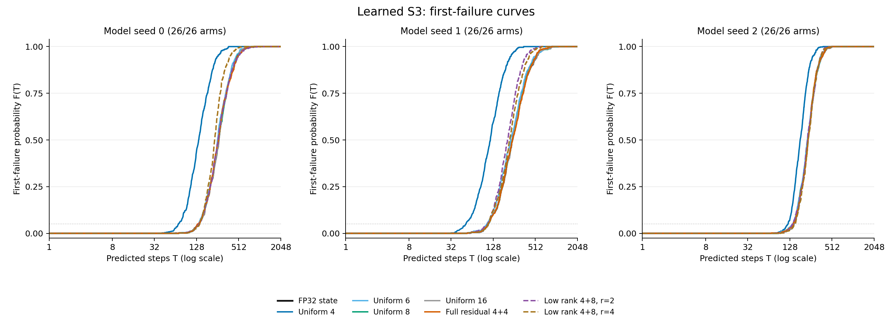

# CKDA Finite-Precision Memory Horizon

English | [한국어](README.ko.md)

This study implements packed recurrent-state storage, causal residual correction, and byte-budget comparisons. You can inspect the first incorrect symbolic-state read for each input sequence, reconstruct the survival curves, and restart the model from its checkpoint and serialized cache.

The question is concrete: **at the same total stored bytes, can a fixed model keep reading the correct state for longer?** A lower state MSE or a correct last token does not answer that question.

## What the code does

- [Packs real state bytes](codec/packed.py), including low-bit codes, FP32 scales, padding and stochastic-rounding state.
- [Transports the candidate's own rounding residual](codec/online.py) through the next affine transition. Full residuals and CAL-fixed rank1/2/4 bases have explicit storage costs.
- [Evaluates a small learned S3 CKDA](scripts/evaluate_learned.py) with the original readout, every token and every head. Uniform2–16-bit and CAL mixed-precision arms compete at the same byte cap.
- [Checks first failure and censoring](codec/survival.py), reconstructs recorded results independently, and [tests a new-process restart](scripts/check_restart.py).

## Reading route

Start with the [report](REPORT.md) for the hypothesis, design, results and conclusion. The [methods](METHODS.md) define the recurrence, read boundary and accounting rules. The [reproduction guide](REPRODUCTION.md) separates model-free CPU audits from checkpoint-based execution and GPU training.

Five numerical geometry controls are kept separate from the trained-model experiment. The learned model uses the official S3/a11_b02 architecture: one layer, 12 heads, a 16×16 state per head and 56,530 parameters. Three locally trained checkpoints share the 20,000-update schedule; every codec for a seed uses the same weights. Each primary arm reads every prefix of 512 independent sequences through length 2048.

The byte ledger includes shared configuration, token coefficient tables and bases, plus each stream's codes, scales, residual, RNG and cursor. Results are shown for 1, 16 and 128 simultaneous streams. The checkpoint is common to the arms and is recorded separately; serialized cache reduction is not a claim about whole-model VRAM.

## What the measurements show

The three native models support a 5%-first-failure-risk horizon of at least64 group tokens under the simultaneous confidence bound, but every TEST sequence has failed at least once by1024. Quantized-state effects therefore sit alongside a native length-extrapolation limit.

After including four additional byte-feasible mixed-precision allocations, **none of54 residual-budget comparisons extends that supported horizon beyond the best feasible baseline**. Rank2 correction increases mean failure-free length at N=128 in all three seeds; that is a different endpoint. The added allocations reuse TEST and are labeled as a post-hoc budget audit. [Full result and interpretation](REPORT.md#conclusion).

The original26-arm study, three model seeds and512 sequences per seed. The dashed line is the observed5% failure level, not a confidence bound. [Original data](results/summary/horizon_curves.csv) · [Supplementary joint budget comparison](results/supplement-summary/budget_comparisons.csv).

Actual packed caches pass fresh-process restart checks. The measured CPU encode/transition/decode/readout paths are slower than native; this implementation supplies storage and readability evidence, not a fused-kernel speedup.

## Contribution and sources

DIOVA provides the packing adapters, storage and restart contracts, first-failure analysis and controlled comparison. Complex KDA provides the model, task and optimizer implementation. Residual feedback and mixed-precision state storage have prior literature; [NOTICE](NOTICE.md) maps those sources to this implementation and records Codex assistance. The [limitations](LIMITATIONS.md) explain the sequential prototype and the scope of the small trained model.

This directory is a local review candidate. Checkpoints remain separate local artifacts; this package contains code, compact recorded evidence and audit tools.
