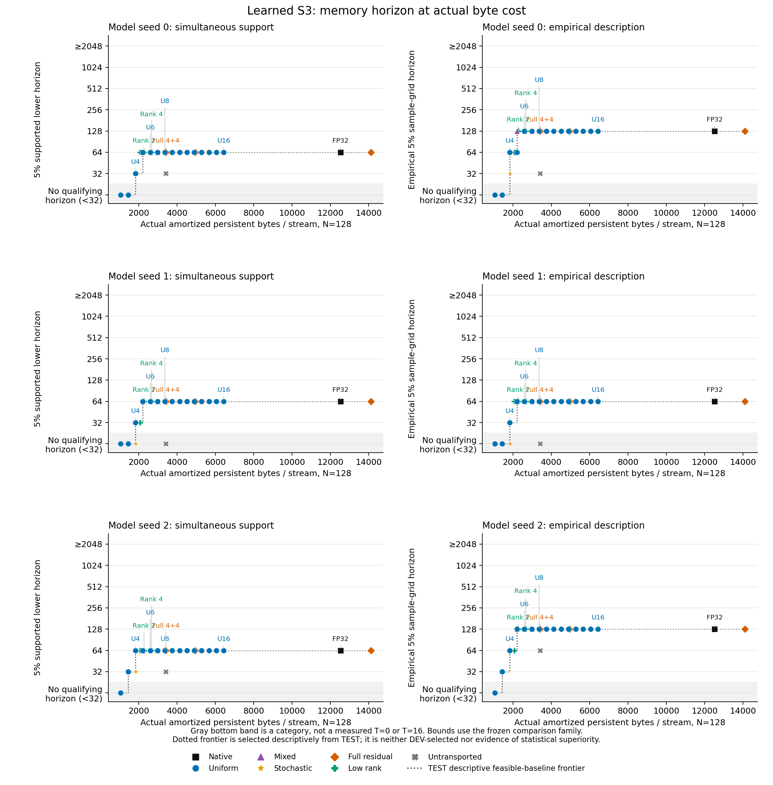

# CKDA의 유한 정밀도 상태 저장과 판독 유지 길이

[한국어 소개](README.ko.md) · [English report](REPORT.md)

## 목차

1. [배경](#배경)
2. [가설](#가설)
3. [이론과 적용 범위](#이론과-적용-범위)
4. [방법](#방법)
5. [실험](#실험)
6. [실험 결과](#실험-결과)
7. [결과 분석](#결과-분석)
8. [결론](#결론)
9. [레퍼런스](#레퍼런스)

## 배경

반복 모델은 이전 상태를 읽고 새 입력으로 갱신한 뒤 다시 저장합니다. 상태 저장을 저비트로 바꾸면 매번 반올림한 값이 다음 계산의 입력이 됩니다. 이 연구는 그 과정에서 **정확한 기호 상태를 처음 잘못 읽는 시점**을 측정합니다.

구현물은 비트 단위 상태 codec, 자기 갱신에서 생긴 잔차를 전달하는 adapter, 입력별 최초 실패 기록, 총 저장량 장부와 새 프로세스 재시작 검사입니다. 한 번 틀린 뒤 다시 맞힌 결과는 현재 시점 정확도에는 반영하지만, 지금까지 한 번도 틀리지 않은 비율에는 반영하지 않습니다.

학습 없는 기하 대조와 작은 학습 CKDA를 분리했습니다. 사용자가 설명한 기존 pilot은 소스가 확보되지 않아 재실행하지 않았고, 이미 알려진 탐색 정보로만 기록했습니다. 이 연구의 새 toy와 DEV 구현 점검 역시 독립적인 방법 확증으로 재사용하지 않습니다.

## 가설

- 잔차도 다음 상태 전이로 함께 변환하면, 단순히 이전 좌표의 잔차를 더하는 대조와 다른 오차 누적을 보일 수 있습니다.
- 그 효과가 저장 비용을 정당화하려면, 잔차 대신 상태 자체에 더 많은 비트를 쓰는 비교군보다 **같은 총 바이트**에서 더 오래 정확히 판독해야 합니다.
- toy에서 성립한 효과가 학습 모델과 모든 head의 상태, 미관측 입력 순서에도 유지되는지는 별도로 확인해야 합니다.

세 번째 질문에 답하기 전에 native FP32 모델의 길이 외삽을 확인합니다. 원래 모델이 틀리는 입력을 제외해 저정밀 설정만 유리하게 평가하지 않습니다.

## 이론과 적용 범위

공식 recurrence의 좌표 convention을 따라 head별로 다음을 사용합니다.

```
A_t = (I − beta_t k_t k_tᵀ) Diag(alpha_t)
S_t = A_t S_(t−1) + beta_t k_t v_tᵀ
o_t = q_tᵀ S_t / sqrt(d_k)
```

정규화한 q/k, gate, 출력 정규화·projection, residual 경로와 원래 MLP 판독기를 유지합니다. signed gate의 내부 부호 gauge 대신 physical 좌표로 상태를 저장하므로 숨은 gauge cache는 없습니다.

저장한 상태를 `Z+Rhat`으로 읽으면 `U=A(Z+Rhat)+B`입니다. U를 양자화한 뒤 자신의 잔차 `E=U−Z_next`만 다음 잔차 코드로 저장합니다. 정확한 산술과 정확한 전체 잔차라면 원래 affine 계산과 같다는 것은 대수 항등식입니다. e를 후보 복원 상태−기준 상태로 정의하면, 정확한 affine 계산에서 남은 저장 오차 eta에 대해 `e_t=A_t e_(t−1)+eta_t`가 됩니다. 실제 FP32 비교에는 후보와 기준 경로의 산술 반올림 차 `rho_candidate−rho_reference`도 더해야 합니다. 두 경로의 dtype이 같아도 입력 상태가 달라지면 이 항은 상쇄되지 않습니다. 이를 새로운 알고리즘이나 정리로 주장하지 않습니다.

정확히 정규화한 k, beta∈[0,2], |alpha|≤1이면 A의 연산자 norm은1 이하이며 오차 누적합 상계를 얻습니다. 실제 부동소수점 연산과 MLP 판독기에 자동으로 적용되는 영구 정확성 보장은 아닙니다. 선형 판독기의 margin 조건도 이 연구의 비선형 판독기 전체에 대한 Lipschitz 보장으로 바꾸지 않습니다.

S3는 세 대상을 순열로 바꾸는 여섯 원소의 군입니다. 정확한 군 원소 ID와 곱셈 표를 별도로 저장하는 유한 상태 추적기는 고정 바이트로 이 과제를 수행할 수 있습니다. 따라서 모든 긴 기억에 무조건 log T 비트가 필요하다는 보편 하한은 성립하지 않습니다. 이 task-specific 대조는 학습 hidden state의 압축 방법과 다릅니다.

## 방법

정답은 별도의 정수 군 곱셈 표로 `g_t=x_t ... x_1`을 계산합니다. 생성원만 입력하는 과제가 아니라 모든 군 원소를 입력합니다. 후보 adapter에는 현재 입력의 계수와 자기 저장 상태만 전달하며, 정답·native 상태·미래 token은 전달하지 않습니다.

학습 모델은 한 층, d_model48,12 heads, head당16×16 상태,48→192→6 MLP 판독기,56,530 parameter입니다. 가중치·계수·상태 전이·판독 계산은 FP32로 고정했습니다. 일곱 token ID(S3 여섯 원소+BOS)의 계수는 공식 B=1/T=1 projection으로 만들고 모든 설정이 공유합니다. 이 표29,100바이트도 공유 저장 비용에 포함합니다. 모델 가중치의226,120바이트와 checkpoint 파일 크기는 상태 codec 예산과 별도로 표시합니다.

각 token을 갱신한 **뒤 저장·복원한 상태**로 답을 읽습니다. BOS도 저장 경계를 거치지만 최초 실패 tau에서 제외하고 정확도를 따로 기록합니다. 초기 영행렬 자체에는 정답 판독을 요구하지 않습니다. 동률은 가장 작은 label index를 선택합니다. 비유한 전체 출력은 해당 시점의 오답이고, 상태 자체가 비유한 입력은 이후 실패 상태로 유지합니다. 나머지 입력은 계속 평가합니다.

CAL64개×길이32, DEV128개×길이128, TEST512개×길이2048을 별도 seed로 생성했습니다. 같은 TEST 최대길이 입력의 prefix를32·64·128·256·512·1024·2048에서 평가합니다. CAL은 basis와 혼합 정밀도 channel 선정에 사용합니다. 원래26개 설정은 TEST 전에 고정했고, 이후 저장량 점검으로 발견한 비교군 누락은 별도 버전의 보충 검사로 구분했습니다.

비교군은 FP32 native, 균일2–16비트, 확률적 INT4 반올림, INT4 상태+전체4/8비트 또는 FP32 잔차, INT4 상태+rank1/2/4 INT8 잔차, 이전 좌표 잔차 대조, CAL 기반4/8·6/8 혼합 정밀도입니다. 전체26개 설정을 모두 보존했습니다. 혼합 정밀도는 CAL의 반올림 오차와 다음 전이의 column norm을 함께 사용한 자체 비교군이며, DAMP 논문 전체의 재현이 아닙니다.

저장량은 `공유 바이트 + 입력 수×입력별 persistent 바이트`입니다. 코드·scale·잔차·난수 seed/counter·8바이트 진행 위치·설정·basis를 합산합니다. N=1·16·128에서 남는 한도에 들어가는 모든 균일·혼합 정밀도와 native를 비교합니다. 비교군에 불필요한 padding을 넣지 않습니다. 실제 uint8 payload storage와 직렬화 크기를 검사하며 임시 FP32 작업 배열, Python 객체, 전체 GPU 메모리는 다른 항목입니다.

주 위험 수준은5%, 보조는1%입니다. 경험적 grid 길이와 신뢰구간으로 지지되는 길이 하한을 분리합니다. 정확한 단측 이항 상한에 Bonferroni 보정을 적용하며, 원래 학습 결과는26설정×7길이×3seed=546개 family입니다.512개 입력으로는 실패0회여도 이 동시 보정에서 위험1% 이하를 지지할 수 없습니다. 최대길이까지 성공한 기록은 우측 검열이며 무한 기억을 뜻하지 않습니다.

실행 중 바이트 장부를 검토해, 일부 저랭크 설정의 한도에 더 높은 비트를 쓸 수 있는 혼합 정밀도 비교군 네 개를 찾았습니다. 저랭크 TEST 결과가 나오기 전에 **저장량과 기존 CAL 순위만으로** 네 설정을 [별도 프로토콜](configs/budget_supplement_v1.json)에 고정했습니다. 원래26개 측정과546개 신뢰 family를 그대로 두고, 보충 검사의 공동 표만30×7×3=630개로 계산합니다. 같은 TEST를 재사용하는 `POST_HOC_BUDGET_AUDIT_SAME_TEST`이며 새 독립 확인이나 모든 비트 배분의 최적성 증거로 해석하지 않습니다. 추가 네 설정의 호출 시간은 측정하지 않습니다.

## 실험

작은 공식 S3/a11_b02 구조를 RTX5080에서 seed0·1·2 각각20,000 updates, batch128로 학습했습니다. 공식 Muon/AdamW와4/6/8/16/32 curriculum을 사용했고 마지막 예정 update만 선택했습니다. seed0가 사전 지정 DEV32 문턱을 통과한 뒤에만 나머지 두 seed를 실행했습니다. 세 seed 모두256개 DEV32 입력에서 all-prefix와 마지막 quarter 정확도1.0이었고, 학습 시간은 각각459.90·533.56·567.75초였습니다. 논문의60,000-step/batch1024 학습을 재현한 결과는 아닙니다.

초기 NumPy 순차 경로는 길이2048 DEV 비교에서 고정 허용 오차를 벗어났습니다. 허용 오차를 넓히지 않고 공식 한-token projection과 Torch 전이·einsum 판독 경로로 맞췄습니다. 최종 경로는 영행렬과 비영 초기 상태 모두에서 원래 한-token cache의 최종 상태와 bitwise 일치했습니다. 이 과정과 초기 plotting 의존성 실패, toy INT2 실행 오류 및 난수 stream 수정은 [개발 기록](provenance/development_attempts.json)과 [toy 수정 기록](results/toy-repair-v1b/erratum-identity.json)에 남깁니다.

toy는 격자와 맞는 signed permutation, 고정 평면 회전, 회전된 비가환 변환, 움직이는 평면, 전환하는 평면의 다섯 조건입니다. 모든 변환을 학습 CKDA의 단일 step이라고 부르지 않습니다. 계수 양자화와 FP64 계산은 이 단계에만 있는 별도 대조입니다.

## 실험 결과

### 먼저 native 판독을 확인했다

| 학습 seed | 경험적 T₀.₀₅(grid) | 동시 신뢰 하한 | 평균 연속 정답 prefix 수 |
|---|---:|---:|---:|
| 0 | 128 | ≥64 | 283.10 |
| 1 | 64 | ≥64 | 271.24 |
| 2 | 128 | ≥64 | 239.87 |

모든 seed에서 길이1024까지512/512개 입력이 한 번 이상 틀렸습니다. 평균 연속 정답 prefix 수는 `mean(min(tau−1,2048))`이며, 마지막 token 정확도와 다릅니다. seed1의 순차 native BOS 정확도는0이고 seed0·2는1입니다. BOS는 모든 결과를 보기 전에 정한 규칙에 따라 별도 표시하며 tau에 포함하지 않았습니다.

전체 길이별 실패 수·token 정확도·마지막 quarter 정확도·분모는 [native 표](results/summary/native_reference.csv)에 있습니다. 같은 raw 결과의 현재 시점 정확도는 재정답을 포함하지만 survival은 포함하지 않습니다.

### 잔차 전달과 저장 비용은 별도 질문이다

toy의 C31 회전에서는 INT8 상태만 저장한244/512개 입력이 길이2048 이전에 처음 틀렸고, INT4 상태+전체 INT4 잔차는0/512였습니다. 그러나 후자의 **총 저장 한도에는 native FP32도 들어가고**, FP32 역시0/512였습니다. 따라서 잔차 전달의 효과를 관측한 것과 같은 바이트에서 압축 개선을 확인한 것은 다릅니다. 고정 저랭크 잔차는 움직이거나 전환하는 평면에서도 모두 잘 작동한다는 가정을 지지하지 않았습니다.

### 학습 모델: 더 긴 평균 정답 구간과 위험 한도는 다르다

원래 26설정×3seed를 모두 끝냈습니다. 아래의 판독 길이는 위험5%에 대한 **546개 동시 비교 신뢰 하한**이며, 평균 연속 정답 길이(RMST)와 다른 지표입니다. 각 칸의 세 값은 seed0·1·2 순서이고, 분모는 각각 같은 TEST 입력512개입니다.

| 설정 | 신뢰 하한 길이: seed0 / 1 / 2 | 평균 연속 정답 길이: seed0 / 1 / 2 |
|---|---|---|
| NATIVE_FP32 | ≥64 / ≥64 / ≥64 | 283.10 / 271.24 / 239.87 |
| UNIFORM_4 | ≥32 / ≥32 / ≥64 | 147.93 / 124.32 / 185.51 |
| UNIFORM_5 | ≥64 / ≥64 / ≥64 | 235.82 / 211.86 / 226.48 |
| UNIFORM_6 | ≥64 / ≥64 / ≥64 | 273.94 / 258.02 / 235.45 |
| UNIFORM_8 | ≥64 / ≥64 / ≥64 | 283.44 / 270.31 / 239.62 |
| FULL_RESIDUAL_4_4 | ≥64 / ≥64 / ≥64 | 282.25 / 270.02 / 238.89 |
| LOWRANK_4_8_R1 | ≥64 / ≥32 / ≥64 | 202.09 / 176.75 / 208.71 |
| LOWRANK_4_8_R2 | ≥64 / ≥64 / ≥64 | 282.89 / 218.40 / 236.77 |
| LOWRANK_4_8_R4 | ≥64 / ≥64 / ≥64 | 241.79 / 235.82 / 240.89 |

INT4 단독에 잔차를 더하면 평균 연속 정답 길이가 늘어나는 경우가 있습니다. 그러나 전체4비트 잔차는 UNIFORM_8보다 더 많은 총 바이트를 쓰고, 위의 위험 기준 길이도 같았습니다. rank2는 N=128에서 한도 안에 들어가는 UNIFORM_5보다 평균 연속 정답 길이가 세 seed 모두 길었지만, 신뢰 하한은 모두64로 같았습니다. 신뢰 하한끼리 비교하는 것 자체도 모집단의 진짜 horizon 차이에 대한 우월성 검정은 아닙니다.

원래 비교군 목록에서 rank1의 seed0는 N=128 한도 안의 UNIFORM_4보다 신뢰 하한이64 대32로 높았습니다. 이 한도에 들어가는 추가 혼합 정밀도 비교군은 별도 보충 검사에서 다룹니다. 평균 길이, 경험적 길이, 신뢰 하한 중 유리한 지표만 골라 하나의 성공 판정으로 합치지 않습니다. [전체 설정과 실행 상태](results/summary/all_arms.csv), [같은 한도 비교](results/summary/budget_comparisons.csv)에서 모든 값을 확인할 수 있습니다.


원래26개 설정의 기록 중 표시한 설정들을 비교한 그림입니다. 수평 점선은 관측 실패 비율5%이며 신뢰구간 상한이 아닙니다. 모든 설정의 길이별 값은 [전체 곡선 표](results/summary/horizon_curves.csv)에 있습니다.

### 실제 저장 바이트

아래는 한 stream의 persistent payload와 공유 비용, 동시 stream 수별 총량입니다. 세 seed의 형식 크기는 같고 코드 값과 basis 값은 다릅니다. 모델 가중치226,120바이트는 모든 설정이 공유하는 별도 항목입니다.

| 설정 | 입력별 / 공유 바이트 | 총 바이트: N=1 / 16 / 128 |
|---|---:|---|
| NATIVE_FP32 | 12,296 / 29,410 | 41,706 / 226,146 / 1,603,298 |
| UNIFORM_4 | 1,592 / 29,626 | 31,218 / 55,098 / 233,402 |
| UNIFORM_5 | 1,976 / 29,626 | 31,602 / 61,242 / 282,554 |
| UNIFORM_6 | 2,360 / 29,626 | 31,986 / 67,386 / 331,706 |
| UNIFORM_8 | 3,128 / 29,626 | 32,754 / 79,674 / 430,010 |
| FULL_RESIDUAL_4_4 | 3,176 / 29,934 | 33,110 / 80,750 / 436,462 |
| LOWRANK_4_8_R1 | 1,832 / 30,707 | 32,539 / 60,019 / 265,203 |
| LOWRANK_4_8_R2 | 2,024 / 31,475 | 33,499 / 63,859 / 290,547 |
| LOWRANK_4_8_R4 | 2,408 / 33,011 | 35,419 / 71,539 / 341,235 |



가로축은 공유 비용을128개 stream에 나눈 입력당 총 저장량입니다. 왼쪽은 신뢰 하한, 오른쪽은 경험적 grid 길이입니다. 회색 아래 영역은32 미만의 어떤 값이 측정됐다는 뜻이 아니라, 평가한 길이 중 조건을 만족한 곳이 없다는 표시입니다. 이 그림은 원래26개 목록이며 보충 네 설정은 별도 표로 제공합니다.

### 호출 시간과 보정 비용

다른 주 평가와 겹치지 않게 seed별 새 CPU 프로세스로 측정했습니다. 조건은 Torch CPU2 threads, 입력16개×길이128, warmup 뒤3회입니다. 아래 값은 전체 호출 시간의 중앙값을2,048개 그룹 token으로 나눈 값이며 단일 요청 지연시간이 아닙니다.

| 설정 | seed0 / 1 / 2, ms / 그룹 token |
|---|---|
| NATIVE_FP32 | 0.0234 / 0.0258 / 0.0245 |
| UNIFORM_4 | 0.0973 / 0.0963 / 0.1009 |
| UNIFORM_8 | 0.0951 / 0.0907 / 0.0987 |
| FULL_RESIDUAL_4_4 | 0.1578 / 0.1615 / 0.1510 |
| LOWRANK_4_8_R2 | 0.1442 / 0.1466 / 0.1472 |

이 순차 prototype에서는 packing·복원을 포함한 저비트 저장 경로가 native보다 느렸습니다. 시간에는 초기 상태 할당, BOS, 계수 표 조회, 상태 복원·전이·저장, 잔차 투영과 원래 판독기를 포함합니다. 모델 로딩·공유 계수 표 제작·정답·MSE 진단·파일 저장은 제외했습니다. [세 반복의 원래 시간과 범위](results/summary/timings.csv)를 남기며 동시 실행 중 얻은 과거 시간은 별도 열로 유지합니다.

원래 CAL 함수를 바꾸지 않은 사후 비용 검사에서 seed별 보정은0.19483·0.19487·0.19769초였습니다. 각 결과의9개 배열은 원래 CAL과 바이트 단위로 같았습니다. 반환된 통계 배열35,712바이트는 임시 peak 메모리 측정이 아닙니다. 보충 네 설정의 호출 시간, GPU codec 시간과 모델 전체 VRAM은 측정하지 않았습니다.

### 실행 실패와 재시작

원래78개 학습 설정 중74개는 비유한 상태 없이 완료했고,4개는 실패한 stream을 이후에도 실패로 유지하면서 전체 길이를 완료했습니다. UNIFORM_2의 seed0·1·2에서248·483·496개 입력, UNIFORM_3의 seed0에서9개 입력이 해당합니다. 이 입력들을 정답률이나 최초 실패 분모에서 제외하지 않았습니다.

세 checkpoint에서 NATIVE_FP32·UNIFORM_8·확률적INT4·전체4+4잔차·rank2잔차를 각각 새 프로세스로 이어 실행했습니다. 총15개 child에서 suffix 예측과 최종 payload 바이트가 끊지 않은 실행과 같았습니다. [재시작 기록](results/restart/)은 짧은 DEV 검사이며 긴 TEST survival을 대신하지 않습니다.

## 결과 분석

고정 저비트 상태와 잔차를 함께 쓰는 설정은 더 높은 정밀도 상태와 경쟁합니다. 공유 basis가 많은 작은 모델이나 입력 수가 적은 경우에는 잔차 자체의 code payload가 작아도 전체 저장량이 커집니다. 그림의 같은 한도에서 가장 좋은 비교군은 TEST의 기술적 frontier이며, 새 codec 선택기를 학습하거나 독립 확인한 결과로 소개하지 않습니다.

학습 모델은 짧은 native 검증을 통과했지만 긴 입력을 완전히 추적하지 못했습니다. 이 외삽 한계와 저정밀 저장의 추가 손실을 분리해야 합니다. 현재 v1은 작은 S3 모델에 대한 결과이며, 언어 모델의 context 길이·품질·TPS·전체 VRAM으로 확장하지 않습니다.

toy에는 reference 상태 MSE·norm·phase 진단이 있고, 학습 기록에는 후보 자신의 write-back MSE·projection leakage·state norm이 있습니다. 후자를 native와의 실제 상태 MSE로 이름 바꾸지 않습니다. TEST tau로 threshold를 맞추는 장기 실패 예측기와 입력 확률을 바꾼 추가 평가는 실행하지 않았습니다.

rank2의 긴 rollout에서는 평균 상태 norm과 basis 밖에 남은 잔차가 크게 증가했습니다. 다음은 원래 기록된 진단값이며 새 상태 오차 측정이 아닙니다. BOS를 포함한2,049회 저장과 최초 오답 이후의 계산도 평균에 들어가므로, 짧은 올바른 prefix의 오차 크기로 해석하면 안 됩니다.

| seed | rank2 write-back MSE / basis 밖 leakage MSE | 평균 상태 norm: rank2 / native |
|---:|---|---|
| 0 | 1.06411×10¹¹ / 1.06408×10¹¹ | 2.07667×10⁷ / 2,936.42 |
| 1 | 9.16613×10¹⁰ / 9.16608×10¹⁰ | 5.17784×10⁷ / 1,670.83 |
| 2 | 2.53613×10²⁵ / 2.53560×10²⁵ | 1.04198×10¹⁴ / 1,461.69 |

[seed0](results/learned-seed0/TEST/LOWRANK_4_8_R2.json)·[seed1](results/learned-seed1/TEST/LOWRANK_4_8_R2.json)·[seed2](results/learned-seed2/TEST/LOWRANK_4_8_R2.json)의 `execution.diagnostics`에 원래 정밀도를 보존했습니다. 이 값은 장기 수치 불안정과 큰 projection leakage가 함께 관측됐다는 기록이며, 최초 판독 실패의 원인을 별도 개입으로 분리한 증거는 아닙니다. 상태 tensor 자체를 다시 공개·검산한 결과로도 표현하지 않습니다.

## 결론

### 더 강한 동일 예산 비교군을 포함한 결과

보충 네 혼합 정밀도 설정도 세 seed에서 모두 완료했습니다. 기존 CAL 순위와 바이트 장부로 고정한 배분이며 새 보정은 없습니다. 원래 TEST 입력을 다시 사용한 `POST_HOC_BUDGET_AUDIT_SAME_TEST`입니다. 원래546개 family 결과는 바꾸지 않고, [공동 결과표](results/supplement-summary/)에서30설정×7길이×3seed=630개 family로 다시 표현했습니다. 보충 설정의 시간은 미측정입니다.

| 추가 비교군 | 총 바이트: N=1 / 16 / 128 | 평균 연속 정답 길이: seed0 / 1 / 2 |
|---|---|---|
| MIXED_4_8_TOP2 | 31,815 / 58,575 / 258,383 | 209.71 / 183.43 / 211.55 |
| MIXED_4_8_TOP5 | 32,103 / 63,183 / 295,247 | 228.73 / 217.30 / 220.18 |
| MIXED_6_8_TOP1 | 32,439 / 68,559 / 338,255 | 273.41 / 259.17 / 233.39 |
| MIXED_6_8_TOP4 | 32,583 / 70,863 / 356,687 | 283.78 / 268.66 / 238.99 |

네 설정 모두 각 seed에서 위험5% 판독 길이 하한64를 지지했습니다. N=128의 TOP2는258,383바이트로 rank1의265,203바이트보다 적게 쓰면서, 평균 연속 정답 길이는 세 seed 모두7.62·6.68·2.85 token 더 길었습니다. 원래 rank1 seed0에서 보였던 신뢰 하한 우위는 이 비교군을 포함하면 사라집니다. rank2는 같은 N에서 가장 좋은 허용 비교군보다 평균 길이가47.07·6.54·10.28 token 길지만, 지지되는 길이 하한은 양쪽 모두64입니다.

**전체·저랭크 잔차6설정×3seed×3동시 입력 수의54개 비교에서**, 후보의 위험5% 판독 길이 신뢰 하한이 같은 바이트 한도 내 가장 좋은 비교군보다 높은 경우는 없었습니다. 이는 측정한 목록의 신뢰 하한을 비교한 기술통계이며, 진짜 horizon의 우월성 검정·모든 비트 배분의 최적성 증명·가능한 효과가 전혀 없다는 증명은 아닙니다. [전체 예산 비교표](results/supplement-summary/budget_comparisons.csv)에 분모와 원래 정밀도를 남겼습니다.

실제 비트 저장, 온라인 잔차 보정, 모든 prefix의 최초 실패와 정확한 재시작을 구현했습니다. **이번 작은 학습 모델과 비교 목록에서는 같은 예산에서 주 지표인 판독 길이 신뢰 하한의 개선을 확인하지 못했습니다.** 일부 평균 연속 정답 길이의 증가, native 모델 자체의 외삽 실패, native보다 느린 CPU 저장·복원 경로는 각각 별도 결과로 보존합니다.

## 레퍼런스

[출처와 기여](NOTICE.md)에 Complex KDA, DAMP, Error Control Dynamics, When Quantization Breaks Memory의 확인한 원문과 구현 대응을 기록했습니다. 공식 모델·optimizer·task는 upstream의 기여이며, 이번 packing·잔차 adapter·측정 및 검산 도구는 DIOVA의 구현입니다. Codex가 구현, 검사와 문서 작성에 참여했습니다.
