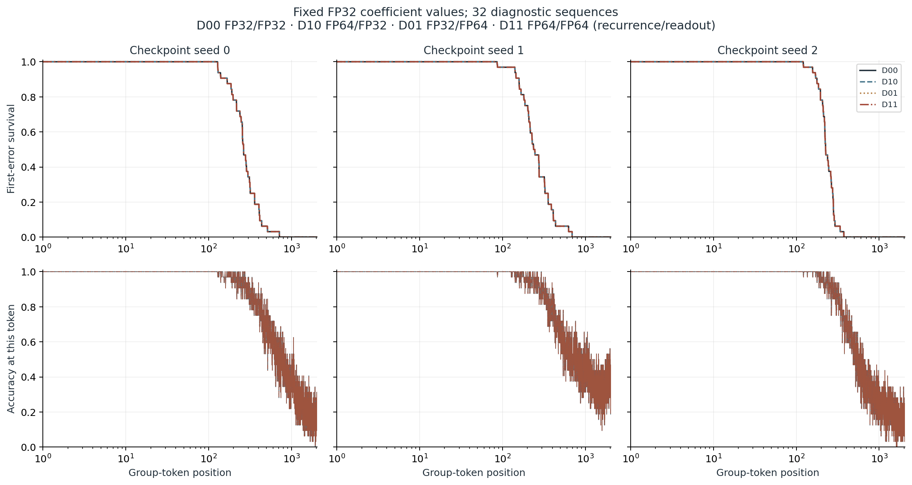
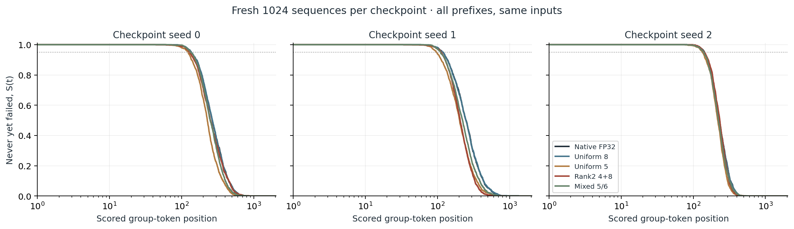
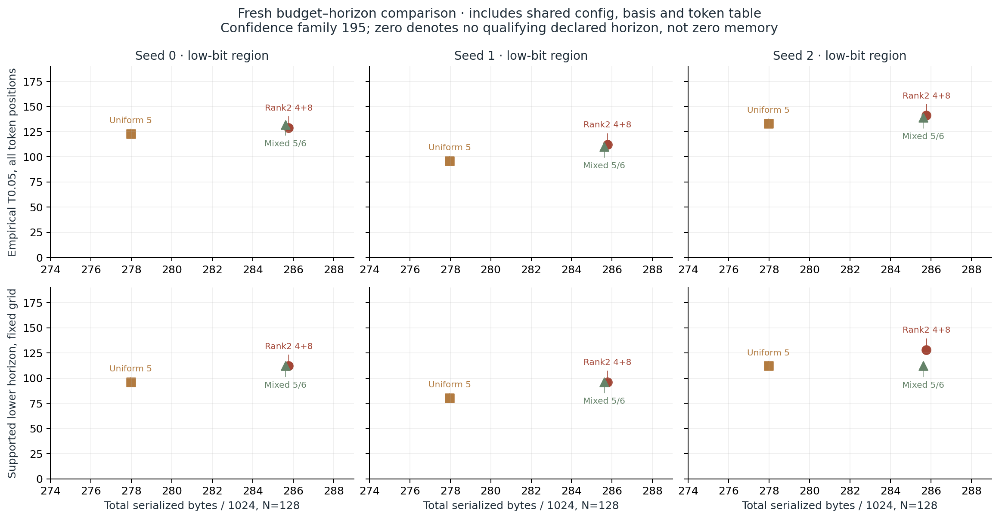
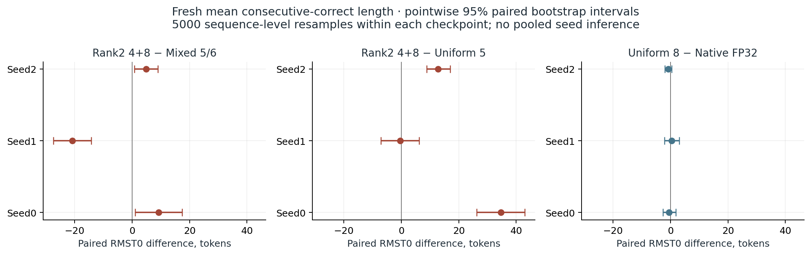
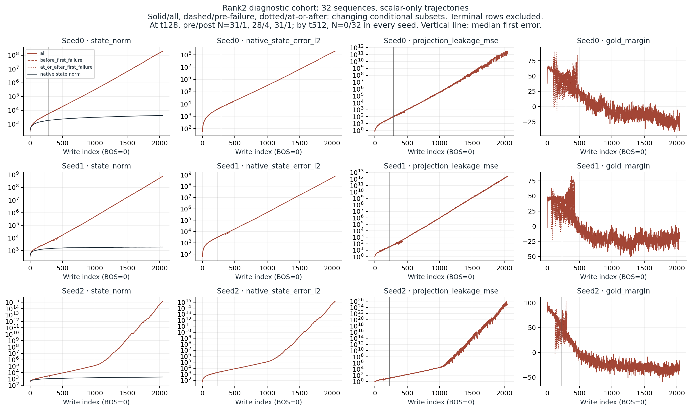

# Case010 v2 — Failure-preserving restart and equal-budget memory horizons

[한국어](REPORT.ko.md) · [Home](README.md)

Implemented a recurrent-state codec that preserves numerical failure, cursor and RNG state across a fresh-process restart. The same three trained checkpoints were evaluated on new inputs to compare packed storage budgets with the length of continuously correct symbolic readout.

## Contents

[Background](#background) · [Questions](#questions) · [Theory](#theory) · [Methods](#methods) · [Experiments](#experiments) · [Results](#results) · [Analysis](#analysis) · [Conclusion](#conclusion) · [References](#references)

## Background

V1 kept its numerical-failure mask inside a function call. The stored bytes lacked that history, so restarting could interpret a zero placeholder as active state. V2 retains the last committed finite body and serializes the failure reason and first write index. Original results, manifests and decisions remain unchanged.

## Questions

1. Do finite, terminal and stochastic caches preserve predictions and final bytes across a fresh process?
2. Does increasing recurrence or readout arithmetic precision change native first-error lifetime while holding the represented FP32 coefficients fixed?
3. On new inputs, does rank2 residual storage extend the 5%-risk readable horizon compared with a mixed 5/6-bit baseline under the same N128 cap?

This follow-up menu was informed by already explored v1 observations. Fresh TEST was not used to select rank, basis, codec or checkpoint. [Protocol](protocol_v2.json) freezes actual input bytes and the comparisons.

## Theory

The physical recurrence is $S_t=A_tS_{t-1}+B_t$. A corrected candidate transports its own represented state $Z+\hat R$ through the full transition and stores the residual of its own write-back. Exact full-residual transport is an accounting identity for corrected-state feedback, not a new theorem. For an exact affine update and residual representation error eta_t, e_t=A_t e_(t−1)+eta_t. Finite arithmetic also requires the difference in computation rounding to enter eta_t, even at a matched dtype; coefficient changes require additional terms. Rank truncation, finite arithmetic and an MLP decoder prevent treating this experiment as an infinite-memory or universal bit-bound result.

First error $\tau$ is the first scored group-token prediction that is wrong or INVALID. Recovery never restores first-error survival. $S(t)=P(\tau>t)$. RMST0 is the mean number of consecutive correct tokens before failure, excluding the failing token; a right-censored sequence contributes 2048. Current-token accuracy counts later recovery separately.

## Methods

Inputs are uniform draws from all six S3 elements; an independent integer left-multiplication table provides symbolic gold. The original single-layer CKDA (d_model 48, 12 heads, head dimension 16), three final checkpoints and pinned upstream `ef9d108…` are unchanged. New training updates: 0. Native uses the same canonical FP32 token table and sequential physical-coordinate path, not a fused CUDA run. The original CAL 64 × 32, seed 1001, supplies frozen bases and channel scores.

Each stream has an 8-byte little-endian cursor, 1-byte terminal code and 8-byte first-terminal write index. ACTIVE uses UINT64_MAX as the first-write sentinel. BOS is write 0 and the first scored token is write 1. Every consumed input advances the cursor, including terminal no-ops. After failure, state/residual/RNG body bytes remain fixed.

A finite wrong label keeps running. A nonfinite readout with finite state produces −1 only at that step and also keeps running. Numerical reconstruction, transition, representation-range or post-write failures terminate only that row and roll back its entire proposed state/residual/RNG commit. Corrupt checkpoints, shapes, programming exceptions and process/resource failures remain execution errors. Gold and tau belong to evaluator history, never codec inputs.

Actual serialization counts shared configuration, basis and token table plus per-stream codes, scales, RNG and header. The mixed baseline starts at 5 bits and promotes 29 head/key channels to 6 bits in the frozen CAL-score order. The next promotion exceeds the rank2 N128 cap. Uniform8 and native are fidelity/capacity references.

| Arm | Stream B | Shared B | Total N1 / N16 / N128 |
| --- | --- | --- | --- |
| NATIVE_FP32 | 12305 | 30344 | 42649 / 227224 / 1605384 |
| UNIFORM_8 | 3137 | 30560 | 33697 / 80752 / 432096 |
| UNIFORM_5 | 1985 | 30560 | 32545 / 62320 / 284640 |
| LOWRANK_4_8_R2 | 2033 | 32409 | 34442 / 64937 / 292633 |
| MIXED_5_6_BUDGET | 2043 | 30965 | 33008 / 63653 / 292469 |

All seeds have the same sizes. N128 is the concurrent-stream storage scenario, distinct from 1024 independent input sequences and the actual evaluation batch of 1024. [Actual buffers](results/ledger_validation.json) verify N1/16/128 sizes. Mixed trades lower shared cost for a slightly larger stream payload; equal-cap feasibility is not claimed at N1024. Common model parameter values 226,120 B and checkpoint file 233,203 B are separate. V2 adds 9 B per stream and 934 B shared metadata. The mixed baseline's v1-envelope ledger is a size-only construction, not a historical measured arm. One temporary FP32 state array occupies 12,582,912 B at N1024; multiple temporaries coexist. Process RAM peak and GPU VRAM were not measured.

## Experiments

- **[A] Historical recalculation:**125toy,78learned and12supplement records. The original 26-arm/family546 and 30-arm/joint630 views are kept separate.
- **[B] Implementation parity:** synthetic fault injection and fresh-process/RNG checks; four arms on the first 16 historical TEST inputs × 2048 in each checkpoint; three extra DEV arms; four selected actual numerical failures. Injected failures never count as measured CKDA incidence.
- **[C] Fresh evaluation:**1024×2048 inputs from seed 50101, shared by five arms and all three checkpoints. A separate 32 × 2048 cohort from seed 40101 supplies precision and trace diagnostics.

Fresh uncertainty uses 13 declared horizons × 5 arms × 3 checkpoints=195 comparisons, alpha 0.05, with exact one-sided binomial upper bounds. Off-grid empirical curves do not inherit that simultaneous confidence statement. With zero events in 1024, the upper bound is 0.0080424: a secondary 1%-risk bound is possible in principle but still depends on observed failures. Paired RMST intervals use 5000 sequence-level resamples within one fixed checkpoint and are pointwise. Checkpoints are not pooled.

The evaluation job stores runtime bytes separately from cumulative tau, INVALID counts and output boundaries. It validates a temporary-directory inventory before a same-filesystem rename. This promises atomic visibility, not fsync crash durability. Full runtime job checkpoints remain private; the review includes initial zero payloads, final hashes and compact predictions.

## Results

### [A] Historical v1

The original 26-arm family has 2/54 budget comparisons with a larger supported horizon; the stronger 30-arm/joint630 view has 0/54. Native all-token empirical T0.05 is 139/108/144, distinct from the old seven-grid values 128/64/128. [Historical recalculation](results/historical-reanalysis/HISTORICAL_ANALYSIS.ko.md) and its figures remain separate from fresh evidence.

### [B] Failure and restart

A synthetic probe reconstructed from the request reproduces v1 revival after restarting a failed stream. The requested independent-review archive and exact probe were unavailable, so their execution is not claimed. All 19 actual historical comparison cells pass. Healthy paths match v1/v2 predictions and body bytes; v2 split/fresh-process paths match complete predictions and final bytes. A separate frozen coverage appendix also tests all four actual failures immediately before and after their recorded failure writes. All four fresh-process post-failure continuations pass, including Uniform3 whose failure followed the original last interior cut. [Failure-boundary appendix](results/historical-failure-boundaries/index.json). A terminal v2 body differs deliberately from v1 by retaining the previous committed body plus failure metadata. [Probe](results/v1_failure_probe_from_request.json), [historical index](results/historical/seed0/index.json), [regression tests](tests/test_online_v2.py).

### [C] Fixed-coefficient precision

| Seed | Mode | RMST0 | Empirical T0.05 | S128 / S512 | Token accuracy |
| --- | --- | --- | --- | --- | --- |
| 0 | D00 | 290.38 | 129 | 100.00% / 6.25% | 45.43% |
| 0 | D10 | 290.38 | 129 | 100.00% / 6.25% | 45.43% |
| 0 | D01 | 290.38 | 129 | 100.00% / 6.25% | 45.43% |
| 0 | D11 | 290.38 | 129 | 100.00% / 6.25% | 45.43% |
| 1 | D00 | 279.69 | 141 | 96.88% / 6.25% | 52.53% |
| 1 | D10 | 279.69 | 141 | 96.88% / 6.25% | 52.53% |
| 1 | D01 | 279.69 | 141 | 96.88% / 6.25% | 52.53% |
| 1 | D11 | 279.69 | 141 | 96.88% / 6.25% | 52.53% |
| 2 | D00 | 236.75 | 157 | 96.88% / 0.00% | 39.14% |
| 2 | D10 | 236.75 | 157 | 96.88% / 0.00% | 39.14% |
| 2 | D01 | 236.75 | 157 | 96.88% / 0.00% | 39.14% |
| 2 | D11 | 236.75 | 157 | 96.88% / 0.00% | 39.14% |

D00 is FP32/FP32, D10 is FP64 recurrence followed by a state cast and the original FP32 readout, D01 uses FP32 recurrence and explicit FP64 readout, and D11 is FP64/FP64. The coefficient construction path is fixed at its represented FP32 q/k/v/alpha/beta/g/e values. D01/D11 promote those values and fixed weights, then evaluate the output sigmoid(g), output projection, normalization and MLP readout in FP64. Coefficient generation is not repeated; readout arithmetic is promoted. Actual dtype traces and explicit-FP32 parity are checked. All four modes have identical complete prediction matrices and tau within each seed. [Readback](provenance/diagnostic_readback.json).

### [C] Fresh packed-state comparison

| Seed | Arm | Empirical T0.05 | Supported T0.05 ≥ | RMST0 | Terminal /1024 |
| --- | --- | --- | --- | --- | --- |
| 0 | NATIVE_FP32 | 135 | 112 | 288.57 | 0 |
| 0 | UNIFORM_8 | 136 | 112 | 288.12 | 0 |
| 0 | UNIFORM_5 | 123 | 96 | 242.85 | 0 |
| 0 | LOWRANK_4_8_R2 | 129 | 112 | 277.47 | 0 |
| 0 | MIXED_5_6_BUDGET | 132 | 112 | 268.20 | 0 |
| 1 | NATIVE_FP32 | 118 | 96 | 271.15 | 0 |
| 1 | UNIFORM_8 | 118 | 96 | 271.57 | 0 |
| 1 | UNIFORM_5 | 96 | 80 | 220.35 | 0 |
| 1 | LOWRANK_4_8_R2 | 112 | 96 | 219.97 | 0 |
| 1 | MIXED_5_6_BUDGET | 110 | 96 | 240.73 | 0 |
| 2 | NATIVE_FP32 | 142 | 128 | 238.28 | 0 |
| 2 | UNIFORM_8 | 141 | 128 | 237.49 | 0 |
| 2 | UNIFORM_5 | 133 | 112 | 222.77 | 0 |
| 2 | LOWRANK_4_8_R2 | 141 | 128 | 235.60 | 0 |
| 2 | MIXED_5_6_BUDGET | 139 | 112 | 230.69 | 0 |

| Seed | Candidate − baseline | Δ RMST0 | Pointwise 95% interval |
| --- | --- | --- | --- |
| 0 | LOWRANK_4_8_R2 − MIXED_5_6_BUDGET | 9.27 | [1.07, 17.35] |
| 0 | LOWRANK_4_8_R2 − UNIFORM_5 | 34.62 | [26.26, 43.03] |
| 0 | UNIFORM_8 − NATIVE_FP32 | -0.45 | [-2.64, 1.85] |
| 1 | LOWRANK_4_8_R2 − MIXED_5_6_BUDGET | -20.76 | [-27.41, -14.20] |
| 1 | LOWRANK_4_8_R2 − UNIFORM_5 | -0.38 | [-7.13, 6.24] |
| 1 | UNIFORM_8 − NATIVE_FP32 | 0.42 | [-2.14, 3.01] |
| 2 | LOWRANK_4_8_R2 − MIXED_5_6_BUDGET | 4.91 | [0.78, 8.94] |
| 2 | LOWRANK_4_8_R2 − UNIFORM_5 | 12.83 | [8.81, 17.00] |
| 2 | UNIFORM_8 − NATIVE_FP32 | -0.79 | [-2.00, 0.38] |

Rank2−mixed RMST0 differences are 9.27 / -20.76 / 4.91 tokens for seeds 0/1/2. A larger supported 5%-risk horizon appears in 1/3 checkpoints. Comparing supported lower bounds is descriptive, not a multiplicity-adjusted test of between-method risk superiority. There are 0 numerical terminal events among 15,360 stream-arm records across the 15 cells; these are not 15,360 independent inputs or models.

### Late instability and cost

Pre/post-failure curves are conditional means over subsets whose membership changes with time. At t128, pre/post sample counts are 31/1, 28/4 and 31/1 for seeds 0/1/2; by t512 they are 0/32 for each seed. [Fixed-time tables](results/diagnostic-summary/trace_fixed_times.csv) report valid counts per metric. Large late rank2 norms, errors and projection losses include continued rollout after the first label error. Terminal scratch zeros do not enter valid norm statistics. [Diagnostic scalars and definitions](results/diagnostic-summary/summary.json) separate error against native/shadow state from self-write-back error. Gold margins are evaluator-only. The ordering of first error, numerical failure and large norm is an observation, not a standalone causal identification.

After the other study evaluation jobs finished, serial CPU 2-thread calls used 16 × 128 inputs and three fixed repeats. The table reports **median complete-call milliseconds per scored group token**. BOS overhead is in the call; the denominator is 16 × 128. Transition, projection, packing, status handling and original readout are included; loading, file I/O and gold/shadow diagnostics are outside the timer.

| Seed | NATIVE_FP32 | UNIFORM_8 | UNIFORM_5 | LOWRANK_4_8_R2 | MIXED_5_6_BUDGET |
| --- | --- | --- | --- | --- | --- |
| 0 | 0.0306 | 0.0939 | 0.1209 | 0.1438 | 0.1185 |
| 1 | 0.0288 | 0.0975 | 0.1206 | 0.1491 | 0.1160 |
| 2 | 0.0306 | 0.0946 | 0.1090 | 0.1419 | 0.1119 |

[Timing records](results/timing/seed0/timing.json) distinguish active updates from terminal no-ops. These are Python/NumPy/PyTorch CPU reference costs, not single-request latency or GPU speedups. System-wide OS background load was not fully controlled.

## Analysis

V2's software improvement is preserving termination across call boundaries. That is separate from increasing model memory horizon. Identical labels under four arithmetic modes on 32 diagnostic inputs make a simple precision-only account insufficient for this observation; they do not establish undertraining, representational impossibility or a necessary bit lower bound.

Mean consecutive-correct length, 5%-risk horizon, current-token accuracy, late state norm and CPU cost are different endpoints. Native also fails long extrapolation, so not every candidate error is attributable to state quantization. Historical joint 0/54 remains unchanged. A new family and sample size change confidence bounds; that numerical change alone is not a method improvement.

## Conclusion

The study implements failure-, RNG- and cursor-preserving packed state and evaluation-job restart, and replays actual historical failures. It retains a fixed-budget comparison on new inputs with complete curves. Rank2's mean effects and supported-horizon outcomes are reported together; neither a favorable checkpoint nor late token accuracy replaces the first-failure objective. New training 0, GPU runs 0, remote publication 0.

## References

[NOTICE](NOTICE.md) · [unchanged v1 sources and hashes](provenance/v1_source_identity.json) · [upstream/checkpoint provenance](provenance/v1_checkpoints.json) · [protocol freeze](provenance/protocol_freeze.json)

The v1 ComplexKDA, state-quantization and error-feedback references are preserved. The model, training and original codecs are upstream/v1 work; this follow-up implements failure-aware execution and its validation. Codex assisted implementation, checking and report writing.
