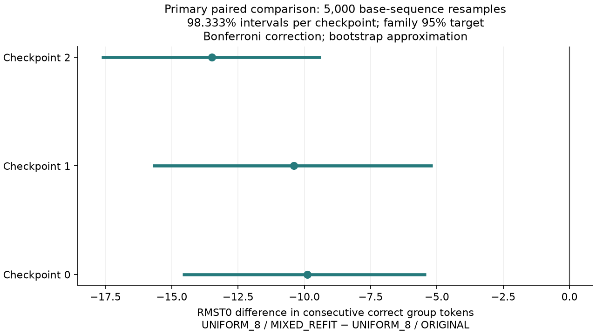
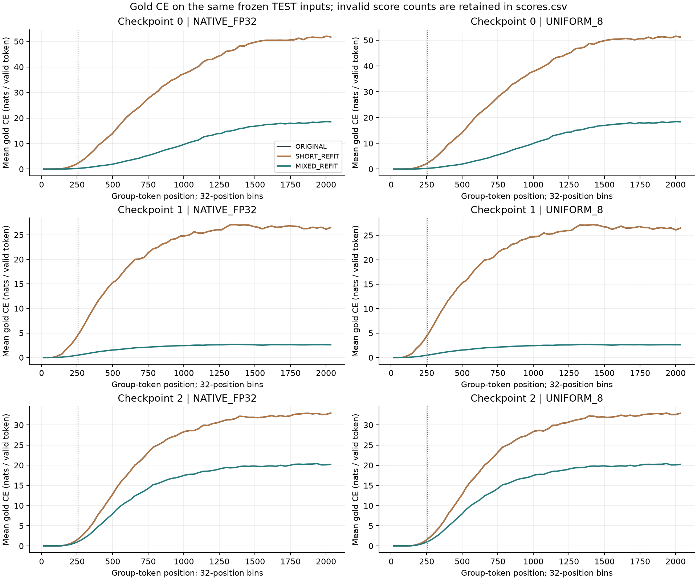

# Case 011 — Frozen-State Readout Adaptation and Length Extrapolation

[한국어](REPORT.ko.md) · [English](REPORT.md) · [README](README.md)

Built a shared-state comparison runner and a two-tensor save/reload path for adapting only the final Linear. The study reads 1,024 new sequences through 2,048 group tokens on each of three existing CKDA checkpoints, keeping Native and INT8 storage fixed.

A recurrent state is a set of numbers that summarizes earlier inputs and changes with each input. Here, frozen state means **the three readouts within one storage mode see the same state and feature at each step**; Native and INT8 follow separate state trajectories. The readout is the final answer-selection layer. A token in this task is one S3 group element, not a natural-language word.

**Main observation:** gold-label scores improved beyond position 256, while the average uninterrupted correct prefix under INT8 became shorter on all three checkpoints.

1. [Background](#s1)
2. [Hypotheses and questions](#questions)
3. [Theory and metrics](#theory)
4. [Methods](#s4)
5. [Experiments](#s5)
6. [Results](#s6)
7. [Analysis](#s7)
8. [Conclusion](#s8)
9. [References and contributions](#references)

## 1. Background
Case010 implemented low-bit state storage and failure-preserving restart. Its arithmetic diagnostic found unchanged predictions/first failures after promoting fixed FP32 coefficients to FP64 on a separate diagnostic cohort. That does not establish a readout cause. Case011 is a separate intervention that actually changes the final readout values over the same state.

## 2. Hypotheses and questions
The predeclared primary question is whether MIXED_REFIT improves INT8 RMST0 over ORIGINAL. SHORT is the position-1–32 refit control; MIXED uses positions through 256. Both fit Native features only. Positions 512/1024/2048 test length extrapolation. No candidates, lambdas or seeds were added after TEST.

## 3. Theory and metrics
`phi_t` is the original GELU feature after the fixed state read, normalization, gating, projection, embedding residual, LayerNorm and hidden Linear. Candidate and original logits are `Wc phi_t + bc` and `W0 phi_t + b0`; neither affects the next state.

`tau` is the first wrong/INVALID 1-based group-token position. `RMST0=mean(min(tau−1,2048))`, with an unfailed sequence censored at 2048. Later recovery does not restore survival. Empirical T0.05 is the final observed position with first-error risk at most 5%; no confidence-supported horizon is calculated here.

Gold cross-entropy (CE) decreases when the model assigns more probability to gold. Token accuracy, average CE and the correct prefix before a first error answer different questions. The three primary contrasts are checkpoint-specific INT8 MIXED−ORIGINAL RMST0. Resampling keeps base sequences paired, with 5,000 draws, seeds 63001/63002/63003 and NumPy `linear` quantiles. Each 98.333…% percentile-bootstrap interval targets a Bonferroni family 95% level **approximately**, not with exact coverage. Tokens, heads and storage evaluations of the same sequence are not independent samples.

## 4. Methods
Only `mlp.2.weight [6,192]` and `mlp.2.bias [6]` may change. The same three existing checkpoints, FP32 states/coefficients and hidden-feature computation are retained. All three heads for a storage read one shared feature. An independent integer S3 left-product evaluator supplies gold only to evaluation. Wrong labels continue; invalid readout from finite state yields −1 and continues; numerical state failure retains the original v2 absorbing terminal policy.

Each refit receives 16,384 supervised rows. SHORT uses the first 32 positions, while MIXED uses eight positions in each of four bands per 512 sequences. Extraction actually shares the full 256-position Native trajectory, so equal supervised rows are not claimed to be equal independently executed training compute. CPU FP64 L-BFGS minimizes `mean CE + λ(||W−W0||²+||b−b0||²)`, with λ={1e−4,1e−2,1}, at most 200 iterations/1000 evaluations. Selection uses equal-band DEV CE after FP32 conversion, with exact ties favoring larger λ. [Full methods](METHODS.md).

Fitting minimizes average CE plus a penalty; λ selection uses **DEV CE with equal weight for four position bands**. The TEST primary metric is **RMST0**. The difference between selection objective and final question was fixed before TEST. The penalty coefficient multiplies the **sum of squared parameter displacements** beside mean CE; there is no feature scaling. This is supervised final-layer adaptation, with no recurrent-backbone training.

## 5. Experiments
| Role | Seed | Sequences | Group tokens |
| --- | --- | --- | --- |
| SMOKE | 61601 | 8 | 32 |
| FIT | 61101 | 512 | 256 |
| DEV | 61201 | 128 | 256 |
| FRESH_TEST | 61301 | 1024 | 2048 |

Inputs sample all six S3 elements uniformly. BOS write0 is unscored and every group prefix is scored. Actual bytes, IDs and hashes were frozen before execution. There were zero new backbone training runs, zero new codecs, 18 fitting candidates, six selected heads and six primary rollouts/18 logical arms. Historical Case010 cohorts are not pooled into this sample.

| Seed | Head | λ | Changed FP32 values | Solver status |
| --- | --- | --- | --- | --- |
| 0 | SHORT_REFIT | 1.0 | 0 | GRADIENT_TOLERANCE_MET |
| 0 | MIXED_REFIT | 0.0001 | 1158 | MAX_ITER_NOT_CONVERGED |
| 1 | SHORT_REFIT | 1.0 | 0 | GRADIENT_TOLERANCE_MET |
| 1 | MIXED_REFIT | 0.0001 | 1158 | MAX_ITER_NOT_CONVERGED |
| 2 | SHORT_REFIT | 1.0 | 0 | GRADIENT_TOLERANCE_MET |
| 2 | MIXED_REFIT | 0.0001 | 1158 | OPTIMIZER_SMALL_CHANGE_OR_DIRECTION_STOP |

SHORT stopped within the initial gradient tolerance and left FP32 parameters unchanged. MIXED seeds 0/1 have `MAX_ITER_NOT_CONVERGED`; seed2 stopped for a small change/direction. The iteration cap was not extended after TEST. Supporting head diagnostics read already saved DEV features and parameters without changing selection.

Selected solver objectives, gradients and stopping records

| Seed | Head | λ | Iteration/evaluation | Objective: initial → final | FIT CE nats: initial → final | Max absolute gradient: initial → final |
| --- | --- | --- | --- | --- | --- | --- |
| 0 | SHORT | 1 | 0/1 | 2.71051e-20 → 2.71051e-20 | 2.71051e-20 → 2.71051e-20 | 6.29e-19 → 6.29e-19 |
| 0 | MIXED | 0.0001 | 200/216 | 0.209249 → 0.0203782 | 0.209249 → 0.0154738 | 0.0262 → 3.63e-06 |
| 1 | SHORT | 1 | 0/1 | 9.18089e-16 → 9.18089e-16 | 9.18089e-16 → 9.18089e-16 | 1.61e-14 → 1.61e-14 |
| 1 | MIXED | 0.0001 | 200/210 | 0.498313 → 0.0418503 | 0.498313 → 0.0368489 | 0.0745 → 0.000249 |
| 2 | SHORT | 1 | 0/1 | 6.60144e-17 → 6.60144e-17 | 6.60144e-17 → 6.60144e-17 | 1.36e-15 → 1.36e-15 |
| 2 | MIXED | 0.0001 | 104/105 | 0.142225 → 0.00501566 | 0.142225 → 0.00078632 | 0.0225 → 6.7e-07 |

Fitting executes in FP64; DEV and inference execute the exported FP32 head. SHORT stopped at iteration zero because the initial maximum gradient was below `1e-7`; its FP32 export is bitwise unchanged. The identical initial/final objectives and [tensor displacement record](results/head_diagnostics.json) support this. Separate final FP64 tensor files are not public, so this is not a new audit of FP64 weight files. MIXED seeds 0/1 reached the 200-iteration cap; seed2 stopped after 104 iterations for a small change/direction. None of the three MIXED fits achieved the gradient stopping criterion. Full selected records: [seed0](results/fit-seed0-MIXED_REFIT.json), [seed1](results/fit-seed1-MIXED_REFIT.json), [seed2](results/fit-seed2-MIXED_REFIT.json).

## 6. Results

Sections 6.1–6.5 retain the original fixed TEST findings. New analysis of those same records is separated in [section 7](#analysis).

### 6.1 Primary: consecutive correct lifetime under INT8

| Checkpoint | ORIGINAL | SHORT | MIXED | Δ MIXED−ORIGINAL | 98.333% interval |
| --- | --- | --- | --- | --- | --- |
| 0 | 285.84 | 285.84 | 275.96 | -9.89 | [-14.59, -5.41] |
| 1 | 264.59 | 264.59 | 254.19 | -10.40 | [-15.71, -5.16] |
| 2 | 239.80 | 239.80 | 226.31 | -13.49 | [-17.66, -9.38] |

Under INT8, the MIXED refit reduced uninterrupted correct lifetime on all three checkpoints. MIXED−ORIGINAL changes for seeds 0/1/2 were -9.89 / -10.40 / -13.49 tokens, with all three primary intervals below zero. Over positions 257–2,048, mean gold CE nevertheless decreased in 3/3 and token accuracy increased in 2/3. Better gold scores did not translate into a longer interval of correctness from the start.

Each checkpoint uses 1,024 paired sequences, 5,000 bootstrap draws and an approximate 98.333% interval. Checkpoints are not pooled into 3,072 independent model observations.

| Checkpoint | ORIGINAL T0.05 | SHORT T0.05 | MIXED T0.05 |
| --- | --- | --- | --- |
| 0 | 141 | 141 | 143 |
| 1 | 115 | 115 | 110 |
| 2 | 143 | 143 | 131 |

These horizons are every-token empirical values, not confidence lower bounds. A sequence passing through 2,048 remains right-censored at the observation limit.

[INT8 original survival curves](results/derived/figures/int8_survival.png)

### 6.2 Secondary Native comparison

| Checkpoint | ORIGINAL | SHORT | MIXED | Δ MIXED−ORIGINAL | Pointwise 95% interval |
| --- | --- | --- | --- | --- | --- |
| 0 | 287.43 | 287.43 | 277.23 | -10.20 | [-14.11, -6.50] |
| 1 | 266.61 | 266.61 | 257.08 | -9.54 | [-14.09, -5.03] |
| 2 | 239.70 | 239.70 | 226.49 | -13.21 | [-16.70, -9.83] |

These secondary intervals are pointwise 95%. INT8 MIXED−SHORT has the same point estimate as MIXED−ORIGINAL because SHORT tensors are unchanged, while its secondary confidence level/resampling seed differ. All same-readout Native↔INT8 contrasts are in [secondary.csv](results/derived/secondary.csv).

Empirical horizons for both storage modes

| Storage | Seed | ORIGINAL = SHORT T0.05 | MIXED T0.05 |
| --- | --- | --- | --- |
| NATIVE_FP32 | 0 | 141 | 143 |
| NATIVE_FP32 | 1 | 114 | 113 |
| NATIVE_FP32 | 2 | 143 | 131 |
| UNIFORM_8 | 0 | 141 | 143 |
| UNIFORM_8 | 1 | 115 | 110 |
| UNIFORM_8 | 2 | 143 | 131 |

### 6.3 INT8 gold scores by position range

| Seed | Positions | ORIGINAL accuracy % | MIXED accuracy % | ORIGINAL CE nats | MIXED CE nats |
| --- | --- | --- | --- | --- | --- |
| 0 | 1–32 | 100.00 | 100.00 | 0.0000 | 0.0002 |
| 0 | 33–128 | 99.92 | 99.95 | 0.0125 | 0.0027 |
| 0 | 129–256 | 95.86 | 96.59 | 0.9255 | 0.1126 |
| 0 | 257–512 | 75.64 | 76.74 | 8.4229 | 1.0975 |
| 0 | 513–1024 | 43.27 | 43.46 | 28.2199 | 5.9880 |
| 0 | 1025–2048 | 21.20 | 21.13 | 48.0973 | 16.1863 |
| 1 | 1–32 | 100.00 | 100.00 | 0.0000 | 0.0006 |
| 1 | 33–128 | 99.55 | 99.61 | 0.1214 | 0.0158 |
| 1 | 129–256 | 92.54 | 92.88 | 2.2983 | 0.2417 |
| 1 | 257–512 | 71.42 | 71.86 | 10.6193 | 1.0782 |
| 1 | 513–1024 | 47.80 | 48.45 | 21.2801 | 2.1044 |
| 1 | 1025–2048 | 36.10 | 36.17 | 26.3626 | 2.5935 |
| 2 | 1–32 | 100.00 | 100.00 | 0.0000 | 0.0000 |
| 2 | 33–128 | 99.96 | 99.94 | 0.0042 | 0.0049 |
| 2 | 129–256 | 96.68 | 96.50 | 0.5672 | 0.3701 |
| 2 | 257–512 | 73.05 | 73.15 | 7.1078 | 4.4274 |
| 2 | 513–1024 | 35.00 | 34.95 | 22.8075 | 14.1163 |
| 2 | 1025–2048 | 19.15 | 19.13 | 31.6552 | 19.5621 |

Lower gold CE is better; it is averaged per valid token observation. Accuracy retains the full token denominator. Positions beyond 256 are outside fitting support. A range average is distinct from a single-position value at 512/1024/2048. [scores.csv](results/derived/scores.csv) preserves denominators, invalid counts, margins and Native values. Public reanalysis uses retained score sums/counts, not reconstructed private full logits.

### 6.4 Controls

| Condition | True feature accuracy % | Shuffled accuracy % | Shuffled RMST0 |
| --- | --- | --- | --- |
| INT8 MIXED / seed0 | 43.31 | 16.71 | 1.20 |
| INT8 MIXED / seed1 | 51.22 | 16.68 | 1.20 |
| INT8 MIXED / seed2 | 39.72 | 16.72 | 1.20 |

The input-only control achieved 16.72% token accuracy and RMST0 1.19 tokens. At the first group token, gold equals the current token, so state-dependent information is unnecessary there. Within-position/current-token permutations use no labels; singleton rows are retained and counted. Separation from these controls supports state-dependent readout at this feature boundary, not a proof of an exact learned group representation or recovery by every decoder.

### 6.5 Storage, reload and cost

| Object / scope | Bytes |
| --- | --- |
| Native state / stream | 12305 |
| INT8 state / stream | 3137 |
| Model parameter values / before and after | 226120 |
| Final Linear values / before and after | 4632 |
| Original checkpoint file / each retained seed | 233203 |
| Added recurrent-state bytes / refitted head | 0 |
| One FIT feature matrix: 16,384 × 192 × FP32 | 12582912 |

| Seed | Patch | Tensor values B | Manifest B | Total files B |
| --- | --- | --- | --- | --- |
| 0 | SHORT_REFIT | 4632 | 3417 | 8049 |
| 0 | MIXED_REFIT | 4632 | 53024 | 57656 |
| 1 | SHORT_REFIT | 4632 | 3412 | 8044 |
| 1 | MIXED_REFIT | 4632 | 51450 | 56082 |
| 2 | SHORT_REFIT | 4632 | 3412 | 8044 |
| 2 | MIXED_REFIT | 4632 | 27514 | 32146 |

The six fresh rollout cells recorded 0 terminal streams in total. This counts numerical state failures, not correct sequences. Model/head values, cache, temporary features and files are separate ledger entries. The cell shared ledger describes the base v2 cache/table contract; selected-head manifests are separate artifact costs. Total artifact disk sizes are not claimed identical. Original checkpoint file sizes come from [Case010 file identities](../010-ckda-finite-precision-memory-horizon/versions/v2/provenance/v1_checkpoints.json). The review ZIP excludes original checkpoints and fitted head tensors while providing [exact patch manifests](provenance/head_patches/) and the loader.

The following checks are historical receipts from the original research run. Across three checkpoints × two storage modes on the fixed SMOKE cohort, original-readout and feature-plus-head logits were bitwise equal, with maximum difference zero. [Twelve fresh processes](provenance/head_reload.json) passed checks of logits, labels, features, cache, cursor and terminal/RNG state. [Thirty saved boundaries](provenance/execution_checkpoints.json) independently passed cursor, prefix, inventory and hash checks without model execution. The original unique unit suite passed 79 tests with no skips; a separate implementation audited six public TEST cells and 19 control summaries. Reruns are not added to the unique test count. [Validation receipt](provenance/validation_receipt.json); [zero changes across 3,708 protected files](provenance/protection.json).

The [complete byte ledger](results/byte_ledger.json) separates shared table/config costs, N=1/16/128 totals and temporary evaluation/fitting arrays. Process peak RAM was not measured.

| Seed | Storage | ORIGINAL ms/token | SHORT ms/token | MIXED ms/token |
| --- | --- | --- | --- | --- |
| 0 | NATIVE_FP32 | 0.02761 | 0.02867 | 0.03521 |
| 0 | UNIFORM_8 | 0.09234 | 0.08859 | 0.08674 |
| 1 | NATIVE_FP32 | 0.02812 | 0.02956 | 0.02920 |
| 1 | UNIFORM_8 | 0.08708 | 0.08766 | 0.09116 |
| 2 | NATIVE_FP32 | 0.02844 | 0.02755 | 0.03158 |
| 2 | UNIFORM_8 | 0.09220 | 0.08766 | 0.08920 |

Values are medians of three individual-head CPU complete calls: two threads and 16×128 group tokens. BOS work is in the numerator but not the group-token denominator. Each call uses one same-shaped Linear, not the multi-head research runner. No speedup significance, GPU speed or individual-request latency claim is made. The original 3 checkpoints × 2 storage modes × 3 heads × 3 repetitions give 54 calls; publication work did not remeasure them. [timing.json](results/timing/timing.json) retains every repetition.

## 7. Analysis
**The same-state intervention is verified: gold scores and first-error lifetime moved differently.** CE averages the negative log probability of gold across tokens; RMST0 can decrease after a single earlier error. Fitting minimizes average CE plus a weight-change penalty rather than directly optimizing the first error of a sequence. This study observes a mismatch between the objectives without identifying its geometric cause.

INT8 empirical T0.05 changes were seed0: 141→143 / seed1: 115→110 / seed2: 143→131 tokens. For seed0 this empirical position rose while RMST0 fell. A 5%-risk position and mean uninterrupted lifetime summarize different parts of the same distribution. These empirical values are not confidence-supported lower bounds.

An unchanged SHORT head means no additional correction under these fitting inputs, gradient tolerance and FP32 boundary. MIXED includes longer FIT features with existing errors and changes both tensors. This is a contrast in fitting-position support; seeds 0/1 reaching their iteration cap prevents interpreting their result as the optimum of all linear decoders.

These are not repeated FP64 diagnostics, new codecs or backbone retraining results. They concern one fresh TEST on the same three checkpoints, not all training initializations or language-model context lengths. A technical all-terminal boundary error was fixed on synthetic checks before TEST; result direction did not change execution rules.

### 7.1 Post-hoc analysis of the same records

The following `POST_HOC_SAME_RECORDS` analysis was added during publication from stored predictions, gold labels and score sums. It adds no fit or forward pass and does not change the original primary comparison or confidence family. [Analysis code](publication/posthoc/analyze.py) and [output with source hashes](publication/posthoc/data/summary.json) identify the calculation.

**Storage interaction on paired inputs.** First compute `(INT8 MIXED−ORIGINAL) − (Native MIXED−ORIGINAL)` for each base sequence, then summarize. Units are tokens.

| Seed | Native Δ | INT8 Δ | Interaction | Post-hoc 95% interval |
| --- | --- | --- | --- | --- |
| 0 | -10.20 | -9.89 | +0.31 | [-2.47, 3.07] |
| 1 | -9.54 | -10.40 | -0.87 | [-4.36, 2.91] |
| 2 | -13.21 | -13.49 | -0.29 | [-2.10, 1.48] |

These descriptive pointwise 95% intervals use 5,000 paired bootstrap draws, seeds 71101/71102/71103 and linear quantiles. All include zero; they are separate from the original 98.333…% primary intervals.

**Distribution of first-error shifts.** Each row contains the same 1,024 base sequences. `d = correct-prefix(MIXED) − correct-prefix(ORIGINAL)` retains the first error even if later predictions recover.

| Seed | Storage | Longer | Shorter | Same | Q25 token | Median token | Q75 token |
| --- | --- | --- | --- | --- | --- | --- | --- |
| 0 | NATIVE_FP32 | 314 | 404 | 306 | -15 | 0 | 5.25 |
| 0 | UNIFORM_8 | 313 | 411 | 300 | -15 | 0 | 5 |
| 1 | NATIVE_FP32 | 340 | 427 | 257 | -15 | 0 | 6 |
| 1 | UNIFORM_8 | 324 | 431 | 269 | -16 | 0 | 5 |
| 2 | NATIVE_FP32 | 331 | 494 | 199 | -33 | 0 | 8 |
| 2 | UNIFORM_8 | 320 | 491 | 213 | -32 | 0 | 7 |

Under INT8, 411/431/491 sequences became shorter versus 313/324/320 becoming longer. Every median is zero: the negative mean does not describe an identical shift for every input. [Per-sequence records](publication/posthoc/data/items.json) include longer, shorter and unchanged outcomes.

**Error redistribution by position.** For example, INT8 positions 129–256 show:

| Seed | CE nats O→M | Accuracy % O→M | New first errors O→M | Only ORIGINAL correct | Only MIXED correct | Wrong→different wrong |
| --- | --- | --- | --- | --- | --- | --- |
| 0 | 0.9255 → 0.1126 | 95.86 → 96.59 | 422 → 457 | 937 | 1896 | 107 |
| 1 | 2.2983 → 0.2417 | 92.54 → 92.88 | 478 → 501 | 1940 | 2388 | 319 |
| 2 | 0.5672 → 0.3701 | 96.68 → 96.50 | 627 → 661 | 1950 | 1713 | 615 |

In this band, CE fell on every checkpoint while the count of sequences encountering their first error rose. This does not support an account in which all early token accuracies declined: band accuracy rose for seeds 0/1 and fell for seed2.

Accuracy and transition counts use 1,024×128=131,072 token observations; CE uses retained valid score observations, with no invalid scores in these records. New-first-error counts are **sequences first wrong in that band out of all 1,024**, not a hazard conditional on survival before the band. [Post-hoc output](publication/posthoc/data/summary.json) contains both storage modes across 1–32 / 33–128 / 129–256 / 257–512 / 513–1024 / 1025–2048. Overall CE/accuracy weight bands by token counts rather than weighting the six bands equally.

**Available margins.** Public records retain per-position margin sums across all sequences, but not per-item margins or logits. They cannot recover margins specifically at ORIGINAL-correct→MIXED-wrong events or full-logit KL. A small decision-boundary change or class-shift mechanism remains unestablished.

**Control denominators.** Actual heads and input-only/shuffle controls score the same 1,024×2,048=2,097,152 token positions. Shuffle permutes without labels inside each position/current-token bucket and retains singletons. At the first position gold equals the current token, and the controls are 100% correct. Approximately one-sixth overall accuracy does not imply chance accuracy at every position or rule out every shortcut.

## 8. Conclusion
The completed artifacts are a shared-cache three-readout comparison, bounded supervision of 1,158 parameters, two-tensor patches with fresh-process replay, and independent public-prediction audits. Under INT8, MIXED−ORIGINAL changes in uninterrupted correct lifetime were -9.89 / -10.40 / -13.49 tokens for seeds 0/1/2, with all primary intervals below zero. Gold CE improved beyond position 256, but correctness from the start did not last longer. This result concerns the current feature, final Linear and fitting budget; it is not a proof that every decoder must fail to recover information.

The [original document copies](publication/original_docs/) preserve the review-stage wording and receipts. Publication work recalculates the same predictions/scalars and adds separately labelled post-hoc analysis; it adds no fitting, TEST forward or GPU run. [Publication verification](publication/README.md) separates current checks from historical receipts.

## 9. References and contributions
- [Case010 version map](../010-ckda-finite-precision-memory-horizon/VERSION_MAP.md) · [fixed precision/readout source](../010-ckda-finite-precision-memory-horizon/versions/v2/source/precision.py).
- OpenEuroLLM / ComplexKDA, pinned commit `ef9d108d1692387cae37f5b2d539a71826a127c1`; original model/task and coefficients.
- John Hewitt and Percy Liang (2019), [Designing and Interpreting Probes with Control Tasks](https://aclanthology.org/D19-1275/). Control motivation; this study does not reproduce that paper’s experimental control task.
- [Protocol and source freeze](configs/protocol.json) · [selected heads](configs/selected_heads.json) · [scalar aggregate](results/derived/aggregate.json) · [head diagnostics](results/head_diagnostics.json) · [NOTICE](NOTICE.md).

ComplexKDA supplies the model and task; Case010 supplies the state codecs; PyTorch/NumPy supply operations and L-BFGS. DIOVA implements the fixed-state intervention, bounded fitting, patch storage/checks and paired analysis. [NOTICE](NOTICE.md) records upstream credit, licenses and Codex assistance.
