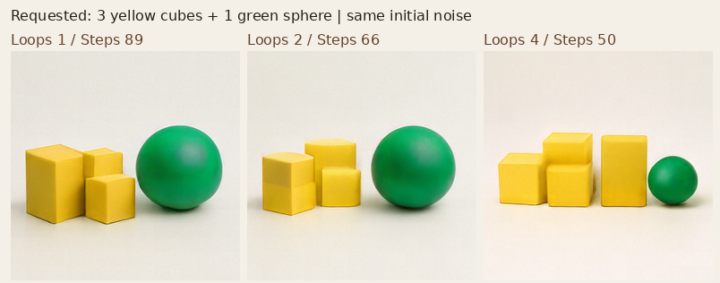

# Case 012 — 이미지 생성 시간, 어디에 계산을 더 쓸까?

[English](README.md) | 한국어

이미지 한 장을 만들 때, 잡음을 여러 번 고치는 **생성 단계**와 각 단계 안에서 모델을 다시 계산하는 **내부 반복**에 시간을 어떻게 나눠 쓸지 비교하는 도구를 구현했습니다. 같은 출발점에서 세 이미지를 생성하고, 걸린 시간과 개수·색·좌우 요구의 충족 여부를 함께 살펴볼 수 있습니다.

**동일 초기 잡음 · 설정별 시간·메모리 기록 · 조건을 가린 평가 화면**

[전체 이미지 비교](publication/IMAGES.ko.md) · [실행 코드](source/adapter.py) · [정식 보고서](REPORT.ko.md)

[Loop와 Step](#loops) · [현재 결과](#results) · [결과의 의미](#interpretation) · [직접 확인](#run) · [출처](#sources)

<a id="loops"></a>
## Loop와 Step은 무엇인가요?

- **Step(생성 단계)**: 잡음에서 시작한 이미지를 다음 상태로 갱신하는 횟수입니다.
- **Loop(내부 반복)**: 생성 단계 하나에서 같은 모델의 핵심 블록을 반복해서 사용하는 횟수입니다.

예를 들어 Loop 4 / Step 50은 이미지를 50단계로 갱신하며, 각 단계의 핵심 계산을 네 번 반복합니다. 여기서 반복 횟수와 단계 수를 함께 바꾸면 시간도 이미지도 달라집니다. B/32의 32는 이미지 patch 크기이고 loop 횟수가 아닙니다.

<a id="results"></a>
## 현재 무엇을 확인했나요?

16개 문장의 서로 다른 초기 잡음 4개씩, 같은 **64쌍**을 세 설정에서 생성했습니다. MAIN 192장과 실행 확인용 SMOKE 24장의 생성·측정을 마쳤습니다.

| 내부 반복 Loop | 생성 단계 Step | 요청 시간 중앙값(초) |
|---:|---:|---:|
| 1 | 89 | 4.534 |
| 2 | 66 | 4.385 |
| 4 | 50 | 4.762 |

RTX 5080 · 512×512 · 같은 Looped-DiT B/32 저장본 · 설정별 64요청. 시간에는 문장 처리, T5 text encoder, 이미지 생성과 CPU 이미지 변환을 포함하며 모델 로딩·PNG 파일 쓰기는 제외합니다.

Loop 2 / Step 66이 가장 짧은 중앙 시간을 보였습니다. 실제 시간 맞추기의 ±5% 목표는 달성하지 못했으므로, 정확한 동일 시간 실험으로 표현하지 않습니다. 새 프로세스 반복에서는 Loop 1과 4의 시간 순위가 바뀌었습니다.

**전체 품질 평가는 주석 대기입니다.** 아직 조건 충족률이나 품질 기반 추천 설정을 계산하지 않았습니다. 이미지가 만들어진 것과 요구를 맞힌 것은 다른 결과입니다.

<a id="interpretation"></a>
## 결과를 어떻게 읽으면 좋을까요?

“노란 정육면체 세 개와 초록 구 한 개”를 요청한 같은 입력의 예시입니다.



시각 점검에서는 앞의 두 이미지에 정육면체 세 개, 마지막 이미지에 네 개가 보였습니다. 더 깊은 내부 반복과 더 적은 생성 단계의 조합이 이미 맞힌 개수 조건을 잃는 사례입니다. Loop와 Step을 동시에 바꿨으므로 Loop만의 원인으로 분리할 수는 없습니다.

이 예시는 코드 에이전트가 첫 고정 seed의 48장을 살펴본 뒤 선택한 **사후·비블라인드 AI 시각 점검**입니다. 공식 인간 주석이나 전체 정답률이 아닙니다. 네 개의 풍선을 요청했는데 세 설정 모두 다섯 개를 그린 사례도 있어, 계산을 달리 배분한다고 모든 오류가 해결되지는 않았습니다.

현재 관측은 “더 깊게 반복하면 언제나 더 정확하다”는 단순한 기대를 뒷받침하지 않습니다. 최종 비교는 실제 시간과 조건별 획득·손실을 함께 읽어야 합니다. [모든 64쌍](publication/IMAGES.ko.md)과 [세부 분석](REPORT.ko.md#s7)에서 다른 입력도 확인하세요.

<a id="run"></a>
## 직접 확인하기

GitHub에서는 [이미지 비교 문서](publication/IMAGES.ko.md)를 바로 읽을 수 있습니다. 저장소를 내려받으면 `demo/viewer.ko.html`을 브라우저로 열어 입력별 결과를 선택하거나 `demo/annotation.ko.html`에서 조건을 가리고 평가할 수 있습니다. HTML 링크를 GitHub에서 누르면 실행 화면 대신 소스가 표시됩니다.

모델 없이 저장된 기록을 검산하려면 Case 012 폴더에서 실행합니다.

```bash
python3 -m venv ../../.venv-case012-cpu
source ../../.venv-case012-cpu/bin/activate
python -m pip install -r requirements-cpu.txt
python analysis/audit.py
python publication/verify.py
```

모델을 다시 실행하지 않고 PNG·시간·입력 pairing·원형 보존을 확인합니다. [CPU 재현과 평가 방법](REPRODUCTION.md) · [모든 원본 PNG 목록](demo/gallery.ko.html) · [동결 설정](configs/main_settings.json)

<a id="sources"></a>
## 출처와 적용 범위

**사용 기술:** PyTorch · Transformers · NumPy · Pillow · HTML/CSS/JavaScript. Looped-DiT 모델은 OpenSenseNova의 구현이며, DIOVA는 동일 잡음 실행기·시간 예산 선택·평가·결과 탐색 도구를 구현했습니다. [출처와 기여](NOTICE.md)

같은 4-loop 학습 저장본을 Loop 1/2/4로 실행한 비교입니다. 별도로 학습한 세 모델의 비교나 새로운 이미지 생성 알고리즘을 제안하는 연구는 아닙니다. 이번 문항은 흰 배경의 개수·색·좌우 구성 16개이며 공식 GenEval 전체 점수와 구분합니다. [모델 식별](provenance/models.json) · [원형 기록과 공개본](publication/README.md)
