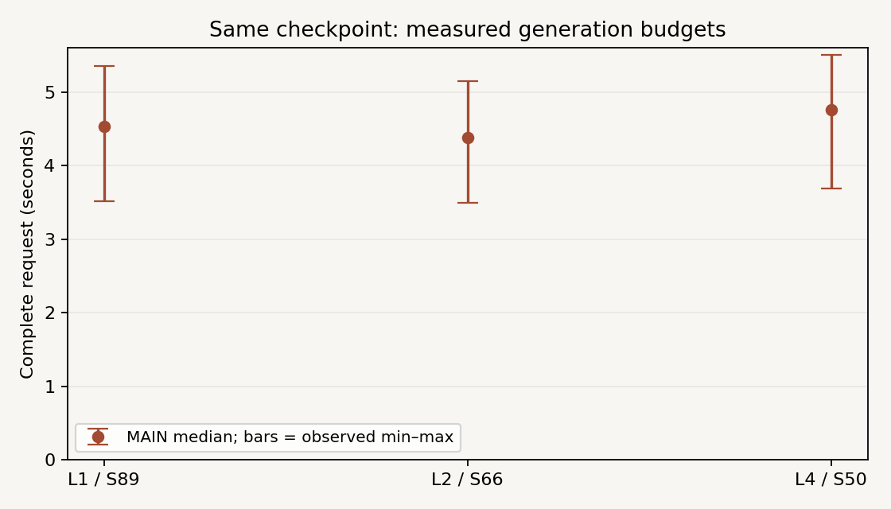

# Case 012 — 같은 생성 시간, 어디에 계산을 더 쓸까?

[English](REPORT.md)

같은 Looped-DiT B/32에서 loop·step 예산을 배분하고, 생성·측정·판독을 연결하는 도구를 구현했습니다. 현재 모든 예정 이미지와 시간 기록을 확보했으며 품질 주석을 기다립니다.

## 목차

1. [배경](#s1)
2. [가설과 검증 질문](#s2)
3. [이론과 비용 모델](#s3)
4. [방법](#s4)
5. [실험](#s5)
6. [실험 결과](#s6)
7. [결과 분석](#s7)
8. [결론](#s8)
9. [레퍼런스와 기여](#s9)

## 1. 배경

이미지 생성에는 잡음을 제거하는 여러 단계와 한 단계 안의 모델 계산이 있습니다. 같은 저장본에서도 내부 반복 수와 생성 단계 수를 바꾸면 다른 시간·이미지를 얻습니다. 이 Case는 그 계산을 요청 완료 시간으로 측정하고, 실제 요청의 개수·색 대응·좌우 조건을 확인할 수 있게 합니다.

Looped-DiT 저자는 이미 loop와 step 비교를 다뤘습니다. 여기서는 새로운 생성 알고리즘 대신 로컬 measured-budget 실행과 paired 판독·선택 도구를 제공합니다.

## 2. 가설과 검증 질문

주 질문은 가까운 측정 시간에서 L=4가 L=1보다 모든 명시 평가 조건을 더 자주 만족하는가입니다. 주 비교는 **C_time−A_time**의 all-constraint pass rate입니다. L=2는 중간 trade-off 조건입니다. 더 많은 loop가 조건을 얻거나 이미 충족한 조건을 잃을 가능성을 모두 비교합니다.

선택에는 LATENCY-DEV의 시간만 사용했습니다. 품질을 보고 prompt·seed·CFG·step·rubric를 바꾸지 않았습니다. 품질 결과는 아직 계산하지 않았습니다.

## 3. 이론과 비용 모델

한 forward의 joint block 수는 `6 + 5L + 6`입니다. CFG=6에서는 conditional/unconditional을 별도로 호출하므로 요청의 model 호출은 `2S`, joint 방문은 `2S(12+5L)`입니다.

| Proxy 조건 | L | S | CFG 제외 joint 방문 | CFG 포함 joint 방문 |
|---|---:|---:|---:|---:|
| A | 1 | 94 | 1598 | 3196 |
| B | 2 | 73 | 1606 | 3212 |
| C | 4 | 50 | 1600 | 3200 |

Text-only preamble은 forward마다 2개이며, embedding·출력 head·T5·전송·Python 비용도 실제 시간에 포함됩니다. 위 proxy는 FLOPs나 wall time의 동일성을 뜻하지 않습니다. TRACE에서 실제 방문 수를 확인했으며 이 hook 시간은 성능 표에서 제외했습니다.

## 4. 방법

저장본·EMA·tokenizer·prompt 길이256·CFG6·해상도512·noise scale2·Euler 수식·eager/TF32 정책을 고정하고 L/S만 바꿨습니다. VAE나 timestep conditioning을 추가하지 않았습니다. Denoiser는 BF16이며 원래 T5 기본 로딩의 실제 dtype은 FP32입니다. 초기 pixel-space 잡음은 BF16이고 원래 수식의 write-back state는 첫 update부터 FP32입니다.

각 prompt–seed의 독립 CUDA generator로 초기 잡음을 재생성하고 실제 byte hash를 비교합니다. 모델 로딩·warmup의 RNG 소비는 이 초기값을 바꾸지 않습니다. 서로 다른 S의 중간 state를 같은 이미지 궤적으로 해석하지 않습니다.

완료 요청 시간은 문자열→tokenization→T5→sampling→CPU/PIL 변환입니다. CUDA synchronization으로 완료를 확인하며 다운로드·모델 cold load·PNG 파일 쓰기·평가·profiler는 제외합니다. Sampler GPU event는 이미 인코딩된 text를 받고 T5와 초기 잡음 생성 밖에서 측정합니다. 유한성 검사와 해시는 타이머 뒤에 수행하고, step별 검사/hook은 별도 TRACE/native-parity 실행으로 분리했습니다.

결과는 `.partial` 디렉터리의 inventory/hash 확인 후 같은 filesystem에서 rename합니다. 완료 attempt는 덮어쓰지 않고 검증해 resume합니다. 실패 start도 예산에 포함됩니다.

## 5. 실험

장치 RTX 5080 (SM12.0), driver610.43.02, PyTorch2.9.1+cu128, Python3.12.14, CPU2threads, batch1. 두 모델은 GPU에 상주하며 offload·compile·새 attention 구현은 없습니다. 기존 환경은 수정하지 않았습니다.

| 집합 | 입력·설정 | 역할 |
|---|---|---|
| SMOKE | 4 prompt ×2 seed ×3 proxy, 24장 | 실행·계측·평가 UI |
| LATENCY-DEV | 3 prompt, L1/2/4 ×S25/50/75, 27요청 +6검증 | 시간만으로 설정 선택 |
| MAIN | 16 prompt ×4 seed ×3설정, 192장 | 64개의 짝지은 최종 이미지 비교 |
| 비용 반복 | 고정2쌍 ×3설정 ×3fresh process, 18요청 | 같은 입력 비용 재측정; 품질 표본 추가0 |

범주는 개수·대상별 색·좌우·복합 조건이며 네 template family를 기록합니다. 영어를 모델 입력으로, 한국어를 표시용으로 유지했습니다. Prompt·rubric·protocol은 첫 생성 전에, 실제 MAIN 설정과 작업 순서는 MAIN 전에 동결했습니다.

DEV의 L4/S50 median 4.535896s를 목표로 삼았습니다. 사전 범위 S25–125 안에서 L1과 L2 각각 한 번의 정수 추정·검증을 수행했습니다. L1/S89는 초기 grid75 밖의 외삽 추정이었고, L2/S66은 보간 범위입니다. 최종 가장 가까운 실측 설정도 +7.09%/+7.25% 오차로 5% 목표를 놓쳤으며 추가 탐색하지 않았습니다.

## 6. 실험 결과

### 구현·출력

MAIN192/192와 SMOKE24/24를 생성했습니다. 원형 Euler의 pre-PIL tensor 및 generate의 PNG pixel은 L1/L2/L4에서 정확히 같았습니다. 짧은 S2 검사에 이어 **MAIN의 S89/S66/S50에서도 bitwise 일치와 모든 step 유한성**을 확인했습니다. 실제 caller 수는 TRACE 기록으로 연결됩니다.

### 실제 시간·메모리

| 설정 | L | S | 요청 median (s) | 요청 min–max (s) | Sampler median (ms) | Allocated peak (GiB) | Reserved peak (GiB) |
|---|---:|---:|---:|---:|---:|---:|---:|
| A_time | 1 | 89 | 4.534 | 3.519–5.354 | 4506.6 | 1.880 | 1.895 |
| B_time | 2 | 66 | 4.385 | 3.491–5.150 | 4357.2 | 1.880 | 1.895 |
| C_time | 4 | 50 | 4.762 | 3.689–5.506 | 4732.4 | 1.880 | 1.895 |

각 설정64개 요청의 median/min–max입니다. Min–max는 관측 범위이며 신뢰구간이 아닙니다. 장치 전체 관측과 torch allocated/reserved를 구분하며, 측정 중 text encoder 상주 정책은 같습니다. 새로운 세 process의 반복 원값은 [summary](analysis/summary.json)에 있습니다.

### 품질 판독

**주석 대기입니다.** Primary score와 paired 품질 변화는 null이며 평가자는 아직 없습니다. Blind UI는 개별 이미지를 먼저 제시하고 L/S·시간·seed를 숨깁니다. JSON export/import와 이미지/rubric hash 검사를 지원합니다. localStorage는 파일 내보내기를 대신하지 않습니다.

Primary는 prompt별 사전 명시 checklist의 모든 조건 충족입니다. 개수 범주의 checklist는 개수를 채점하고, 색 대응·좌우·복합 조건은 각각 해당 명시 항목을 채점합니다. 모든 영어 문장의 표현이나 시각적 아름다움을 하나의 점수로 평가하지 않습니다. `uncertain`은 primary에서 미충족이며 별도 낙관적 sensitivity를 제공합니다. 미주석은 실패0이나 정답1이 아닙니다.

주석 후 같은64쌍을 both-pass/A-only/C-only/neither로, constraint별 얻음/잃음으로 집계합니다. Prompt를 cluster로 paired bootstrap5000회(seed72501, linear quantile95%구간) 재표집하며 같은 prompt의 seed와 설정은 함께 유지합니다. 관련된 네 family와 작은 pilot 범위는 해석에 포함합니다. 192장을 독립 문항으로 세지 않습니다.

## 7. 결과 분석

Block proxy가 비슷한 세 설정도 T5·preamble·출력·단계별 overhead가 달라 요청 시간이 같을 필요는 없습니다. DEV에서 허용 오차를 달성하지 못했으므로 정확한 동일 시간의 품질 우위가 아닌 실제 quality–time 관계로 해석해야 합니다.

현재 판정 가능한 것은 생성 경로·동일 초기 잡음·측정·재현 계약입니다. 더 많은 loop가 개수·색·좌우 정답을 개선하거나 훼손했는지는 사람의 주석 후 확인합니다. 서로 다른 최종 이미지를 비교하는 것이며 내부 loop가 실제로 한 이미지를 고친 궤적을 측정한 것은 아닙니다.

Cold first sample과 model load는 별도 기록하고, 반복 생성은 독립 품질 입력으로 늘리지 않았습니다. GenEval 전체 evaluator·CLIP/FID·외부 또는 대형 judge는 실행하지 않았습니다.

### 저장된 기록의 추가 분석 — 이번 공개 정리

같은273개 record JSON에서 MAIN192개와 반복18개를 다시 계산했습니다. 새 모델 실행과 품질 주석은0건이며, 이 분석은 **POST_HOC_SAME_RECORDED_SCALARS**입니다. [입력별 시간과 source hashes](publication/posthoc/analysis.json)

L2/S66의 MAIN 중앙 시간은 L1/S89보다3.28%, L4/S50보다7.93% 짧았습니다. 같은64쌍에서 각각45쌍·47쌍이 더 빨랐습니다. 한 MAIN process가 공유된 관측이므로 독립적인64개의 runtime 실험으로 확대하지 않습니다. 새 process에서 같은 두 입력을 반복했을 때 L2는 모두 가장 짧았지만 L1/L4 순위는 바뀌었습니다.

Sampler CUDA event가 전체 CPU wall 시간보다 긴 기록이192건 중45건 있었으며, 최대 차이는 약116ms였습니다. 서로 다른 clock 값을 빼서 T5·전송·PIL 비용을 계산할 수 없습니다. 원인은 아직 진단하지 않았고 원래 측정값은 보존했습니다. 전체 요청 시간의 기술통계와 반복값을 제시하되 미세한 속도 차이를 안정적인 우위로 확대하지 않습니다.

첫 고정 seed72301의 전체16문항·48장에 대한 비블라인드 AI 시각 점검에서는 풍선4개 요청이 세 설정 모두5개였고, cube3개 요청이 L1/2에서3개·L4에서4개로 보였습니다. 이 사례는 전체192장의 인간 품질 평가를 대체하지 않습니다. [사후 예시의 image identity](publication/example_identity.json) · [모든 이미지](publication/IMAGES.ko.md)

현재는 예산 배분에 따라 요구 조건을 얻거나 잃을 수 있는지 비교할 자료를 확보한 단계입니다. 요청된 개수·색·좌우를 각각 평가해야 그럴듯한 외관과 정확한 구성의 차이를 확인할 수 있습니다. 최종 품질 우위와 preset은 실제 blind 주석 후 원래 prompt-cluster 집계로 판단합니다.

## 8. 결론

동일 저장본의 L/S 실행·시간 선택·원자적 기록·blind 평가·한영 탐색 도구를 구현하고 예정된 MAIN/SMOKE 생성을 완료했습니다. 실제 생성 예산은 302회, GPU generation-process ledger는 1337.1초로 사전320회/14400초 한도 안입니다. 품질 기반 winner와 preset은 **ANNOTATION_PENDING**입니다.

다음 행동은 [조건을 가린 평가](demo/annotation.ko.html), [전체 이미지 비교](demo/viewer.ko.html), [모델 없는 검산](REPRODUCTION.md)입니다. 새 학습·추가 품질 sweep·GitHub/Pages 게시는 수행하지 않았습니다.

## 9. 레퍼런스와 기여

- [OpenSenseNova/Looped-DiT](https://github.com/OpenSenseNova/Looped-DiT), pinned MIT 코드·모델. Architecture/evaluation 본문과 [논문 v1](https://arxiv.org/abs/2609.40305v1)의 loop/step 비교를 읽었습니다. 저자 표의 독립 재현을 주장하지 않습니다.
- [B/32 model card](https://huggingface.co/sensenova/Looped-DiT-B32), [FLAN-T5-Large](https://huggingface.co/google/flan-t5-large), [GenEval](https://github.com/djghosh13/geneval). GenEval은 참고만 했으며 이번 user subset은 공식 전체 점수가 아닙니다.
- 고정 source/model/prompt identity: [provenance](provenance/models.json), [input freeze](configs/input_freeze.json). DIOVA의 실행·예산 선택·평가·검산 기여와 Codex 지원은 [NOTICE](NOTICE.md)에 정리했습니다.
