# Every MAIN image comparison

[한국어](IMAGES.ko.md) · [Case overview](../README.md)

All 192 MAIN images are shown: 16 prompts × four initial noises × three settings, without quality selection. Annotations are pending. Times are individual requests; these are 256px thumbnails. The link below each image opens its original 512px PNG.

## main-count-1

A clean studio photograph of exactly two red apples on a plain white background. Every object is fully visible, separate, and unoccluded. No other objects.

### Seed 72301

| L1 / S89 | L2 / S66 | L4 / S50 |
|---|---|---|
| 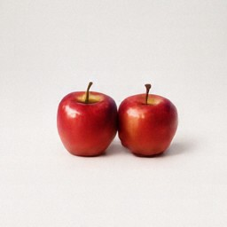 | 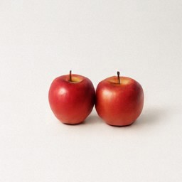 | 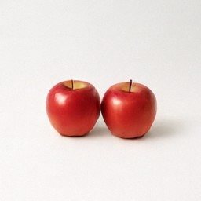 |
| [Original PNG](../results/attempts/fddfd03e495a1388a8776848/attempt-1/image.png) · 4.204s · Not annotated | [Original PNG](../results/attempts/8002dfcdba765ac53c1f0388/attempt-1/image.png) · 3.742s · Not annotated | [Original PNG](../results/attempts/68faf5bf3a0b4a33a99d75d9/attempt-1/image.png) · 5.321s · Not annotated |

### Seed 72302

| L1 / S89 | L2 / S66 | L4 / S50 |
|---|---|---|
| 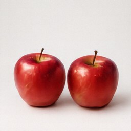 | 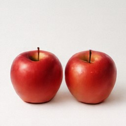 | 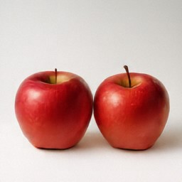 |
| [Original PNG](../results/attempts/6d925be92c84ab3a9a333dc8/attempt-1/image.png) · 4.392s · Not annotated | [Original PNG](../results/attempts/924da5e96fc9443e05659866/attempt-1/image.png) · 3.723s · Not annotated | [Original PNG](../results/attempts/39b9e1cd308df37eeb6469fe/attempt-1/image.png) · 5.048s · Not annotated |

### Seed 72303

| L1 / S89 | L2 / S66 | L4 / S50 |
|---|---|---|
| 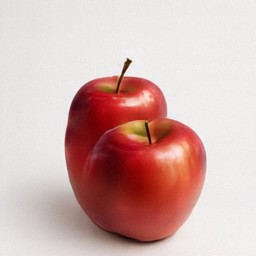 | 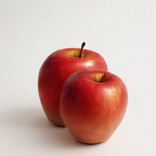 | 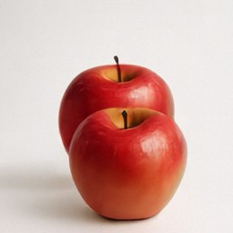 |
| [Original PNG](../results/attempts/705d1270e2df264a5bcde1e3/attempt-1/image.png) · 5.030s · Not annotated | [Original PNG](../results/attempts/2d0c7413c546fff450715a88/attempt-1/image.png) · 4.559s · Not annotated | [Original PNG](../results/attempts/7036aa7fa528bc2f1e6c1012/attempt-1/image.png) · 4.178s · Not annotated |

### Seed 72304

| L1 / S89 | L2 / S66 | L4 / S50 |
|---|---|---|
| 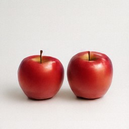 | 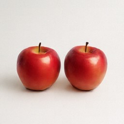 | 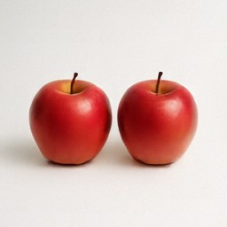 |
| [Original PNG](../results/attempts/20a5dbc1560818602146a4b4/attempt-1/image.png) · 4.350s · Not annotated | [Original PNG](../results/attempts/2c6a44725f97445d415cf74e/attempt-1/image.png) · 3.642s · Not annotated | [Original PNG](../results/attempts/e8ecff1e6770ec890b9d4242/attempt-1/image.png) · 3.811s · Not annotated |

## main-count-2

A clean studio photograph of exactly three yellow bananas on a plain white background. Every object is fully visible, separate, and unoccluded. No other objects.

### Seed 72301

| L1 / S89 | L2 / S66 | L4 / S50 |
|---|---|---|
| 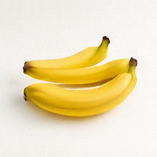 | 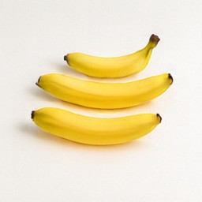 | 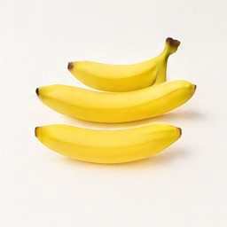 |
| [Original PNG](../results/attempts/8161ebb8d1cd9814ad3f7749/attempt-1/image.png) · 4.300s · Not annotated | [Original PNG](../results/attempts/001a444bc6d87e48f280e328/attempt-1/image.png) · 3.975s · Not annotated | [Original PNG](../results/attempts/02b5116a2b2a3d799e797b44/attempt-1/image.png) · 4.783s · Not annotated |

### Seed 72302

| L1 / S89 | L2 / S66 | L4 / S50 |
|---|---|---|
| 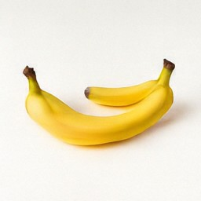 | 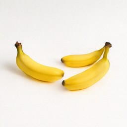 | 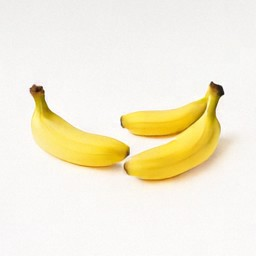 |
| [Original PNG](../results/attempts/63eb5f4f95c3190d1b857a25/attempt-1/image.png) · 3.519s · Not annotated | [Original PNG](../results/attempts/6a29789c01a9706edb274944/attempt-1/image.png) · 4.798s · Not annotated | [Original PNG](../results/attempts/49831dccf254f90655428c21/attempt-1/image.png) · 4.262s · Not annotated |

### Seed 72303

| L1 / S89 | L2 / S66 | L4 / S50 |
|---|---|---|
| 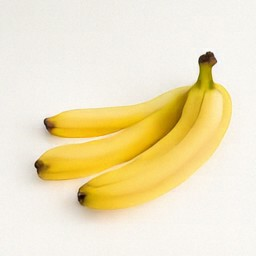 | 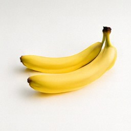 | 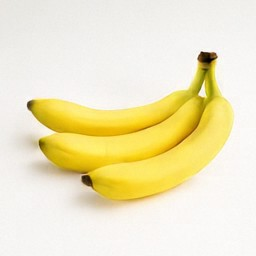 |
| [Original PNG](../results/attempts/16e06a1c0687269615d087d9/attempt-1/image.png) · 4.664s · Not annotated | [Original PNG](../results/attempts/fdc136e9000e443655559d5b/attempt-1/image.png) · 4.509s · Not annotated | [Original PNG](../results/attempts/0ccc76ec1b99b7faf4b347ad/attempt-1/image.png) · 4.660s · Not annotated |

### Seed 72304

| L1 / S89 | L2 / S66 | L4 / S50 |
|---|---|---|
| 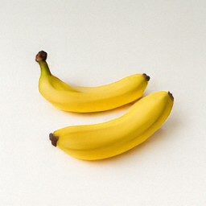 | 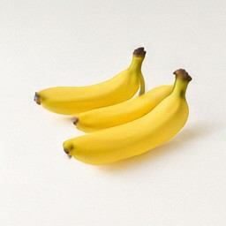 | 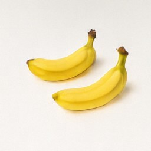 |
| [Original PNG](../results/attempts/6ef607855ae1822d09c3ffe7/attempt-1/image.png) · 4.325s · Not annotated | [Original PNG](../results/attempts/cd98cfe4b4d7ab35db5a6421/attempt-1/image.png) · 4.330s · Not annotated | [Original PNG](../results/attempts/eabc2db9dad4fc9453ae71a5/attempt-1/image.png) · 5.278s · Not annotated |

## main-count-3

A clean studio photograph of exactly four blue balloons on a plain white background. Every object is fully visible, separate, and unoccluded. No other objects.

### Seed 72301

| L1 / S89 | L2 / S66 | L4 / S50 |
|---|---|---|
|  |  | 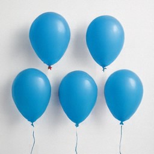 |
| [Original PNG](../results/attempts/c77afa61985b14f83cb30091/attempt-1/image.png) · 4.852s · Not annotated | [Original PNG](../results/attempts/dfd3c043e85df0792ef6dc04/attempt-1/image.png) · 4.162s · Not annotated | [Original PNG](../results/attempts/fae8a19adaa2e37159b5f337/attempt-1/image.png) · 3.689s · Not annotated |

### Seed 72302

| L1 / S89 | L2 / S66 | L4 / S50 |
|---|---|---|
| 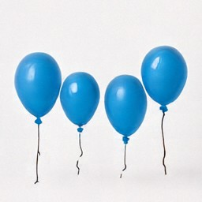 |  |  |
| [Original PNG](../results/attempts/da9250d8288179263f43dbd4/attempt-1/image.png) · 4.590s · Not annotated | [Original PNG](../results/attempts/08cd943070fd3d949572bd53/attempt-1/image.png) · 4.893s · Not annotated | [Original PNG](../results/attempts/b03cb55acf2ef1381789e9a2/attempt-1/image.png) · 5.073s · Not annotated |

### Seed 72303

| L1 / S89 | L2 / S66 | L4 / S50 |
|---|---|---|
| 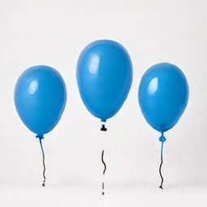 | 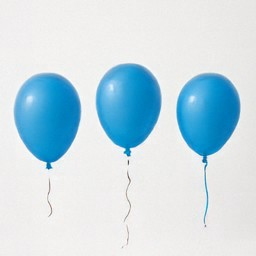 |  |
| [Original PNG](../results/attempts/73481671fb9d14361a2272c9/attempt-1/image.png) · 4.898s · Not annotated | [Original PNG](../results/attempts/5bfa3ea2c3e96a7276a750f6/attempt-1/image.png) · 4.496s · Not annotated | [Original PNG](../results/attempts/55dba078a93263546c09fa54/attempt-1/image.png) · 4.917s · Not annotated |

### Seed 72304

| L1 / S89 | L2 / S66 | L4 / S50 |
|---|---|---|
| 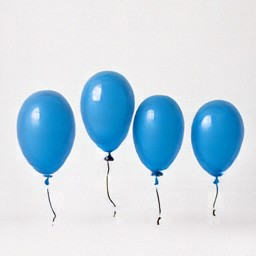 |  |  |
| [Original PNG](../results/attempts/adcddfe3a1fb9f38f3570ddb/attempt-1/image.png) · 5.308s · Not annotated | [Original PNG](../results/attempts/2a462a197b451261b88848ad/attempt-1/image.png) · 4.423s · Not annotated | [Original PNG](../results/attempts/5ad1eaf2b6e470510f5391bd/attempt-1/image.png) · 5.035s · Not annotated |

## main-count-4

A clean studio photograph of exactly one green mug on a plain white background. Every object is fully visible, separate, and unoccluded. No other objects.

### Seed 72301

| L1 / S89 | L2 / S66 | L4 / S50 |
|---|---|---|
| 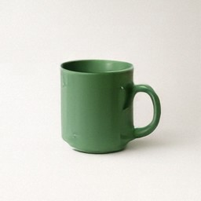 | 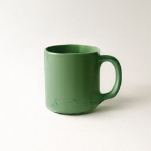 | 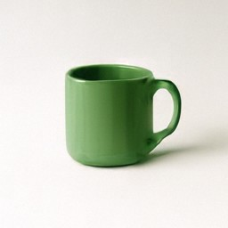 |
| [Original PNG](../results/attempts/38603bdf84efaf9b538e6c66/attempt-1/image.png) · 4.552s · Not annotated | [Original PNG](../results/attempts/3965475e2831b18e80f081dd/attempt-1/image.png) · 4.373s · Not annotated | [Original PNG](../results/attempts/82b6836f50e3e3e867cce6d0/attempt-1/image.png) · 5.100s · Not annotated |

### Seed 72302

| L1 / S89 | L2 / S66 | L4 / S50 |
|---|---|---|
| 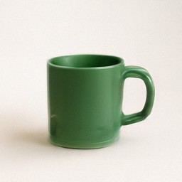 | 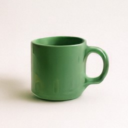 | 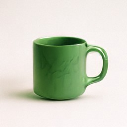 |
| [Original PNG](../results/attempts/ffd2d0b28cbd5aa1cb48ccd9/attempt-1/image.png) · 5.159s · Not annotated | [Original PNG](../results/attempts/edae3b65a6bb4dd09a48fb57/attempt-1/image.png) · 4.599s · Not annotated | [Original PNG](../results/attempts/7155fb92c67673a4066bf1ed/attempt-1/image.png) · 4.728s · Not annotated |

### Seed 72303

| L1 / S89 | L2 / S66 | L4 / S50 |
|---|---|---|
| 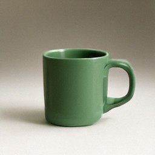 | 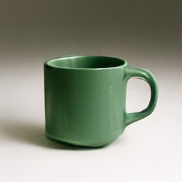 | 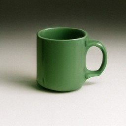 |
| [Original PNG](../results/attempts/5d17c5a3f6f209dba49369e9/attempt-1/image.png) · 4.407s · Not annotated | [Original PNG](../results/attempts/5017a6244f4f247258ee0e54/attempt-1/image.png) · 4.428s · Not annotated | [Original PNG](../results/attempts/14d320d47411af23b3b42e38/attempt-1/image.png) · 4.732s · Not annotated |

### Seed 72304

| L1 / S89 | L2 / S66 | L4 / S50 |
|---|---|---|
| 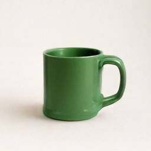 | 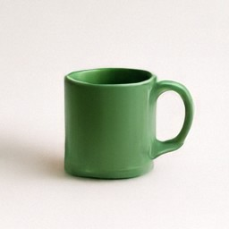 | 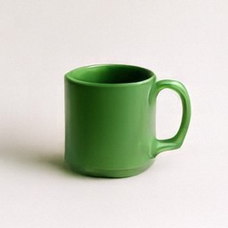 |
| [Original PNG](../results/attempts/8b98fa096f36e2226fa7c27b/attempt-1/image.png) · 4.864s · Not annotated | [Original PNG](../results/attempts/3252dc0ea68a4fddcdc64c41/attempt-1/image.png) · 4.315s · Not annotated | [Original PNG](../results/attempts/08452a5cc00ea20fb380d6da/attempt-1/image.png) · 5.085s · Not annotated |

## main-color-1

A clean studio photograph of one red cube and one blue sphere, fully visible and separate on a plain white background. No other objects.

### Seed 72301

| L1 / S89 | L2 / S66 | L4 / S50 |
|---|---|---|
| 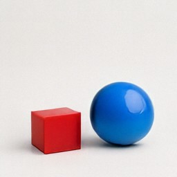 | 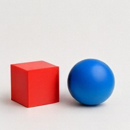 | 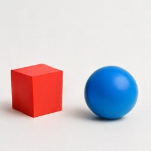 |
| [Original PNG](../results/attempts/1dd13cf396a3b3a29cdd9a25/attempt-1/image.png) · 4.458s · Not annotated | [Original PNG](../results/attempts/cd0899d2c92e9072519a93c7/attempt-1/image.png) · 3.656s · Not annotated | [Original PNG](../results/attempts/8a00368721ee8830105e5d51/attempt-1/image.png) · 4.242s · Not annotated |

### Seed 72302

| L1 / S89 | L2 / S66 | L4 / S50 |
|---|---|---|
| 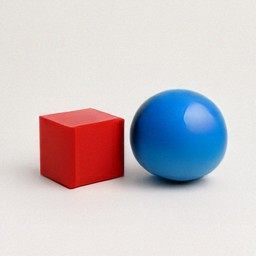 | 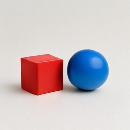 | 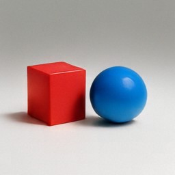 |
| [Original PNG](../results/attempts/ecc6634d3e58181ab010a5ca/attempt-1/image.png) · 4.964s · Not annotated | [Original PNG](../results/attempts/b6f41d6f4d03fa22d54c6bcb/attempt-1/image.png) · 4.866s · Not annotated | [Original PNG](../results/attempts/79633a85dda7e1ff9b2e801c/attempt-1/image.png) · 4.183s · Not annotated |

### Seed 72303

| L1 / S89 | L2 / S66 | L4 / S50 |
|---|---|---|
| 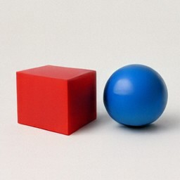 | 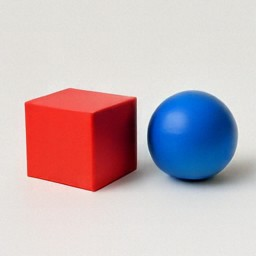 | 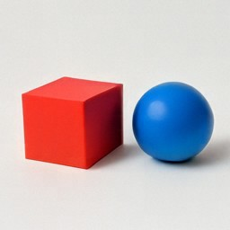 |
| [Original PNG](../results/attempts/6df38e775b1e9567e8ea8554/attempt-1/image.png) · 4.007s · Not annotated | [Original PNG](../results/attempts/8e9c36cba01533eae5bf2ef9/attempt-1/image.png) · 3.762s · Not annotated | [Original PNG](../results/attempts/c137be1c53da9ec08a78e39b/attempt-1/image.png) · 5.150s · Not annotated |

### Seed 72304

| L1 / S89 | L2 / S66 | L4 / S50 |
|---|---|---|
|  |  |  |
| [Original PNG](../results/attempts/7ff44c4303c6efad2277124a/attempt-1/image.png) · 4.993s · Not annotated | [Original PNG](../results/attempts/e3253ec99fe56c1ef3faf680/attempt-1/image.png) · 4.417s · Not annotated | [Original PNG](../results/attempts/a9f1cf98fe8d6e40e92878ab/attempt-1/image.png) · 4.031s · Not annotated |

## main-color-2

A clean studio photograph of one green mug and one yellow plate, fully visible and separate on a plain white background. No other objects.

### Seed 72301

| L1 / S89 | L2 / S66 | L4 / S50 |
|---|---|---|
|  |  |  |
| [Original PNG](../results/attempts/b2e1b86c6b523fb47d1fbd41/attempt-1/image.png) · 4.557s · Not annotated | [Original PNG](../results/attempts/5061c8494ee266c043d17a6d/attempt-1/image.png) · 4.670s · Not annotated | [Original PNG](../results/attempts/c76cfb4696917d3f0109c40d/attempt-1/image.png) · 5.009s · Not annotated |

### Seed 72302

| L1 / S89 | L2 / S66 | L4 / S50 |
|---|---|---|
|  |  |  |
| [Original PNG](../results/attempts/282c6e850f1f4c9a0f42c819/attempt-1/image.png) · 4.606s · Not annotated | [Original PNG](../results/attempts/dc6d7c1b223e2adba42f2fb2/attempt-1/image.png) · 4.553s · Not annotated | [Original PNG](../results/attempts/fba7ac71003a4a071864a09a/attempt-1/image.png) · 4.646s · Not annotated |

### Seed 72303

| L1 / S89 | L2 / S66 | L4 / S50 |
|---|---|---|
|  |  |  |
| [Original PNG](../results/attempts/e065c184d24ff99e223004f0/attempt-1/image.png) · 4.723s · Not annotated | [Original PNG](../results/attempts/c87445f1a15de94ad78e4974/attempt-1/image.png) · 4.212s · Not annotated | [Original PNG](../results/attempts/169c44a026f6d5b5caeb9d21/attempt-1/image.png) · 5.151s · Not annotated |

### Seed 72304

| L1 / S89 | L2 / S66 | L4 / S50 |
|---|---|---|
|  |  |  |
| [Original PNG](../results/attempts/fa6819b04d5bf693b9ad2c08/attempt-1/image.png) · 5.354s · Not annotated | [Original PNG](../results/attempts/0ec3924746c0d6f50693948c/attempt-1/image.png) · 4.379s · Not annotated | [Original PNG](../results/attempts/9e7bb7ccb082ed7ea81736d1/attempt-1/image.png) · 4.814s · Not annotated |

## main-color-3

A clean studio photograph of one blue toy car and one red toy bicycle, fully visible and separate on a plain white background. No other objects.

### Seed 72301

| L1 / S89 | L2 / S66 | L4 / S50 |
|---|---|---|
|  |  |  |
| [Original PNG](../results/attempts/cb092ac98e819c89f3499df6/attempt-1/image.png) · 5.045s · Not annotated | [Original PNG](../results/attempts/89adc6cc3da07bf42157606c/attempt-1/image.png) · 4.463s · Not annotated | [Original PNG](../results/attempts/f4eb6942b003db9c60eed8b6/attempt-1/image.png) · 4.151s · Not annotated |

### Seed 72302

| L1 / S89 | L2 / S66 | L4 / S50 |
|---|---|---|
|  |  |  |
| [Original PNG](../results/attempts/489e8abfa8f523f03a63f69a/attempt-1/image.png) · 4.516s · Not annotated | [Original PNG](../results/attempts/853b823af67d58d867f698be/attempt-1/image.png) · 4.428s · Not annotated | [Original PNG](../results/attempts/adbbf762784403515d2d12d7/attempt-1/image.png) · 5.067s · Not annotated |

### Seed 72303

| L1 / S89 | L2 / S66 | L4 / S50 |
|---|---|---|
|  |  |  |
| [Original PNG](../results/attempts/9a49e2316bef9c3e0d8d76f7/attempt-1/image.png) · 5.058s · Not annotated | [Original PNG](../results/attempts/09d4afc852f4317d39708974/attempt-1/image.png) · 4.478s · Not annotated | [Original PNG](../results/attempts/5d1d0f0510d074fd7e34e8bf/attempt-1/image.png) · 5.089s · Not annotated |

### Seed 72304

| L1 / S89 | L2 / S66 | L4 / S50 |
|---|---|---|
|  |  |  |
| [Original PNG](../results/attempts/7b9cd248fc21980555f421cc/attempt-1/image.png) · 4.443s · Not annotated | [Original PNG](../results/attempts/9b1c38376b061254b97d35ff/attempt-1/image.png) · 3.491s · Not annotated | [Original PNG](../results/attempts/63ab505b752ad052541a6377/attempt-1/image.png) · 4.213s · Not annotated |

## main-color-4

A clean studio photograph of one yellow suitcase and one purple backpack, fully visible and separate on a plain white background. No other objects.

### Seed 72301

| L1 / S89 | L2 / S66 | L4 / S50 |
|---|---|---|
|  |  |  |
| [Original PNG](../results/attempts/c90b235056d309b18669e148/attempt-1/image.png) · 4.350s · Not annotated | [Original PNG](../results/attempts/9133bcf7fd0787996b5e9c4a/attempt-1/image.png) · 4.340s · Not annotated | [Original PNG](../results/attempts/9da272108beb7d7c582fb2ce/attempt-1/image.png) · 4.956s · Not annotated |

### Seed 72302

| L1 / S89 | L2 / S66 | L4 / S50 |
|---|---|---|
|  |  |  |
| [Original PNG](../results/attempts/4bbbfd7b6b0a244015f3b582/attempt-1/image.png) · 4.393s · Not annotated | [Original PNG](../results/attempts/c8609edc23e335dfcb921a9f/attempt-1/image.png) · 4.163s · Not annotated | [Original PNG](../results/attempts/b5e63042f791d500b377c68b/attempt-1/image.png) · 4.765s · Not annotated |

### Seed 72303

| L1 / S89 | L2 / S66 | L4 / S50 |
|---|---|---|
|  |  |  |
| [Original PNG](../results/attempts/2ea459078e79bc11080871b8/attempt-1/image.png) · 4.486s · Not annotated | [Original PNG](../results/attempts/d4f4779a0ad95860b2b0ed31/attempt-1/image.png) · 4.067s · Not annotated | [Original PNG](../results/attempts/a8d8ab08b2c0f41d6eb74424/attempt-1/image.png) · 5.229s · Not annotated |

### Seed 72304

| L1 / S89 | L2 / S66 | L4 / S50 |
|---|---|---|
|  |  |  |
| [Original PNG](../results/attempts/b6e7e392c2d4c78c54bce748/attempt-1/image.png) · 4.372s · Not annotated | [Original PNG](../results/attempts/55f5815caa4d0527642b8dd5/attempt-1/image.png) · 4.393s · Not annotated | [Original PNG](../results/attempts/b987297b91348c5acf80ad3b/attempt-1/image.png) · 5.142s · Not annotated |

## main-position-1

A clean studio photograph of one red cube on the left side of the image and one blue sphere on the right side. Both are fully visible and separated on a plain white background. No other objects.

### Seed 72301

| L1 / S89 | L2 / S66 | L4 / S50 |
|---|---|---|
|  |  |  |
| [Original PNG](../results/attempts/19fd9997eb0e63ddd71f5f9f/attempt-1/image.png) · 4.510s · Not annotated | [Original PNG](../results/attempts/ede0334a0729bad9ae8ccb59/attempt-1/image.png) · 4.391s · Not annotated | [Original PNG](../results/attempts/867ff19b84e1a0fa832ab4e5/attempt-1/image.png) · 4.167s · Not annotated |

### Seed 72302

| L1 / S89 | L2 / S66 | L4 / S50 |
|---|---|---|
|  |  |  |
| [Original PNG](../results/attempts/e4e79c90aa6e8fe9ff116c25/attempt-1/image.png) · 4.414s · Not annotated | [Original PNG](../results/attempts/8d89a7d8afe9416bbe14bad0/attempt-1/image.png) · 4.150s · Not annotated | [Original PNG](../results/attempts/9bb0048765d4181b6a524841/attempt-1/image.png) · 4.943s · Not annotated |

### Seed 72303

| L1 / S89 | L2 / S66 | L4 / S50 |
|---|---|---|
|  |  |  |
| [Original PNG](../results/attempts/0fdc3ccfc9efa2eec12fccd0/attempt-1/image.png) · 4.274s · Not annotated | [Original PNG](../results/attempts/d640e391f3a0cc0e9ee6d69f/attempt-1/image.png) · 4.647s · Not annotated | [Original PNG](../results/attempts/b3a0d9029b162d472cf610a4/attempt-1/image.png) · 4.618s · Not annotated |

### Seed 72304

| L1 / S89 | L2 / S66 | L4 / S50 |
|---|---|---|
|  |  |  |
| [Original PNG](../results/attempts/7dad27ca229e2ba16aebd570/attempt-1/image.png) · 5.070s · Not annotated | [Original PNG](../results/attempts/68690327d31867bfdd13772d/attempt-1/image.png) · 4.533s · Not annotated | [Original PNG](../results/attempts/26b51e958a80b190faa4c2f9/attempt-1/image.png) · 4.045s · Not annotated |

## main-position-2

A clean studio photograph of one green bottle on the left side of the image and one yellow mug on the right side. Both are fully visible and separated on a plain white background. No other objects.

### Seed 72301

| L1 / S89 | L2 / S66 | L4 / S50 |
|---|---|---|
|  |  |  |
| [Original PNG](../results/attempts/ecebb2e3a517a3d6fc102d80/attempt-1/image.png) · 4.452s · Not annotated | [Original PNG](../results/attempts/3a413a57dbb126a3f0a90585/attempt-1/image.png) · 3.705s · Not annotated | [Original PNG](../results/attempts/746e801068b637b0552a71a4/attempt-1/image.png) · 4.244s · Not annotated |

### Seed 72302

| L1 / S89 | L2 / S66 | L4 / S50 |
|---|---|---|
|  |  |  |
| [Original PNG](../results/attempts/477135ae63e33d9f773e5926/attempt-1/image.png) · 5.139s · Not annotated | [Original PNG](../results/attempts/790af92541a80b43e2905bb5/attempt-1/image.png) · 4.527s · Not annotated | [Original PNG](../results/attempts/3b1c2ad779e2a6a3ff54b19c/attempt-1/image.png) · 4.532s · Not annotated |

### Seed 72303

| L1 / S89 | L2 / S66 | L4 / S50 |
|---|---|---|
|  |  |  |
| [Original PNG](../results/attempts/a1f64f33919c913a6f521192/attempt-1/image.png) · 4.581s · Not annotated | [Original PNG](../results/attempts/8d7a0fd00d897bf425f4f8a0/attempt-1/image.png) · 4.227s · Not annotated | [Original PNG](../results/attempts/1f7596012ea845592d3c6f72/attempt-1/image.png) · 4.188s · Not annotated |

### Seed 72304

| L1 / S89 | L2 / S66 | L4 / S50 |
|---|---|---|
|  |  |  |
| [Original PNG](../results/attempts/df53401af9bbfd448b67a550/attempt-1/image.png) · 4.270s · Not annotated | [Original PNG](../results/attempts/1dd1a71897bce17ac2b293e6/attempt-1/image.png) · 4.555s · Not annotated | [Original PNG](../results/attempts/5ac2cd5f18572c7905a0a995/attempt-1/image.png) · 4.760s · Not annotated |

## main-position-3

A clean studio photograph of one purple chair on the left side of the image and one orange table on the right side. Both are fully visible and separated on a plain white background. No other objects.

### Seed 72301

| L1 / S89 | L2 / S66 | L4 / S50 |
|---|---|---|
|  |  |  |
| [Original PNG](../results/attempts/6d0bdae10df25534b4cfa2c8/attempt-1/image.png) · 4.217s · Not annotated | [Original PNG](../results/attempts/02672aebac2717a987bc51b7/attempt-1/image.png) · 4.249s · Not annotated | [Original PNG](../results/attempts/fd4fcff35b8fa9656b415b32/attempt-1/image.png) · 4.423s · Not annotated |

### Seed 72302

| L1 / S89 | L2 / S66 | L4 / S50 |
|---|---|---|
|  |  |  |
| [Original PNG](../results/attempts/5947d18347415abaf006c962/attempt-1/image.png) · 5.249s · Not annotated | [Original PNG](../results/attempts/33d121329b0f55d0cc937215/attempt-1/image.png) · 4.182s · Not annotated | [Original PNG](../results/attempts/53dd19cb12bf5c1f8315a918/attempt-1/image.png) · 4.588s · Not annotated |

### Seed 72303

| L1 / S89 | L2 / S66 | L4 / S50 |
|---|---|---|
|  |  |  |
| [Original PNG](../results/attempts/516cd0b97763ac780f059c66/attempt-1/image.png) · 4.489s · Not annotated | [Original PNG](../results/attempts/4dd0edbcfe4104c921dedfc8/attempt-1/image.png) · 4.780s · Not annotated | [Original PNG](../results/attempts/d6f75fdddfa308b4b4cc4c3f/attempt-1/image.png) · 5.076s · Not annotated |

### Seed 72304

| L1 / S89 | L2 / S66 | L4 / S50 |
|---|---|---|
|  |  |  |
| [Original PNG](../results/attempts/84ab698343d345b89e434e54/attempt-1/image.png) · 3.851s · Not annotated | [Original PNG](../results/attempts/c0caa0e32e418c09505bd058/attempt-1/image.png) · 4.621s · Not annotated | [Original PNG](../results/attempts/532c752593b8e3a3f0dc432e/attempt-1/image.png) · 5.305s · Not annotated |

## main-position-4

A clean studio photograph of one blue toy airplane on the left side of the image and one red toy train on the right side. Both are fully visible and separated on a plain white background. No other objects.

### Seed 72301

| L1 / S89 | L2 / S66 | L4 / S50 |
|---|---|---|
|  |  |  |
| [Original PNG](../results/attempts/21c5d717c06843fa5a42c740/attempt-1/image.png) · 4.371s · Not annotated | [Original PNG](../results/attempts/4aaf0d852f9b9875f9d8c8d5/attempt-1/image.png) · 5.150s · Not annotated | [Original PNG](../results/attempts/b6cb32213594677bac6ee8c8/attempt-1/image.png) · 4.728s · Not annotated |

### Seed 72302

| L1 / S89 | L2 / S66 | L4 / S50 |
|---|---|---|
|  |  |  |
| [Original PNG](../results/attempts/9bbdee1679289626f6625c92/attempt-1/image.png) · 4.095s · Not annotated | [Original PNG](../results/attempts/de827647c6e7ae220dd0e234/attempt-1/image.png) · 4.795s · Not annotated | [Original PNG](../results/attempts/caf55a48a4f76efc03f2e35c/attempt-1/image.png) · 5.147s · Not annotated |

### Seed 72303

| L1 / S89 | L2 / S66 | L4 / S50 |
|---|---|---|
|  |  |  |
| [Original PNG](../results/attempts/740562010ecbaad5541cc2f7/attempt-1/image.png) · 4.701s · Not annotated | [Original PNG](../results/attempts/ff967172a00fd9044b884dc0/attempt-1/image.png) · 3.992s · Not annotated | [Original PNG](../results/attempts/01d02e4b9168d4deba554c80/attempt-1/image.png) · 4.768s · Not annotated |

### Seed 72304

| L1 / S89 | L2 / S66 | L4 / S50 |
|---|---|---|
|  |  |  |
| [Original PNG](../results/attempts/bf16e1ce3558e299e1837349/attempt-1/image.png) · 5.011s · Not annotated | [Original PNG](../results/attempts/7d89f526d80c30910d2233e0/attempt-1/image.png) · 4.684s · Not annotated | [Original PNG](../results/attempts/b1c0cdc6ef9ad14dea80e4f0/attempt-1/image.png) · 4.614s · Not annotated |

## main-compound-1

A clean studio photograph of exactly two red mugs grouped on the left side of the image and exactly one blue bottle on the right side. All objects are fully visible and separate on a plain white background. No other objects.

### Seed 72301

| L1 / S89 | L2 / S66 | L4 / S50 |
|---|---|---|
|  |  |  |
| [Original PNG](../results/attempts/9e601f62f64c007dcee742f8/attempt-1/image.png) · 3.612s · Not annotated | [Original PNG](../results/attempts/0a9065837c02797be176a81d/attempt-1/image.png) · 4.325s · Not annotated | [Original PNG](../results/attempts/adab3887458195f0d7dc16dd/attempt-1/image.png) · 4.235s · Not annotated |

### Seed 72302

| L1 / S89 | L2 / S66 | L4 / S50 |
|---|---|---|
|  |  |  |
| [Original PNG](../results/attempts/6b24c2ab166c918ca5363cda/attempt-1/image.png) · 4.932s · Not annotated | [Original PNG](../results/attempts/1c85a3c8ef06a49b2cfee282/attempt-1/image.png) · 3.925s · Not annotated | [Original PNG](../results/attempts/84f782ea82df650b7e6fd17b/attempt-1/image.png) · 3.951s · Not annotated |

### Seed 72303

| L1 / S89 | L2 / S66 | L4 / S50 |
|---|---|---|
|  |  |  |
| [Original PNG](../results/attempts/e9af498b7a1f00dbfa95bfd2/attempt-1/image.png) · 4.243s · Not annotated | [Original PNG](../results/attempts/410b94eacf31ff32ed3dcaa1/attempt-1/image.png) · 4.639s · Not annotated | [Original PNG](../results/attempts/76297af091721c9159d2e6f8/attempt-1/image.png) · 5.094s · Not annotated |

### Seed 72304

| L1 / S89 | L2 / S66 | L4 / S50 |
|---|---|---|
|  |  |  |
| [Original PNG](../results/attempts/a9eb014849c02244f4510071/attempt-1/image.png) · 4.574s · Not annotated | [Original PNG](../results/attempts/6dd7ba55223a5b31f46300df/attempt-1/image.png) · 3.616s · Not annotated | [Original PNG](../results/attempts/b45d63662afeceb5422eba99/attempt-1/image.png) · 5.042s · Not annotated |

## main-compound-2

A clean studio photograph of exactly three yellow cubes grouped on the left side of the image and exactly one green sphere on the right side. All objects are fully visible and separate on a plain white background. No other objects.

### Seed 72301

| L1 / S89 | L2 / S66 | L4 / S50 |
|---|---|---|
|  |  |  |
| [Original PNG](../results/attempts/4559ca47f0df59109ec4397d/attempt-1/image.png) · 4.710s · Not annotated | [Original PNG](../results/attempts/409a3ee05dfc2922d77e12ff/attempt-1/image.png) · 4.940s · Not annotated | [Original PNG](../results/attempts/4b157d175f54315370ea6e32/attempt-1/image.png) · 4.623s · Not annotated |

### Seed 72302

| L1 / S89 | L2 / S66 | L4 / S50 |
|---|---|---|
|  |  |  |
| [Original PNG](../results/attempts/a853d2092c16b58421cca841/attempt-1/image.png) · 4.933s · Not annotated | [Original PNG](../results/attempts/d171c7ae1cea37975f6bb4ea/attempt-1/image.png) · 4.178s · Not annotated | [Original PNG](../results/attempts/be0308d3d1e8e46d95e8e6c8/attempt-1/image.png) · 4.529s · Not annotated |

### Seed 72303

| L1 / S89 | L2 / S66 | L4 / S50 |
|---|---|---|
|  |  |  |
| [Original PNG](../results/attempts/fd8b9fd8980331a844141584/attempt-1/image.png) · 4.440s · Not annotated | [Original PNG](../results/attempts/ba74dff757927e983d876962/attempt-1/image.png) · 4.363s · Not annotated | [Original PNG](../results/attempts/7f4a4027609915023b89d2d6/attempt-1/image.png) · 3.947s · Not annotated |

### Seed 72304

| L1 / S89 | L2 / S66 | L4 / S50 |
|---|---|---|
|  |  |  |
| [Original PNG](../results/attempts/c2975e0e9ed756c998027834/attempt-1/image.png) · 3.912s · Not annotated | [Original PNG](../results/attempts/4b6dd2cc05fb8e5efce10b9c/attempt-1/image.png) · 4.675s · Not annotated | [Original PNG](../results/attempts/5df27b1d3df7e11171171863/attempt-1/image.png) · 4.329s · Not annotated |

## main-compound-3

A clean studio photograph of exactly two purple balloons grouped on the left side of the image and exactly one orange gift box on the right side. All objects are fully visible and separate on a plain white background. No other objects.

### Seed 72301

| L1 / S89 | L2 / S66 | L4 / S50 |
|---|---|---|
|  |  |  |
| [Original PNG](../results/attempts/2bd625d7486d6a681df81eae/attempt-1/image.png) · 4.339s · Not annotated | [Original PNG](../results/attempts/9eb65881d49062b50b5963a7/attempt-1/image.png) · 3.929s · Not annotated | [Original PNG](../results/attempts/ac09047bf66f93b25d1fa34d/attempt-1/image.png) · 5.031s · Not annotated |

### Seed 72302

| L1 / S89 | L2 / S66 | L4 / S50 |
|---|---|---|
|  |  |  |
| [Original PNG](../results/attempts/fa8eb52af88303f250aaf913/attempt-1/image.png) · 4.151s · Not annotated | [Original PNG](../results/attempts/59d07ac66390b96d0133bbda/attempt-1/image.png) · 4.082s · Not annotated | [Original PNG](../results/attempts/e1600eeb85674b20c883fc5d/attempt-1/image.png) · 4.955s · Not annotated |

### Seed 72303

| L1 / S89 | L2 / S66 | L4 / S50 |
|---|---|---|
|  |  |  |
| [Original PNG](../results/attempts/80d82c6f480bb7ee0e847fa6/attempt-1/image.png) · 5.135s · Not annotated | [Original PNG](../results/attempts/541e33c18bf438cf53c1565a/attempt-1/image.png) · 4.048s · Not annotated | [Original PNG](../results/attempts/72fbe56691fb9c29b2b7a5b6/attempt-1/image.png) · 4.879s · Not annotated |

### Seed 72304

| L1 / S89 | L2 / S66 | L4 / S50 |
|---|---|---|
|  |  |  |
| [Original PNG](../results/attempts/276c591f175acf74430c7e32/attempt-1/image.png) · 3.967s · Not annotated | [Original PNG](../results/attempts/4e554cacdf3d03a389c87874/attempt-1/image.png) · 4.439s · Not annotated | [Original PNG](../results/attempts/7107c94ed711d4bd032014e8/attempt-1/image.png) · 4.663s · Not annotated |

## main-compound-4

A clean studio photograph of exactly two blue toy cars grouped on the left side of the image and exactly one red toy bus on the right side. All objects are fully visible and separate on a plain white background. No other objects.

### Seed 72301

| L1 / S89 | L2 / S66 | L4 / S50 |
|---|---|---|
|  |  |  |
| [Original PNG](../results/attempts/3c56ed1480149c11d60b7c2d/attempt-1/image.png) · 5.288s · Not annotated | [Original PNG](../results/attempts/49bee65c32d29cbe7f9eca0a/attempt-1/image.png) · 4.407s · Not annotated | [Original PNG](../results/attempts/0a29416b371fa88c2b90141d/attempt-1/image.png) · 5.414s · Not annotated |

### Seed 72302

| L1 / S89 | L2 / S66 | L4 / S50 |
|---|---|---|
|  |  |  |
| [Original PNG](../results/attempts/240f193b45fbf70cb038a1f9/attempt-1/image.png) · 4.850s · Not annotated | [Original PNG](../results/attempts/f6c4f3f0633014a0552d1c8e/attempt-1/image.png) · 4.371s · Not annotated | [Original PNG](../results/attempts/d2a436c0e8b39ac35a61e73b/attempt-1/image.png) · 5.169s · Not annotated |

### Seed 72303

| L1 / S89 | L2 / S66 | L4 / S50 |
|---|---|---|
|  |  |  |
| [Original PNG](../results/attempts/a8317a391b1606464851a46a/attempt-1/image.png) · 4.642s · Not annotated | [Original PNG](../results/attempts/046250dc9d73edb9daaf77af/attempt-1/image.png) · 4.766s · Not annotated | [Original PNG](../results/attempts/fc68b8d8e8e722015bbbe637/attempt-1/image.png) · 4.313s · Not annotated |

### Seed 72304

| L1 / S89 | L2 / S66 | L4 / S50 |
|---|---|---|
|  |  |  |
| [Original PNG](../results/attempts/5116485a8f4a6ebc73b1b3ac/attempt-1/image.png) · 4.899s · Not annotated | [Original PNG](../results/attempts/edced57e44db3c800a73f7ed/attempt-1/image.png) · 4.121s · Not annotated | [Original PNG](../results/attempts/d5b5c3c6147af0a096b7f22b/attempt-1/image.png) · 5.506s · Not annotated |
