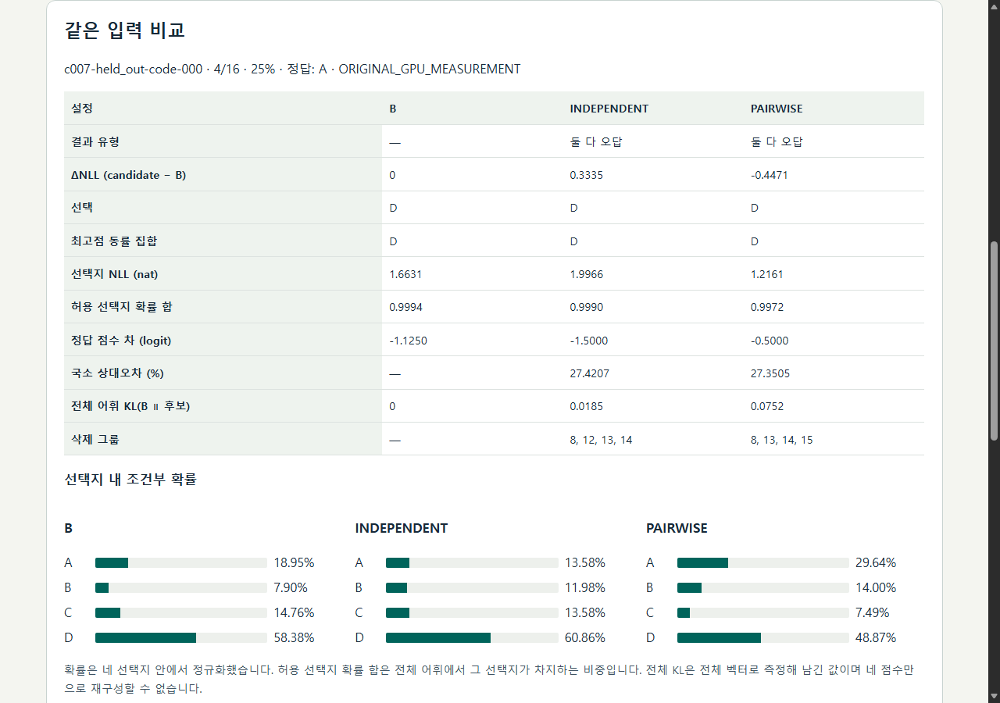

# Tools, implementation and technical collaboration

English | [한국어](../ko/PORTFOLIO.md) · [Home](../../README.md)

[New here?](START_HERE.md) · [Plain-language glossary](GLOSSARY.md)

## A 30-second introduction

<!-- claims: c007-transfer c007-quality c006-native c006-readout -->
DIOVA connects model compression with inference measurement and output analysis. The project includes PyTorch model adapters, RTX 5080 measurements, and tools for exploring individual results. The implementation covers model adapters and matrix slicing, GPU cost and answer comparisons, and CPU replay with result interfaces. See [technologies by task](../../README.md#tech-stack), then follow the code tour below to functions and tests.

At 25% MLP deletion, PAIRWISE slightly lowered local error and preserved more baseline choices, but INDEPENDENT had better gold NLL. At 50%, the selected modules were identical; the frozen status is **COMPLETED_NO_CLEAR_TRANSFER**. In Case006, A_PUBLIC changed 5 of 192 standard choices and V4 changed 8 of 192. A same-input readout follow-up examines ties and the final vocabulary projection. These examples make both implementation choices and competing evaluation objectives visible. [Casebook](CASEBOOK.md) · [Open the local screen](GETTING_STARTED.md#local-showcase).

*Local Edge screenshot: the first fixed CODE input, 25% deletion. [Case006 readout screen](../../presentation/screenshots/case006-readout.png) shows the separately labelled same-input diagnostic. These are selected views for navigation, not aggregate performance summaries.*

## Working capabilities and their evidence

- **Runtime diagnosis:** a before/after runner isolates an upstream kernel-selection guard on SM120. [Case001 runner](../../cases/001-sm120-int8-fallback/run.py).
- **Cost measurement:** attention adapters include smoothing, quantization and conversion in complete-call time. [Case004 adapters](../../cases/004-low-precision-attention-break-even/src/backends.py).
- **Numerical analysis:** reference comparisons separate EFQ mapping and scale choice, while a fixed precision screen records its stopping decision. [Case003 analysis](../../cases/003-efq-softmax-numerical-audit/ANALYSIS.md) · [Case005 analysis](../../cases/005-attention-precision-pareto/ANALYSIS.md).
- **Structural model changes:** matched row/column selection produces a smaller dense MLP, checked against a masked computation. [Case007 surgery](../../cases/007-interaction-aware-mlp-pruning/src/surgery.py).
- **Input-level evaluation:** gold-grounded transitions, score shifts and exact ties are inspectable for each scenario. [Case006 analysis](../../cases/006-attention-decision-stability/ANALYSIS.md) · [readout scalar checker](../../cases/006-attention-decision-stability/supplemental/readout-ties-v1/scripts/verify_scalar.py).
- **Analysis delivery:** source hashes connect display records to preserved evidence, and a small selector replay exposes the actual calibration objective. [Showcase builder](../../tools/showcase/build.py) · [CPU replay](../../tools/showcase/replay_selection.py).

## A three-stop code tour

<!-- claims: c006-implementation -->
1. **Control a native attention call.** Start at [`ScopedAttention`](https://github.com/Munsik-Kim/inference-lab/blob/bc1da81a82bff2e2827c5b4cabc9082cb6db5484/cases/006-attention-decision-stability/src/intervention.py#L30). `route` permits the layer-13 square prefill intervention; `__exit__` restores the prior registry entry. Read the [restoration-on-exception test](https://github.com/Munsik-Kim/inference-lab/blob/bc1da81a82bff2e2827c5b4cabc9082cb6db5484/cases/006-attention-decision-stability/tests/test_core.py#L193).
2. **Make the matrix smaller.** [`sliced`](https://github.com/Munsik-Kim/inference-lab/blob/bc1da81a82bff2e2827c5b4cabc9082cb6db5484/cases/007-interaction-aware-mlp-pruning/src/surgery.py#L6) maps retained groups to gate/up rows and down columns. `masked` supplies the reference; `replace_mlp` restores the original module in `finally`. The [shape/bias/equivalence test](https://github.com/Munsik-Kim/inference-lab/blob/bc1da81a82bff2e2827c5b4cabc9082cb6db5484/cases/007-interaction-aware-mlp-pruning/tests/test_core.py#L62) covers that contract.
3. **Reject incomplete evidence.** [`assess`](https://github.com/Munsik-Kim/inference-lab/blob/bc1da81a82bff2e2827c5b4cabc9082cb6db5484/cases/006-attention-decision-stability/src/validity.py#L10) requires full-output and routing checks. Pair joins reject missing, duplicate or mismatched inputs in the [original tests](https://github.com/Munsik-Kim/inference-lab/blob/bc1da81a82bff2e2827c5b4cabc9082cb6db5484/cases/006-attention-decision-stability/tests/test_core.py#L249). The new [display checker](../../tools/showcase/check.py) compares the extracted display data with these preserved sources.

## A 60–90 second demonstration script

*Script for a live walkthrough; no recorded video is supplied.*

“Open the local Case007 screen. B is the unpruned baseline, and the two columns beside it remove the same number of groups. Keep the 25% budget and choose the fixed CODE guide. This item shows why local reconstruction, baseline agreement and probability on the correct answer are different measurements. Change to 50%: the selected groups and module outputs match. Timing is shown separately for six fixed inputs, rather than attributed to this item.

“Now open Case006. Select a standard input and compare the gold answer, top-score set and four probabilities. A regression loses a baseline-correct answer; a flip can also gain a correct answer or change between wrong answers. Switch to the labelled FP32 diagnostic: it uses the same scenarios and its own baseline readout. Finally, open the source link and run the CPU selector command. It enumerates group combinations from calibration Q and checks the recorded selection without a model forward.”

## Three introduction lines with source links

<!-- claims: c004-cost c005-stop -->
- Built a group-selection and matrix-slicing pipeline with masked-versus-sliced and held-out comparisons. [Case007 methods](../../cases/007-interaction-aware-mlp-pruning/METHODS.md).
- Implemented a single-layer Qwen intervention and paired analysis of answer probabilities, regressions, gains and ties. [Case006 methods](../../cases/006-attention-decision-stability/METHODS.md).
- Measured complete attention cost and retained **STOP_DEV_SCREEN** alongside the observed precision–cost trade-off. [Case004 cost](../../cases/004-low-precision-attention-break-even/README.md) · [Case005 decision](../../cases/005-attention-precision-pareto/README.md).

## Contribution and reuse

<!-- claims: attribution -->
The project's work is comparison execution, scoped adapters, matrix surgery, validity checks, numerical/behavioral analysis and evidence viewers. Qwen and Red Hat AI provide checkpoints; Transformers, PyTorch and vLLM provide model/runtime components; SageAttention provides low-precision kernels. hclsys authored the Case001 guard. Han and coauthors developed EFQ-Softmax. HOPE motivates interaction-aware deletion in a separate MoE expert-pruning setting; the dense-group objective follows directly from the chosen MLP decomposition.

OpenAI Codex assisted implementation, local execution, tests, analysis and writing. [Case001](../../cases/001-sm120-int8-fallback/NOTICE.md), [Case003](../../cases/003-efq-softmax-numerical-audit/NOTICE.md), [Case006](../../cases/006-attention-decision-stability/NOTICE.md) and [Case007 notices](../../cases/007-interaction-aware-mlp-pruning/NOTICE.md) credit reused work. Project code uses [Apache-2.0](../../LICENSE); model/upstream terms remain applicable.

## Technical collaboration

The code supports discussions about **model-change evaluation**, **local inference diagnosis** and **reproducible analysis tools and result screens**. A useful starting point is a model boundary, a public input ID and a metric to compare. [Repository issues](https://github.com/Munsik-Kim/inference-lab/issues) provide a public technical-question channel; keep credentials and private customer data out of public reports.

The evidence covers specific models, one device and synthetic tasks. Deployment is **NOT_ASSESSED**. CPU audits check retained scalars; excluded full vectors and independent GPU replication have a separate verification scope in the [reproduction guide](GETTING_STARTED.md).

## Checkpoint build and reconstruction: Case 008

<!-- claims: c008-tracks -->
Connected GPTQ conversion, packed checkpoint checks and fresh vLLM execution; separately implemented fixed-small-MLP ridge fitting and a per-layer loader. File/resident-weight reductions in Q and squared local error recovery in R are distinct from mixed gold scores and unresolved request speedups. [Structured report](../../cases/008-build-reconstruct-reload/REPORT.md) · [Loader and fitting tour](../../cases/008-build-reconstruct-reload/PORTFOLIO.md).
